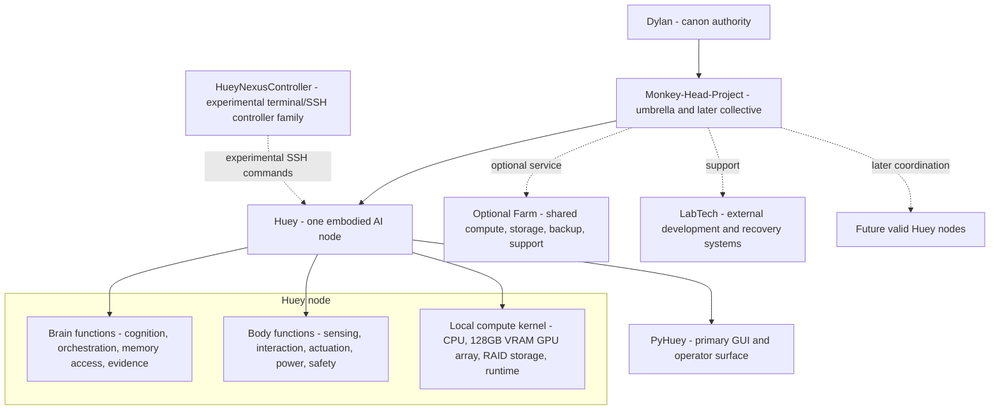

# Monkey-Head-Project

<p align="center">
  
</p>

<p align="center"><strong>Philosophy: "Breathing new life into old tech"</strong></p>

<p align="center">
  <a href="#project-position">Position</a> ·
  <a href="#unified-v202">Unified V202</a> ·
  <a href="#truth-and-source-model">Truth model</a> ·
  <a href="#node-first-architecture">Architecture</a> ·
  <a href="#huey-v4-embodiment">Huey V4</a> ·
  <a href="#experimental-subprojects">Subprojects</a> ·
  <a href="#runtime-and-python-ecosystem">Runtime</a> ·
  <a href="#human-oversight-gate">Human review</a>
</p>

<p align="center">
  
  
  
  
  
</p>

> [!IMPORTANT]
> This README is the Unified V202 review front door. It does not independently lock project canon. `master-plan-Unified-V202.json` remains the candidate machine-facing architecture until Dylan L.R. Pollock explicitly approves or intentionally merges a designated canonical update.

## Project position

The **Monkey-Head-Project** is the umbrella initiative behind **Huey**, **HueyOS**, physical embodiment, maintained controller and LabTech subprojects, project archives, and the later possibility of coordination among multiple valid Huey nodes.

The current Unified V202 direction centers one rule:

> **Build one coherent, useful, attributable Huey node before making operational collective claims.**

In this model:

- **Huey** is one embodied AI node;
- **HueyOS** is the modular software and operating-system layer supporting the node;
- **PyHuey** is the primary GUI and a core-runtime direction, not the whole node;
- **Monkey-Head-Project** is the umbrella and eventual collective layer;
- **Brain** and **Body** are node-local functional domains;
- **Farm** is optional shared or supra-node infrastructure;
- **LabTech** projects remain external support systems with bounded authority.

## Unified V202

**Unified V202 marks a major structural alignment, moving decisively from a collection of experimental components toward one highly standardized, distinctly embodied Huey system.**

This release actively brings repository architecture, physical embodiment direction, robust compute constraints, and public documentation into a singular, cohesive framework.

The central direction mandates that we:

1. build and prove one coherent, useful, embodied Huey node;
2. preserve visible boundaries between current reality, accepted direction, provisional choices, unresolved decisions, and target state;
3. make Brain and Body parts of the local node rather than separate substitutes for Huey;
4. keep Huey Farm optional rather than constitutive;
5. expand toward shared compute, additional nodes, and collective governance only after one valid node can stand on its own.

All deprecated concepts—including external Atlas continuity dependencies and outdated V1 MP3 fixture proofs—have been aggressively purged from this documentation to protect project sovereignty and prevent scope confusion.

## Truth and source model

Unified V202 rigorously carries forward the strongest repository rules and public release standards established in earlier lab iterations.

### Truth classes

| Truth class | Meaning |
|---|---|
| **Current reality** | Observed hardware, merged code, working commands, tests, logs, and verified behaviour |
| **Accepted direction** | Architecture Dylan has selected for implementation, even when incomplete |
| **Provisional choice** | A replaceable working option pending evidence or review |
| **Unresolved** | A decision deliberately left open |
| **Target state** | A later capability dependent on resources, maturity, or validation |
| **Historical lineage** | Earlier systems and decisions preserved without silently overriding the present |

### Source authority

1. Dylan's explicit accepted decisions;
2. the newest accepted machine-facing master plan;
3. merged repository and implementation evidence;
4. README and technical documentation;
5. DLRP.ca presentation and release records;
6. older plans, transcripts, and archives as lineage.

A website claim, branch document, generated report, agent statement, transcript, or pull request is not automatically canon.

### Release discipline

Major project and website releases should preserve:

- human-readable and machine-readable records;
- source origin and synchronization status;
- checksums and generated-file inventories;
- fresh-extraction validation;
- explicit privacy and no-secret boundaries;
- deliberate image provenance, crop, alt-text, and use records;
- compact packages without duplicate payloads;
- system or local typography without remote font dependencies.

## Current position

| Area | Classification | Present position |
|---|---|---|
| **Repository canon** | Accepted predecessor | `master-plan-Unified-V202.json` remains the absolute baseline pending final human review. |
| **Unified V202 documents** | Review candidates | Standardization plan, migration matrix, oversight checklist, README, and master-plan candidate. |
| **Huey node** | Accepted-direction candidate | One physically coherent AI unit is the proposed primary architectural unit. |
| **Huey V4** | Active embodiment direction | A three-tiered physical assembly merging a heavy-duty wood speaker-project base, a Thermaltake Mozart metal midrange, and a wood top supporting the animatronic head. |
| **HueyNexusController** | Experimental sandbox | Nexus 5 and Nexus 7 family controller platform; strictly an experimental, terminal-based initiative subject to removal. |
| **PyHuey** | Primary GUI and core-runtime direction | Main operator surface; integration and authority boundaries require implementation evidence. |
| **Current Python package** | Implemented | Distribution name `hueyos`; targeting pure Python 3.13 while explicitly supporting side-carded 3.12 packages for PyGPT. |
| **Target namespace alignment** | Incomplete | No completed repository-wide `huey` to `hueyos` import migration is claimed. |
| **HIMS foundation** | Merged, non-controlling | Messaging and ledger foundations exist; authenticated controller transport remains an implementation target. |
| **Collective** | Target architecture | Not operational; one valid node comes first. |

## Node-first architecture



A Huey node is proposed as one physically individual AI unit with local compute, Brain and Body functions, operator-visible state, attributable evidence, safe-stop and recovery behaviour, and useful standalone operation.

Collective membership, Farm access, distributed compute, or bifurcation is not required for the first node to be valid. Farm is optional shared infrastructure. The Monkey-Head-Project may later coordinate multiple valid nodes, but that collective is not currently operational.

## Huey V4 embodiment

Huey V4 is the active physical-cohesion direction, not a completed machine. It perfectly embodies the lab's ethos of breathing new life into old tech by extensively utilizing robust, salvaged materials.

The physical structure is defined by a distinct three-tiered architecture:

- **The Base:** Constructed from a repurposed wooden speaker project, providing a highly stable foundation equipped with heavy-duty wheels and integrated speakers.
- **The Midrange:** The metal Thermaltake Mozart case, structurally bridging the tiers and serving as the housing for the core compute components.
- **The Top:** A customized wooden cap upon which sits the plastic animatronic monkey head and an attached animatronic hand utilized specifically for coding interactions.

**Surface Finishing:** The structural exterior abandons traditional clear coats. The plastic and sanded wood surfaces are primed and aggressively coated with a latex-based silver paint. This specific paint composition dries to create a durable, highly unique rubber-like texture.

**Cooling:** The previously discussed external heat exchange system intended to channel Canadian winter air is officially paused. To rapidly stand up the physical shell, the system utilizes a provisional internal air exchange loop.

### Compute direction

- CPU-first transcription, orchestration, logging, I/O, and support duties remain practical first assignments.
- The compute kernel locks the system to an ASUS TUF Gaming Z790-Plus WiFi motherboard and an Intel Core i9-12900K processor.
- **Accelerated Compute:** The system integrates four node-local Nvidia Tesla V100 32 GB GPUs connected via PCIe risers. This creates a massive 128 GB of pooled local VRAM to easily run expansive open-source architecture like `gpt-oss-120b`.
- A fifth basic discrete GPU provides display output and system boot graphics.
- **Power Delivery:** To sustain this tremendous hardware draw, power delivery utilizes two linked Corsair RM1000x high-capacity PSUs, synchronized via an Add2PSU adapter to achieve unparalleled load distribution.
- **Storage:** Core memory relies on two 10 TB hard drives spinning in a highly redundant RAID 1 array.
- Aggregate accelerator memory must not be described as transparent unified VRAM.
- The Lenovo Legion Go is completely retired from core runtime and operates purely as external LabTech hardware.

## Experimental Subprojects

### HueyNexusController

**HueyNexusController** is an experimental sandbox initiative exploring the restoration and repurposing of old Google Nexus Android devices as raw physical control surfaces.

*CRITICAL CAVEAT: This subproject is heavily provisional, serves purely as conceptual food-for-thought, and is subject to immediate removal. It possesses zero canonical execution authority over the physical body.*

The experimental device family includes:

| Platform | Codename | Project role |
|---|---|---|
| Google Nexus 5 | `hammerhead` | Conceptual pocket-sized handset controller |
| Google Nexus 7 (2012 Wi-Fi) | `grouper` | Experimental compact tablet interface |
| Google Nexus 7 (2012 mobile) | `tilapia` | Experimental mobile-connected interface |
| Google Nexus 7 (2013 Wi-Fi) | `flo` | Experimental higher-resolution interface |
| Google Nexus 7 (2013 LTE) | `deb` | Experimental LTE-capable interface |

For initial deployment, these devices will eschew complex GUI applications in favor of raw terminal access, utilizing SSH to execute basic functions directly within HueyOS.

| Field | Direction |
|---|---|
| **Primary Target** | Native Debian or strictly terminal/SSH access |
| **Fallback OS** | LineageOS using the same basic protocol boundaries |
| **Identity boundary** | Controller hardware only; Huey's identity and canonical memory do not reside on a Nexus device |
| **Hardware policy** | Replaceable operational, development, recovery, backup, and parts-donor devices |

Battery reuse or modification remains strictly safety-gated. Each model requires absolute evidence for capacity, voltage stability, swelling, temperature, sustained-load discharge, and protection.

### LabTech

**LabTech** covers external operator, development, recovery, and maintenance systems. LabTech machines—such as the retired Lenovo Legion Go—may build, inspect, repair, test, or communicate with Huey, but they do not become Huey merely because they support the project.

LabTech authority must remain bounded, attributable, revocable where applicable, and separate from Huey's identity and canonical continuity.

## Runtime and Python Ecosystem

PyHuey remains the proposed primary GUI and a core runtime component. It should provide a clear, observable operator surface while preserving a highly resilient CLI path for diagnostics, automation, and core hardware recovery.

**Python Standardization:** The repository aggressively targets a pure **Python 3.13.x** ecosystem. To facilitate current legacy functionality, the system explicitly supports the side-carding of Python 3.12 packages specifically to allow PyGPT to remain operational until upstream framework validation allows complete 3.13 integration.

### HIMS

HIMS — the **Huey Internal Messaging System** — has foundations under both `src/huey/messaging` and `src/huey/hims`.

The existing foundation remains non-controlling. In theory, experimental interfaces like the Nexus controllers will eventually rely on HIMS for:

- audit logging;
- device revocation and replacement.

A delivered message must not become physical action merely because transport succeeded. Authorization, validation, safe-stop behaviour, and Body-facing execution remain absolute, unyielding separate boundaries.

## Quick start

The repository currently requires Python 3.13.x (with 3.12 compatibility isolated for PyGPT):

```text
>=3.13,<3.14
```

Install the core project in editable mode:

```bash
python3.13 -m pip install -c constraints.txt -e .
```

Install development dependencies when working on tests and repository validation:

```bash
python3.13 -m pip install -c constraints.txt -e '.[dev]'
```

Run the test suite:

```bash
python3.13 -m pytest -q
```

Inspect the CLI before invoking an evolving command surface:

```bash
huey --help
huey-api --help
huey-command-center --help
```

## Repository map

| Area | Role |
|---|---|
| `README.md` | Human-facing project front door and review orientation |
| `master-plan-Unified-V202.json` | Candidate successor pending human oversight |
| `docs/architecture/v202-standardization-plan.md` | Reconciliation standard |
| `docs/architecture/v202-migration-matrix.md` | Preserve, re-scope, merge, defer, and reject matrix |
| `docs/review/v202-human-oversight-checklist.md` | Human acceptance gate |
| `docs/hardware/huey-nexus-controller.md` | Experimental Nexus controller-family specification |
| `docs/hardware/huey-nexus-controller.json` | Machine-readable controller-family specification |
| `src/huey` | Current Python implementation and runtime import namespace |
| `src/huey/messaging` | HIMS messaging foundation |
| `src/huey/hims` | HIMS ledger, routing, storage, and related components |
| `src/huey/connectors/pyhuey` | Current embedded PyHuey connector path |
| `tests` | Regression and behavioural verification |

## Documentation layers

| Layer | Responsibility |
|---|---|
| **Master plan** | Machine-facing architecture, status, reasoning, boundaries, and unresolved decisions |
| **README** | Professional human orientation and repository front door |
| **Runtime evidence** | What code, tests, hardware, fixtures, and logs actually prove |
| **Technical docs** | Implementation details, setup, architecture, hardware, runbooks, and audits |
| **Governance documents** | Law, legitimacy, offices, and constitutional process |
| **DLRP.ca** | Public coherence and explanation with visible source status |
| **Archives and transcripts** | Lineage without automatic canon authority |

These layers should remain synchronized without being collapsed into one document or treated as interchangeable authority.

## Human oversight gate

The Unified V202 review is a human acceptance and truth-boundary pass, not another uncontrolled architecture-invention cycle.

Before canonical synchronization, Dylan must review:

1. node and collective definitions;
2. Brain, Body, and Farm re-scope;
3. Huey V4 three-tiered physical facts and hardware inventory;
4. Four-GPU and pure compute wording;
5. PyHuey, Python 3.13 ecosystem, package, and namespace continuity;
6. HueyNexusController platform classification as entirely experimental;
7. public and private information boundaries;
8. website and release standards selected for promotion;
9. every unresolved claim that must remain visibly open.

Use `docs/review/v202-human-oversight-checklist.md` for the complete gate.

## Explicit non-claims

This candidate does not claim that:

- Unified V202 is accepted canon;
- Huey V4 is physically complete;
- the intended Intel Core i9 compute kernel is fully inventoried, fitted, powered, cooled, or validated inside the Mozart midsection;
- the four Tesla V100 cards and dual Corsair RM1000x PSUs are fully acquired, wired, or actively pooling compute;
- aggregate GPU memory is transparent unified VRAM;
- Farm or a multi-node collective is operational;
- target-state governance is active;
- the runtime import namespace has completed a repository-wide migration from `huey` to `hueyos`;
- native Debian currently boots reliably with complete hardware support across all Nexus 5 and Nexus 7 variants;
- every supported Nexus variant has passed platform acceptance;
- Phosh, Plasma Mobile, touchscreen, cellular data, audio, cameras, charging, suspend, sensors, or battery modifications are proven across the controller family;
- authenticated HIMS controller provisioning, command routing, or Huey Body execution is complete;
- controller delivery grants physical execution or governance authority;
- Huey's identity or canonical memory resides on a handset or tablet;
- DLRP.ca replaces repository, implementation, or machine-facing authority.

## License and provenance

Project code is licensed under **GPL-3.0-only** unless a component explicitly states otherwise. Documentation and media are licensed under **CC-BY-SA-4.0** unless otherwise noted.

PyHuey, PyGPT-derived, archived, imported, and companion integration paths retain separate provenance and licensing boundaries. See [`docs/legal/provenance-and-licenses.md`](docs/legal/provenance-and-licenses.md).

---

<p align="center"><strong>"Breathing new life into old tech"</strong></p>
