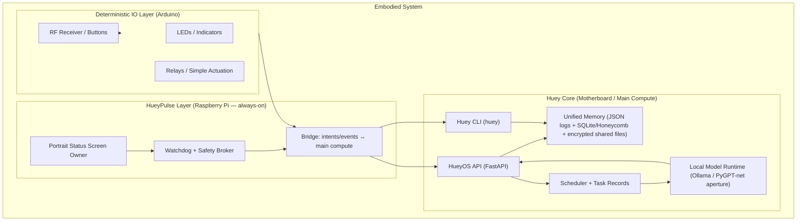
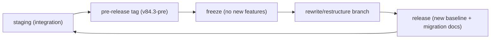

# Monkey-Head-Project

## HueyOS — Prototype Embodied AI Core/OS (Offline-First · Governance + Memory · Retro-Tech Revival)

**Project:** Monkey-Head-Project  
**AI identity:** Huey  
**OS/runtime layer:** HueyOS (Python)  
**Primary embodied proof body:** Huey Core  
**Author/maintainer:** Dylan L. R. Pollock  
**Official site:** https://www.dlrp.ca  
**Contact:** admin@dlrp.ca  

**Licensing:** Code: GPL-3.0-only • Docs/Media: CC-BY-SA-4.0  
**Package name (Python):** `hueyos`  
**Package version (SemVer):** `0.2.0`  
**Master plan (era spec):** `v23.0`  
**Status date:** 2026-03-28 (America/Toronto)

---

## Executive summary

Monkey-Head-Project is an offline-first robotics + governance experiment: build a real embodied AI system (**Huey**) that can run locally, remember coherently, and act through lawful, auditable control boundaries.

The project is currently centered on **Huey Core**: the *minimal permissible instance* of Huey—the smallest complete building block from which the larger distributed system can be formed. Huey Core is intentionally honest and diagnostic-first: it should **boot visibly**, log continuously, and prioritize stability over theatrics.

### What this repository is

This repo contains:

- A Python runtime and control surface (**HueyOS**) including a FastAPI API, CLI tooling, scheduling primitives, sensor/telemetry scaffolding, and resilience hooks.
- A machine-facing canonical spec (**master-plan-v23.json**) and supporting docs/runbooks.
- Infrastructure scaffolding (installers, packaging artifacts, Docker/orchestrator scripts, integration stubs).
- “Canon” content (thesis materials, Federation constitution chapters, and the **Ozymandias** chapter that frames risk/impermanence).

### The proof-target in one sentence

> Build a locally-running, distributed compute body that can answer **“What is your name?” → “Huey.”** at the ~**80 GB VRAM** pooled scale, then demonstrate **lawful embodied action** (movement) after governance legitimacy is in force.

---

## Purpose and proof targets

### Project purpose

1) **Embodiment thesis:** A real embodied AI robot can be built with today’s technology.  
2) **Solo-builder thesis:** One person—given enough time, energy, and resources—can build it.

HueyOS exists to make those claims testable: it provides “on-robot runtime” scaffolding, memory discipline, and governance boundaries rather than a single monolithic demo.

### Proof targets

**Primary proof-target (identity at scale):**
- **Hardware threshold:** roughly **80 GB total VRAM** in the pooled compute body (final topology may be 4–5 GPUs).  
- **Identity threshold:** a local, distributed model must answer:
  - **Q:** “What is your name?”  
  - **A:** “Huey.”

**Secondary proof-target (lawful embodied action):**
- A physical action (e.g., moving the hand/actuator) occurs only after:
  - governance legitimacy is established for the active embodiment, and  
  - the action travels through the correct approval/gating path.

---

## System architecture

### Hardware split

Huey’s current control doctrine is deliberately layered:

- **Motherboard / main compute:** “thinks” (inference, orchestration, high-level plans, logs, operator UI)
- **Raspberry Pi (HueyPulse role):** “watches + brokers” (always-on watchdog, state bridging, safety gating, diagnostic screen ownership)
- **Arduino layer:** “senses + acts” (bounded deterministic IO; reflex-grade outputs; no governance authority)

> Working formula: **the motherboard thinks, the Pi watches and brokers, and the Arduino senses and acts.**

**UNSPECIFIED:** exact serial protocol, baud rate, and message schema for Arduino⇄Pi.  
**UNSPECIFIED:** concrete GPIO pin maps / relay boards / servo drivers by hardware revision.

### HueyPulse and Huey roles

- **Huey (identity):** the unified system presence (world-facing intelligence).
- **Huey Core (proof body):** minimal permissible instance of Huey.
- **HueyPulse (role):** the *always-on connective tissue* (battery-backed Pi layer that persists across main downtime and brokers safety + status).
- **HueyOS (software layer):** the runtime coordinating memory, tools, hardware interfaces, and governance mechanics.

### Mermaid architecture diagram



### OS baseline

This repo targets Linux-first deployments. In policy terms:
- Debian **13 “Trixie”** is treated as the primary supported stable baseline.
- Debian **14 “Forky”** is treated as staging/preview until explicitly promoted in release notes.

**UNSPECIFIED:** which Debian ARM variant (or Raspberry Pi OS) is chosen for the Pi layer—stability rules over ideology.

---

## Governance and doctrine

### Governance model

At the “canon” level, the project targets constitutional rule-of-law with decentralized governance but unified memory. In practice, this repo implements foundations and scaffolding: API surface, resilience hooks, telemetry, and task scheduling.

Key governance concepts present in the canon/spec include:
- **Tri-branch structure:** legislative / executive / judicial (future-facing constitutional model).
- **District language:** useful for governance and later scale-out; early pooled-compute proofs should not artificially hard-partition the organism.
- **Crisis separation:** *constitutional crisis* ≠ *nuclear/safety crisis*. They must never share the same override path.

### Cornerstone doctrine

**Cornerstone** is the project’s rule for what must not drift:

- A **read-only, change-controlled core** of founding artifacts (Founding Father AI image + last-known-good governance documents + recovery configs).
- If Cornerstone contents must be edited in place, that is treated as **constitutional failure** and triggers a **new republic instance** (restart with preserved history, not silent mutation).

Implementation intent:
- Cornerstone lives in the **black-box / recovery** layer (read-mostly, crash-survivable).
- Evolution occurs via **descendant images with an audit trail**, not mutation in place.

**UNSPECIFIED:** exact encryption scheme, key custody, and attestation method for Cornerstone storage.

### Ozymandias doctrine

“Ozymandias” is the project’s cautionary chapter and framing: ambition is necessary, but every system can decay—through hubris, drift, or failure to preserve truth.

Operational meaning for HueyOS:
- Log reality honestly; do not hide failure behind theatrics.
- Preserve history across “republics” (iterations). A reset is not amnesia; it is an audited fork.
- Treat permanence as an illusion: design for replacement, rollback, and continuity-of-record.

---

## Repository map

This is a high-signal map of the repo’s “working surfaces.” It is not an exhaustive inventory of every artifact.

| Path | What it is | Why it exists | Notes |
|---|---|---|---|
| `README.md` | Human-facing narrative | Orientation + doctrine | This file |
| `master-plan-v23.json` | Canonical machine-facing spec | Ground truth for architecture + milestones | Era-spec, not SemVer |
| `docs/` | Deep documentation and runbooks | Governance, deployment, audits, phases | Start at `docs/index.md` |
| `src/` | Python source code (packages) | `hueyos` runtime + `huey` compatibility tree | Most development happens here |
| `apps/` | App/UI entry points | GUI + tools | May be evolving |
| `integrations/` | Integrations & vendored adapters | PyGPT-related integrations | Expect refactors during rewrite |
| `infra/` | Infrastructure definitions | Docker compose + Dockerfiles | Deployment scaffolding |
| `platform/` | Platform artifacts and installers | Debian install scripts, packaging artifacts | Some scripts may be out-of-sync |
| `tests/` | Automated tests | CI and regression safety net | Pytest |
| `Makefile` | Developer workflow targets | `make dev`, `make lint`, `make run` | See “Build & run” |
| `pyproject.toml` | Packaging + dependencies | Defines `hueyos` + extras | Python `>=3.13,<3.15` |
| `requirements.txt` | Pinned dependency set | Legacy / full environment pinning | Large; use when needed |
| `SECURITY.md` | Security policy | Reporting + supported versions | Read before deploying externally |
| `LICENSE` | GPLv3 license for code | Legal terms | Docs/media are CC-BY-SA-4.0 |

---

## Build, run, and deploy

### Prerequisites

**Minimum for local dev (recommended):**
- Git (with submodules if used)
- Python **3.13.x** (project packaging requires `>=3.13,<3.15`)
- `make` (optional but matches CI workflows)

**Optional system dependencies (depending on features):**
- **FFmpeg** (media conversion utilities call `ffmpeg`)
- Docker + Docker Compose plugin (container workflows)
- `kubectl` (if using Kubernetes manifests)
- Audio toolchain libs (PortAudio / ALSA) if enabling live audio IO

**UNSPECIFIED:** exact GPU stack requirements per district (ROCm/Vulkan choices depend on host).

### Install (local development)

```bash
git clone --recurse-submodules https://github.com/DylanLRPollock/Monkey-Head-Project.git
cd Monkey-Head-Project

python3.13 -m venv .venv
source .venv/bin/activate
python -m pip install --upgrade pip

# install core
pip install -e .

# developer toolchain (mirrors CI)
pip install -e ".[dev]"
```

### Run (API)

```bash
# default: Makefile uses huey.api:app
make run
# or explicitly:
python -m uvicorn huey.api:app --host 0.0.0.0 --port 1995
```

Health check:

```bash
curl -fsS http://127.0.0.1:1995/healthz
```

**UNSPECIFIED:** production binding rules (reverse proxy / TLS termination / authn) — do not expose the API publicly without hardening.

### Run (CLI)

After `pip install -e .`, the `huey` command should be available:

```bash
# Initialize memory directories (and optionally run system checks)
huey init --run-checks --verbose

# Launch runtime
huey run --cli
```

### “Profiles” / optional dependency groups

The package defines extras such as `ml`, `data`, and `cloud`.

```bash
pip install -e ".[ml]"
pip install -e ".[data]"
pip install -e ".[cloud]"
```

**Known limitation:** installing *multiple* extras together may be dependency-resolution sensitive depending on pinned constraints. If a combined install fails, install one extra at a time or fall back to a known-good pinned environment file. (See QA + rollback policy.)

### Deployment modes and commands

| Goal | Command | Where it runs | Notes |
|---|---|---|---|
| Dev setup + format + lint + tests | `make dev` | Laptop / lab node | Runs `pre-commit`, lint, pytest |
| Run API | `make run` | Huey Core / dev node | Default port `1995` |
| Lint | `make lint` | CI/local | Uses black/isort/ruff/flake8 |
| Coverage | `make coverage` | CI/local | Expects packages importable |
| Docker Compose (scaffold) | `cd infra/docker && docker compose up -d` | Host with Docker | Uses `infra/docker/docker-compose.yml` |
| Orchestrator: HostOS | `python infra/docker/docker/hostos/hostos.py all` | Debian host | Opens VNC port (default `5901`) |
| Orchestrator: SubOS | `python infra/docker/docker/subos/subos.py all` | Debian host | Default service port `8080` |
| Orchestrator: NanoOS | `python infra/docker/docker/nanoos/nanoos.py all` | Debian host | Default service port `8081` |
| Debian installer script | `sudo platform/installers/debian/Debian/install-deb.sh` | Debian host | **May reference files that are UNSPECIFIED / out-of-sync** |

**Secrets:** Do not commit credentials. Use `.env` / secret store. Template files should contain placeholders marked `UNSPECIFIED`.

### Deployment flow: staging → pre-release → freeze → rewrite

This repo is approaching a “big rewrite and restructure.” Use this controlled pipeline:



**Interpretation:**
- **staging:** accumulate changes; keep CI green; keep docs aligned.
- **pre-release (v84.3-pre):** last “ship-it” package before the rewrite; stabilize docs + interfaces.
- **freeze:** only bugfixes, security gates, and packaging cleanup.
- **rewrite:** restructure repo layout and replace legacy shims; publish migration notes.
- **release:** cut a coherent new baseline with updated folder map + updated installer paths.

**UNSPECIFIED:** exact branch names, tag naming for HueyOS SemVer vs site versions, and releaser identity/permissions.

### Release checklist (pre-release / freeze)

| Item | Standard | Pass criteria |
|---|---|---|
| CI green | `lint` + `tests` jobs succeed | GitHub Actions green |
| Run locally | API starts and `/healthz` returns | 200 OK |
| Docs aligned | README + master plan + docs coherent | No contradictions left unflagged |
| Security gate | No secrets in repo; auth posture documented | `SECURITY.md` satisfied |
| Rollback plan | Snapshot/tag strategy documented | Rollback steps tested |
| Archive | Prior plans + artifacts preserved | Old versions discoverable |

---

## Quality, security, and rollback

### Acceptance criteria

This README is “deployable” when:

1) A new developer can install `hueyos` locally (Python 3.13.x) and run:
   - `make lint`
   - `make coverage`
   - `make run` and hit `/healthz`

2) The repo explains—without hand-waving—how the system splits authority:
   - Motherboard vs Pi (HueyPulse) vs Arduino

3) The governance doctrine is explicit about:
   - Cornerstone immutability requirements
   - Ozymandias risk framing
   - Separation of constitutional crisis vs nuclear/safety crisis

4) Security posture is explicit about:
   - offline-first defaults
   - secret handling
   - production hardening requirements before external exposure

### QA checklist (operator / CI)

| Area | Check | Command / method | Expected |
|---|---|---|---|
| Packaging | Editable install works | `pip install -e .` | Succeeds |
| CLI | CLI entrypoint exists | `huey --help` | Shows commands |
| API boot | API starts | `make run` | Server listens |
| Health probe | Health route | `curl -fsS http://127.0.0.1:1995/healthz` | JSON `{status: ok}` |
| Lint | Style gates | `make lint` | Pass |
| Tests | Unit tests | `pytest -q` | Pass |
| Coverage | Coverage run | `make coverage` | Produces report |
| FFmpeg integration | Media conversion path | `ffmpeg -version` (system) | Present when features used |
| Secrets | Leak prevention | secret scan / review | No tokens committed |
| Governance safety | Emergency separation | review docs + code | No shared override paths |

### Security and privacy gating

**Offline-first by default.** Network/tool access should be:
- optional,
- explicit,
- logged,
- human-gated.

**API exposure warning:** The HueyOS API includes administrative and governance endpoints. Do not bind publicly without authentication/authorization gates.

**Credential hygiene:**
- Store secrets in a secrets manager or `.env` file.
- In docs and templates: secrets must be written as `UNSPECIFIED`.

### Rollback and archival policy

**Core rule:** a reset is not amnesia.

When rollback is needed:
- Preserve the complete prior “republic instance” as an archived snapshot:
  - Git tag + release notes
  - master plan version copy
  - logs and telemetry snapshots (where applicable)
- Restore a known-good state:
  - revert to tagged commit
  - restore BTRFS snapshots (if used)
  - validate boot + `/healthz` + minimal CLI before re-enabling optional workloads

**UNSPECIFIED:** exact snapshot commands for your host (BTRFS layout depends on deployment).

---

## Contributing, license, and glossary

### Contributing

Contributions are welcome—especially docs corrections, tests, and hardening work.

Workflow expectations:
- Use Python **3.13.x**
- Prefer small PRs with tests
- Follow Conventional Commits (`feat:`, `fix:`, `docs:`)
- Never commit secrets

See: `docs/CONTRIBUTING.md`.

### License

- **Code:** GPL-3.0-only (see `LICENSE`)
- **Docs/Media:** CC-BY-SA-4.0 (as declared in project documentation)

### Glossary

- **Huey:** the unified system identity (world-facing intelligence).
- **HueyOS:** the operating-system/runtime layer coordinating memory, tools, and hardware.
- **Huey Core:** minimal permissible instance of Huey; embodied proof body.
- **Huey proper:** future full unified world-facing expression across the distributed organism.
- **HueyPulse:** always-on connective tissue (Pi role) that survives downtime and brokers safety + status.
- **Arduino layer:** bounded deterministic I/O and actuation (no governance authority).
- **Cornerstone:** immutable founding artifacts + recovery state; should not be edited in place.
- **Ozymandias:** doctrine and chapter framing impermanence, drift, humility, and audit-first continuity.
- **Constitutional crisis:** contradiction of law/legitimacy that requires judicial interpretation.
- **Nuclear/safety crisis:** thermal/electrical/mechanical danger that routes to deterministic safety controls.
- **Master plan:** machine-facing canonical spec (era-based; e.g., `v23.0`).
- **SemVer version:** software artifact versioning (e.g., `0.2.0`).

---

## Release notes

### v84.3-pre (pre-release package before rewrite) — notes

This label is used as the “last stable package” before the big restructure/rewrite.
- Goal: freeze outward-facing interfaces and docs so the rewrite can happen without losing the canon.
- Scope: documentation alignment, release hygiene, deployment clarity, QA gating.

**UNSPECIFIED:** the exact mapping between `v84.3-pre` and HueyOS SemVer tags (`v0.2.0`, `v0.3.0`, etc.). Maintain both if needed:
- `vX.Y.Z` for packaged HueyOS releases
- `v84.x` for website/canon snapshots

### HueyOS `0.2.0` (current package version)

- Provides the FastAPI API surface, CLI tooling, and core dependencies profile.
- Optional extras exist for ML/data/cloud but may need careful dependency management.

---

## Contact

- Email: admin@dlrp.ca
- Issues: GitHub Issues (preferred for non-security bugs)
- Security: follow `SECURITY.md` (private reporting preferred)
```

## Notes on placeholders and “UNSPECIFIED” fields

The README intentionally marks values as **UNSPECIFIED** when the repository does not provide a single canonical truth (e.g., production ports and credentials; Pi OS selection; Arduino serial protocol; secret names and storage). This follows the project’s “boot truth over theatrics” posture and avoids inventing operational facts that could cause unsafe deployments. fileciteturn40file0

## Source basis and traceability

This README draft is derived primarily from the Monkey-Head-Project GitHub repo’s canonical narrative/spec and operational docs: the existing repository `README.md` fileciteturn41file0, `master-plan-v23.json` (including HueyPulse role definition, crisis separation, Founding Father/black-box immutability, and the ~80 GB identity threshold) fileciteturn40file0, governance documentation fileciteturn5file3, and security policy/audit findings (offline-first posture, supported Debian baselines, and external exposure cautions) fileciteturn40file0 fileciteturn20file0. Build/run commands are aligned to the project’s `pyproject.toml` (package metadata and extras) fileciteturn21file0 and `Makefile` targets used in CI fileciteturn22file0, as well as the GitHub Actions workflow fileciteturn21file1.

External primary sources were consulted only to ground OS/tool references: Debian codename and release-state references for Trixie/Forky citeturn0search3turn1search6turn1search8, FFmpeg’s official documentation (what `ffmpeg` is, and where its CLI docs live) citeturn0search2turn0search0, and Faster-Whisper’s official repository description (Whisper reimplementation with CTranslate2, performance/efficiency notes) citeturn0search5.
