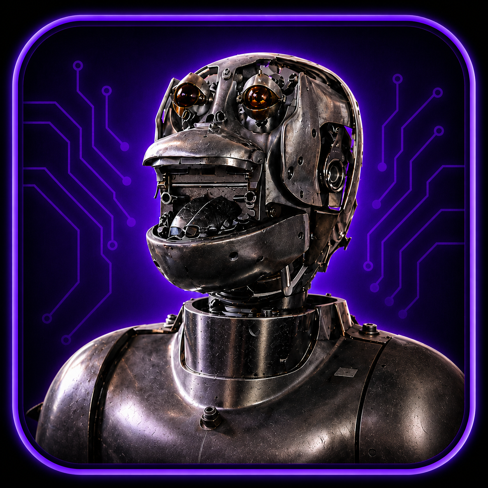
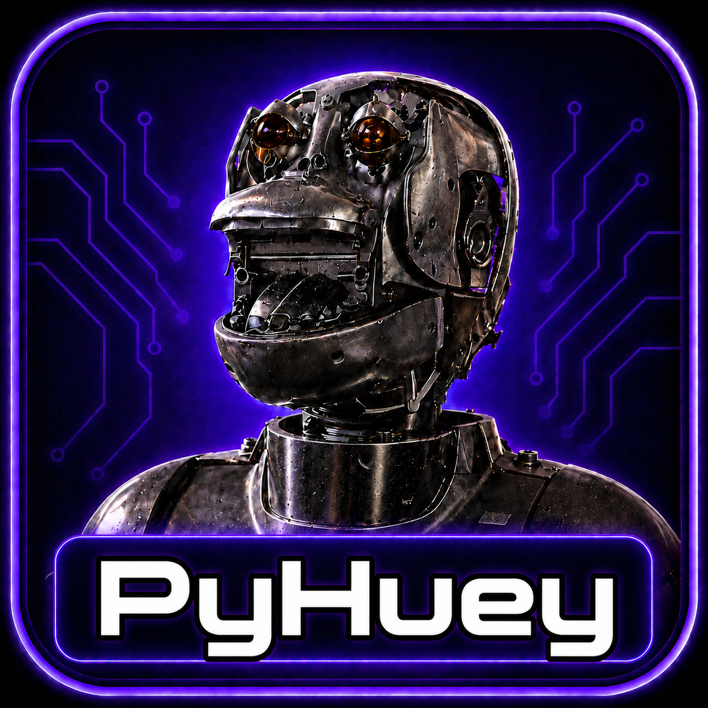
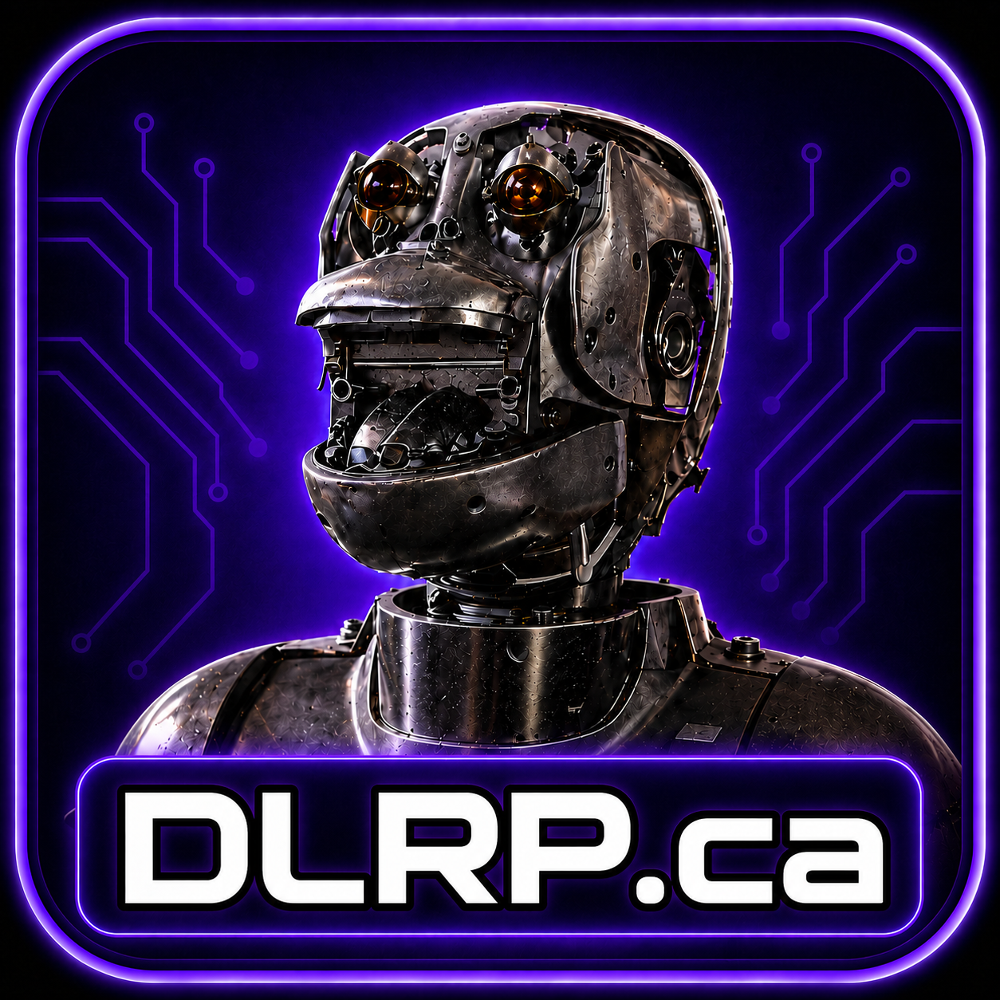
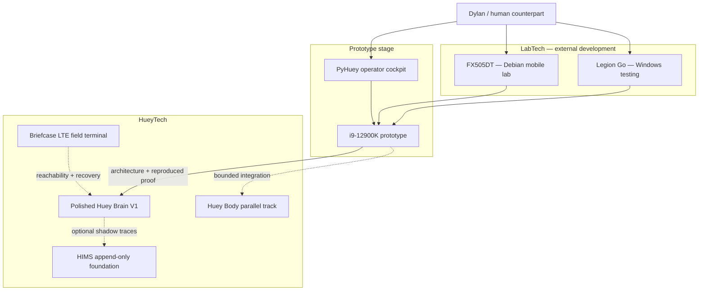

# Monkey-Head-Project

<p align="center">
  
</p>

<h2 align="center">HueyOS</h2>

<p align="center">
  <strong>Offline-first embodied AI, developed through reproducible proof and obtainable hardware.</strong>
</p>

<p align="center">
  <a href="#current-position">Current position</a> ·
  <a href="#why-this-architecture">Why this architecture</a> ·
  <a href="#system-map">System map</a> ·
  <a href="#v1-proof">V1 proof</a> ·
  <a href="#roadmap">Roadmap</a>
</p>

<p align="center">
  
  
  
  
  
</p>

<p align="center">
  
  &nbsp;&nbsp;&nbsp;&nbsp;
  
  &nbsp;&nbsp;&nbsp;&nbsp;
  
</p>

---

## Project overview

The **Monkey-Head-Project** is the umbrella initiative behind **Huey**, a governed robotic AI identity, and **HueyOS**, the software and operating-system layer that supports it.

The project is built around a practical premise:

> A durable embodied AI system can be developed with obtainable technology when each capability is proven, recorded, and transferred deliberately.

Version 120.2 defines the current route from prototype work to polished Huey Brain V1. It also explains why the project uses controlled audio fixtures, separate LabTech and HueyTech roles, an external PyHuey cockpit, foundation-stage HIMS messaging, parallel Huey Body development, and a funding gate for Huey Farm.

| Field | v120.2 position |
|---|---|
| **Project** | `Monkey-Head-Project` |
| **Identity** | `Huey` |
| **Software / OS layer** | `HueyOS` |
| **Human counterpart** | Dylan L.R. Pollock |
| **Machine-facing source of truth** | `master-plan-v120.2.json` |
| **Current platform** | Custom i9-12900K prototype Huey Brain |
| **Polished Huey Brain V1** | Under active development; operational validation pending |
| **Huey Body** | Under active development through a bounded parallel track |
| **Canonical proof** | Known MP3 → media preparation → local transcription → API response → structured log |

---

## Current position

### Active development

| System | Classification | Present role |
|---|---|---|
| **Custom i9-12900K system** | Prototype Huey Brain | Primary operator workstation, architecture test bed, and V1 proof platform |
| **Polished Huey Brain V1** | HueyTech | Final V1 target shaped by prototype evidence |
| **Huey Body** | HueyTech | Physical sensing and actuation platform developing in parallel |
| **Briefcase** | HueyTech | LTE-connected field terminal for reachability, communication, documents, and recovery |
| **PyHuey** | External cockpit | Primary operator interface in standalone and embedded-connector forms |
| **HIMS foundation** | Internal infrastructure | Append-only messaging and event records; optional V1 shadow tracing |

### Active LabTech

| Device | Baseline | Role |
|---|---|---|
| **ASUS FX505DT** | Debian 14 “Forky”; 32 GB DDR4 | Mobile lab |
| **Lenovo Legion Go** | Windows 11 | Windows feature and compatibility testing |

### Funding-dependent expansion

**Huey Farm** remains the pooled-compute target. Approximately **80 GB of local pooled VRAM** is the present planning scale, with `gpt-oss-120b` as a provisional test candidate. Hardware and model selection will be refreshed when funding makes procurement actionable.

### Hardware lineage

The 2017 iMac 5K is decommissioned. Its useful RAM was repurposed into the ASUS FX505DT. The iMac remains part of the project’s hardware lineage rather than its active architecture.

> [!IMPORTANT]
> “Under active development” and “operational” are separate milestones. Polished Huey Brain V1 and Huey Body receive operational status through explicit validation.

---

## Why this architecture

The architecture is deliberate. Each major choice advances a specific project need and produces a clear implementation consequence.

| Decision | Why it fits the project | Practical consequence |
|---|---|---|
| **Prototype first, polished V1 second** | The project can learn quickly on real hardware while preserving a meaningful final acceptance stage. | Prototype results guide design; polished V1 status follows successful transfer and reproduction. |
| **Use the i9 system in a dual role** | It is the strongest available workstation and exposes Intel performance/efficiency-core behavior directly. | Operator and proof workloads share one prototype while their configuration and records remain distinct. |
| **Begin with known MP3 fixtures** | Preserved inputs isolate model and software changes from room, microphone, and speaker variability. | Every run can be compared across devices, configurations, and development stages. |
| **Test CPU and GPU transcription** | The i9 CPU offers compatibility; the RX 5500 XT may offer acceleration. Evidence should select their roles. | Benchmarks assign primary, fallback, and cross-check paths from measured quality and reliability. |
| **Keep Huey Body parallel** | Mechanical progress can continue without obscuring cognitive-proof results. | Body tests use their own scope and records, then converge through explicit integration gates. |
| **Separate LabTech from HueyTech** | Support hardware and Huey-side capability carry different identity, lifecycle, and authority. | Device roles remain understandable and can be deliberately promoted or retired. |
| **Build HIMS foundation before authority** | Append-only messages can be validated before routing and execution are entrusted to them. | V1 stays independently executable while HIMS rehearses traceability through optional shadow events. |
| **Use PyHuey as the cockpit** | The PyGPT/PyGPT-net foundation already provides a mature and stable interaction surface. | Huey-specific tools can mature without rebuilding general GUI infrastructure. |
| **Keep Command Center experimental** | It contains useful interface ideas but still reflects mock-first AI-generated prototyping. | Reusable components can be salvaged while credentials and control remain isolated. |
| **Fund Huey Farm deliberately** | Large-model hardware carries significant acquisition, power, cooling, and support costs. | Procurement begins with a fresh model/hardware comparison when resources exist. |

The full reasoning, evidence standards, and review triggers live in `master-plan-v120.2.json`.

---

## System map



### Role model

- **LabTech develops and observes.**
- **The prototype discovers and validates.**
- **Polished Huey Brain V1 reproduces and operationalizes.**
- **PyHuey presents bounded operator workflows.**
- **Huey Body develops through independently attributable tests.**
- **Briefcase provides portable field reachability.**
- **HIMS records foundation-stage internal messages.**
- **Huey Farm expands compute when funding and evidence align.**

---

## Prototype Huey Brain

The current prototype is both the primary operator workstation and the platform used to shape polished Huey Brain V1.

| Component | Current baseline |
|---|---|
| CPU | Intel Core i9-12900K |
| Architecture focus | Performance-core and efficiency-core workload placement |
| Motherboard | ASUS TUF GAMING Z790-PLUS WIFI |
| Memory | 16 GB DDR5-6000 |
| GPU | Gigabyte Radeon RX 5500 XT OC 8G |
| Operating system | Debian 14 “Forky” |
| Root storage | RAID 10 across four Intel Optane M10 16 GB drives |
| Home storage | 1 TB 2.5-inch SSD |

Detailed GPU identifiers, firmware observations, storage topology, and transfer rules are retained in the master plan. The README keeps the baseline visible without becoming a hardware inventory.

### Dual-role discipline

The dual role reduces synchronization overhead while the architecture is being discovered. Proof runs remain distinguishable through explicit configuration, isolated artifacts, and structured records. The roles will separate when polished V1 is ready or when operator workloads begin to affect repeatability.

---

## V1 proof

### Proof contract


The proof is intentionally small enough to reproduce and complete enough to expose real system behavior.

| Stage | Required result |
|---|---|
| **Fixture selection** | Immutable source identity or hash |
| **Media preparation** | Probe metadata, transcription-ready audio, and preparation manifest |
| **Local transcription** | Transcript with engine, model, device, timing, and configuration |
| **Response bridge** | API response or explicit error record |
| **Structured record** | Append-only JSON/JSONL entry linking every artifact |

### Two-stage acceptance

1. **Prototype validation** — implement, benchmark, stabilize, and document the proof on the i9 platform.
2. **Polished V1 reproduction** — transfer the accepted architecture and reproduce the same fixture contract on polished Huey Brain V1.

This transfer is part of the proof. It converts successful development into reproducible system capability.

### Transcription strategy

The same fixtures will be evaluated through:

- Intel Core i9-12900K CPU execution
- AMD Radeon RX 5500 XT execution

The comparison records output quality, repeatability, latency, memory, thermals, failure rate, and setup complexity. The evidence assigns primary and fallback roles. Where useful, the secondary path also serves as a cross-check against device-specific drift.

### Response strategy

The V1 quality baseline remains API-backed. Mock mode supports deterministic CI and failure-path testing. Local response experiments remain available as a separate path toward future on-device sovereignty.

### Completion boundaries

| Part of V1 completion | Separate maturity path |
|---|---|
| Preserved fixture set | Live microphone capture |
| Deterministic media preparation | Wake word and passive listening |
| Local transcription evidence | Huey Body actuation |
| API response record | HIMS routing authority |
| Structured JSON/JSONL log | Constitutional multi-agent runtime |
| Prototype-to-polished reproduction | Huey Farm capacity |

> [!NOTE]
> PyHuey improves operation and visibility, while the proof retains a CLI-capable path. Optional HIMS traces enrich the record while the structured run log remains canonical.

---

## Huey Body parallel track

Huey Body is under active development, with substantial physical work expected as the build progresses. Version 120.2 preserves the stable structure while allowing component choices to mature.

Each Body experiment should define:

- the physical subsystem under test,
- the exact command or stimulus,
- the expected motion or sensor result,
- operator initiation and safe-stop behavior,
- observed result and recovery path,
- the interface needed for later Brain integration.

Brain and Body converge through explicit integration gates after both sides present stable interfaces. This approach preserves momentum and keeps failures attributable.

---

## Briefcase field role

Briefcase is portable HueyTech built around dependable access beyond the local network.

Its first capability set is:

- LTE-based reachability and health checks,
- authenticated communication with Huey,
- field documentation and ordinary 2-in-1 work,
- recovery access and diagnostics,
- clear behavior during connection loss and restoration.

Broader operational authority can be evaluated after authentication, audit, failure handling, and revocation are proven under field conditions.

---

## HIMS

The **Huey Internal Messaging System** foundation is merged under `src/huey/messaging`.

Current foundation:

- immutable `HIMSMessage` envelopes,
- append-only `HIMSEvent` lifecycle records,
- local JSONL-backed `HIMSStore`,
- inbox, outbox, status, and archive operations,
- unit tests and architecture documentation.

The architecture separates message creation, routing, validation, execution, and recording. Version 120.2 uses HIMS for foundation work and optional V1 shadow traces. Later authority stages require their own routing policies, execution gates, refusal behavior, and recovery tests.

---

## PyHuey

PyHuey is the primary external operator cockpit for prototype work.

It is valuable because the PyGPT/PyGPT-net foundation already supplies a stable interface, provider support, and mature application structure. The project can therefore concentrate on Huey-specific tools and connectors.

PyHuey currently supports two complementary forms:

- **Standalone cockpit** for independent operator workflows
- **Embedded connector** for bounded HueyOS integration

Tools exposed through PyHuey should be fixed, reviewable, and attributable. CLI fallback preserves proof independence and recovery access.

---

## Command Center

Command Center remains an experimental GUI companion and interface-design sandbox.

### Useful material

- purple-first operator-console styling,
- migration and checklist views,
- mock V1 run visualization,
- mock operator panels,
- local persistence and JSON import/export concepts,
- validation-command and task-generation ideas.

### Promotion standard

Before Command Center can be considered operational, it needs:

- accurate package identity and current documentation,
- tested data adapters,
- secure credential architecture,
- correct repository and workflow metrics,
- maintained automated tests,
- a unique role that complements rather than duplicates PyHuey.

Until then, it remains a safe place to explore visual and interaction ideas, isolated from credentials and Huey control.

---

## Huey Farm

Huey Farm is the funding-dependent path to larger local models and pooled compute.

| Planning item | Current direction |
|---|---|
| Purpose | Local pooled compute and large open-weight model testing |
| Memory scale | Approximately 80 GB pooled VRAM |
| Current model candidate | `gpt-oss-120b` |
| Selection method | Fresh model, hardware, power, cooling, and software comparison at funding time |
| Relationship to V1 | Independent expansion; V1 remains achievable without Farm capacity |

This funding gate keeps near-term work focused on obtainable hardware while retaining a concrete scale for future planning.

---

## Development path

### 1. Stabilize the prototype

- verify Debian Forky stability,
- document P-core/E-core topology and workload placement,
- verify Optane RAID health and recovery,
- establish CPU, GPU, thermal, memory, and storage baselines.

### 2. Freeze the fixture contract

- preserve source fixtures and hashes,
- standardize probe and preparation output,
- define artifact retention,
- establish comparable run identifiers.

### 3. Benchmark transcription

- test CPU and RX 5500 XT paths,
- compare quality and operational cost,
- assign primary and fallback roles,
- retain cross-checking where it adds value.

### 4. Complete the structured loop

- connect the API-backed response bridge,
- preserve secret-safe configuration,
- stabilize the run-log schema,
- make every failure explicit and attributable.

### 5. Reproduce on polished Huey Brain V1

- freeze the accepted prototype procedure,
- transfer documented dependencies and configuration,
- run the same fixture set,
- compare results and record necessary adaptation,
- grant operational status through accepted evidence.

### Parallel: advance Huey Body

- record each physical experiment independently,
- establish safe-stop and recovery behavior,
- stabilize interfaces before Brain/Body convergence.

---

## Quick start

The repository currently supports **Python 3.13.x**.

```text
>=3.13,<3.14
```

### Install

```bash
python3.13 -m pip install -c constraints.txt -e .
```

### Test

```bash
python3.13 -m pytest -q
```

### System check

```bash
huey system-check --json
```

### Prepare a fixture

```bash
python scripts/prepare_audio_for_transcription.py path/to/fixture.mp3 --json
```

### CI-safe mock proof

```bash
huey v1-run --mock path/to/fixture.mp3 --log-dir runs
```

> [!CAUTION]
> Keep API credentials outside source, exported dashboards, and run logs. Public internet exposure is outside the V1 deployment model.

---

## Repository map

| Area | Role |
|---|---|
| `README.md` | Human-facing project front door |
| `master-plan-v120.2.json` | Machine-facing decisions, rationale, and implementation direction |
| `src/huey` | Canonical HueyOS source package |
| `src/huey/media` | Media probing, preparation, analysis, and previews |
| `src/huey/messaging` | HIMS foundation |
| `src/huey/connectors/pyhuey` | Embedded PyHuey connector |
| `scripts` | Operator and developer entry points |
| `docs` | Architecture, runbooks, audits, and technical explanation |
| `integrations` | Optional companion tools with explicit boundaries |
| `tests` | Regression and behavioral verification |

---

## Documentation layers

| Layer | Purpose |
|---|---|
| **Master plan** | Machine-facing decisions, full reasoning, evidence standards, and review triggers |
| **README** | Professional orientation, current state, and concise architectural reasoning |
| **Technical docs** | Implementation details, architecture, setup, and runbooks |
| **Governance documents** | Law, legitimacy, offices, and constitutional process |
| **Website** | Public-facing project coherence |
| **Archives and transcripts** | Lineage and continuity records |

When two layers differ, the conflict should be surfaced and resolved within the layer that owns the decision. Current accepted architecture governs active implementation; historical material explains lineage.

---

## Core terms

| Term | Meaning in v120.2 |
|---|---|
| **Monkey-Head-Project** | Umbrella initiative |
| **Huey** | Governed AI and robotic identity |
| **HueyOS** | Software and operating-system layer behind Huey |
| **Prototype Huey Brain** | i9-12900K development platform used to discover and validate architecture |
| **Polished Huey Brain V1** | In-development V1 target that must reproduce the accepted proof |
| **Huey Body** | Physical sensing and actuation platform on a bounded parallel track |
| **Huey Farm** | Funding-dependent pooled-compute expansion |
| **LabTech** | External development, testing, documentation, and recovery systems |
| **HueyTech** | Explicitly classified Huey-side hardware and software capability |
| **Briefcase** | LTE-capable HueyTech field terminal |
| **PyHuey** | Primary external operator cockpit and embedded connector |
| **HIMS** | Append-only internal messaging foundation with staged authority |
| **Command Center** | Experimental GUI and interface-design sandbox |
| **Fixture** | Preserved known audio input used for reproducible testing |
| **Structured run log** | Attributable record linking input, preparation, transcript, response, configuration, and timing |
| **Atlas** | External continuity and implementation partner outside Huey’s identity and authority |

---

## Roadmap

### Current

- stabilize the i9 prototype,
- benchmark CPU and RX 5500 XT transcription,
- complete the fixture-to-log proof,
- use PyHuey as the bounded external cockpit,
- mature HIMS foundation and optional traces,
- advance Huey Body through independent physical tests.

### Next

- freeze the accepted prototype procedure,
- reproduce it on polished Huey Brain V1,
- define Brain/Body integration gates,
- validate Briefcase reachability and recovery,
- document the first complete prototype-to-polished transfer.

### Later

- live microphone and wake-word integration,
- HIMS routing and execution authority,
- constitutional multi-agent runtime,
- Huey Farm procurement and large open-weight model testing,
- broader lawful embodied action.

---

## Governance

Huey’s constitutional architecture remains the target for separated, attributable, and reviewable authority. Parliament, the Presidency, the Supreme Court, unified memory, and preserved records retain their governance role.

Version 120.2 keeps governance doctrine distinct from current prototype orchestration. Operational legitimacy will follow its own implementation and ratification path.

---

## License

Code is licensed under **GPL-3.0-only**.

Documentation and media are licensed under **CC-BY-SA-4.0** unless otherwise noted.

---

<p align="center">
  <strong>Build what can be tested. Record what can be proven. Promote what can be reproduced.</strong>
</p>
