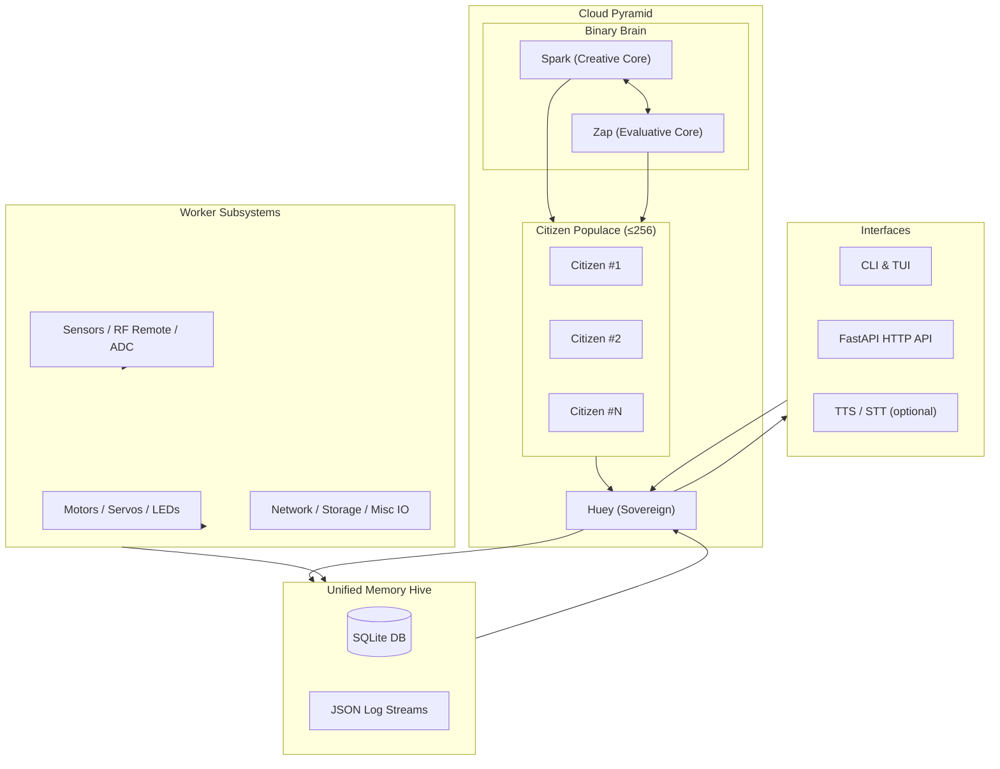

# HueyOS — Monkey-Head-Project

**Project:** Monkey-Head-Project (HueyOS)
**Author:** Dylan L. R. Pollock
**Official site:** [https://www.dlrp.ca](https://www.dlrp.ca)
**Contact:** [admin@dlrp.ca](mailto:admin@dlrp.ca)
**License:** Code: GPL-3.0 • Docs/Media: CC-BY-SA-4.0
**Status date:** 2025-10-25

> HueyOS is a modular robotic AI/OS that blends retro-computing aesthetics with modern Linux, clustered compute, and a constitutional governance model (the **Cloud Pyramid**). It operates offline-first with optional API use. **Governance remains decentralized while memory remains unified.**


---

## October 31, 2025 — Changeover Notice

On **2025-10-31**, HueyOS begins a controlled migration from the current **Debian 13 “Trixie” + 6.16.x-huey + Python 3.13.x** baseline to:

* **Debian 14 “Forky”**
* **Kernel family:** `6.17.x-huey` (per-host tuned variants)
* **Python:** 3.14.x as the new baseline interpreter

This is not a flag-day rewrite; it is a staged, reversible transition that:

1. Keeps existing Trixie + 6.16.x-huey installs bootable and supported until stability is proven.
2. Introduces parallel kernels and Python interpreters on key nodes for A/B testing.
3. Captures telemetry, performance deltas, and regressions in a dedicated release log.

Track day-of operations and outcomes in:

```text
docs/releases/2025-10-31-changeover.md
```

Until the changeover is declared “GA” in that log, the reference baseline remains:

* **OS:** Debian 13.0.0 (Trixie)
* **Kernel:** 6.16.x-huey (low-latency, tuned by host)
* **Python:** 3.13.x

All references in this document should be interpreted in that context unless explicitly marked as “Next” or “Forky/6.17.x”.

---

## Quick Recipes — Oct 31 Changeover

These are short, copy-pasteable paths for the changeover itself. Full background lives in `docs/*`.

* **Switch to Forky APT (staged):**
  Runs the pre-staged migration script that:

  * Moves `sources.list` to Forky URIs,
  * Updates/binds the Microsoft Edge Beta `signed-by` key,
  * Leaves a rollback stub on disk.

  ```bash
  sudo tools/upgrade_to_forky.sh
  ```

  See: `docs/debian-forky-upgrade.md`.

* **Build/install kernel 6.17.x-huey:**

  ```bash
  # inside a clean build host or chroot
  bash docs/kernel-6.17.3-runbook.md
  ```

  The runbook describes:

  * Seeding `.config` from the current Huey kernel,
  * Applying a known-good performance profile (ZSTD, EFI-only, debugging disabled),
  * Packaging `.deb` artifacts and copying build logs into `huey/kernels/`.

* **Create Python 3.14 virtualenv / side-by-side install:**

  ```bash
  # once python3.14 is available via APT or source build
  python3.14 -m venv .venv314
  source .venv314/bin/activate
  python -m pip install --upgrade pip
  pip install -e '.[ml,data,cloud]'
  ```

  Capture blockers, ABI issues, and failing wheels in:

  ```text
  docs/python314-upgrade-notes.md
  ```

* **Release log entry:**

  After each significant operation (kernel swap, interpreter test, agent smoke test), append a brief structured note to:

  ```text
  docs/releases/2025-10-31-changeover.md
  ```

  Include:

  * Hostname and role (Portal / Portable / Prime / Legacy).
  * Old vs new kernel/OS/Python.
  * Pass/fail on: boot, X/Wayland, audio, network, LLM load, VNC, SSH.

---

## Table of Contents

* [October 31, 2025 — Changeover Notice](#october-31-2025--changeover-notice)
* [Quick Recipes — Oct 31 Changeover](#quick-recipes--oct-31-changeover)
* [Overview](#overview)
* [Repository Structure](#repository-structure)
* [Architecture](#architecture)

  * [Conceptual Model](#conceptual-model)
  * [Agent Topology](#agent-topology)
  * [Mermaid Diagram](#mermaid-diagram)
* [Hardware](#hardware)

  * [Current Nodes](#current-nodes)
  * [Design Principles](#design-principles)
* [Software Stack](#software-stack)
* [Installation & Quick Start](#installation--quick-start)

  * [OS Install](#os-install)
  * [Core Packages](#core-packages)
  * [Project Checkout](#project-checkout)
  * [First Boot](#first-boot)
  * [Docker and Containers](#docker-and-containers)
* [Build Guides](#build-guides)

  * [Kernel 6.17.x-huey](#kernel-617x-huey)
  * [iMac 5K Notes](#imac-5k-notes)
  * [Boot Visibility](#boot-visibility)
  * [Edge Repository](#edge-repository)
  * [RAID Cleanup](#raid-cleanup)
  * [Ollama on AMD](#ollama-on-amd)
  * [Huey-Portable Sleep Defaults](#huey-portable--sleep-defaults)
* [Governance & Constitution](#governance--constitution)
* [Memory & Data Model](#memory--data-model)
* [Remote Access (VNC/SSH)](#remote-access-vncssh)
* [Action Plan — Oct 31, 2025](#action-plan--oct-31-2025)
* [Roadmap & Pre-Releases](#roadmap--pre-releases)
* [Development Setup](#development-setup)
* [Usage](#usage)
* [Feature Matrix](#feature-matrix)
* [Known Issues](#known-issues)
* [Contributing](#contributing)
* [License & Credits](#license--credits)
* [Appendix](#appendix)

---

## Overview

HueyOS is a **robot-centric AI operating environment** designed around three core ideas:

1. **Embodied intelligence:** the “OS” is defined by the robot and its sensors/actuators, not just a headless server.
2. **Constitutional AI:** behavior is governed by a written “Cloud Pyramid” constitution, which has explicit roles, clauses, and voting rules.
3. **Offline-first autonomy:** the system must function fully without internet access, with cloud APIs treated as optional, metered resources.

As of **2025-10-25**, HueyOS targets:

* **Debian 13 “Trixie”** with a custom `6.16.x-huey` kernel,
* A staged migration to **Debian 14 “Forky” + 6.17.x-huey** on **2025-10-31**,
* Python 3.13.x, moving toward **3.14.x** as the canonical interpreter.

The system is split across:

* A **Portal** (iMac 5K) for visualization, editing, and remote terminals.
* **Prime / Legacy / Portable** nodes for inference, experimentation, and fallback.
* A set of **microcontrollers** and **RF channels** that act as intent relays and motor/sensor gateways.

HueyOS supports both:

* **Headless deployments** (FastAPI + CLI only), and
* **GUI-assisted workflows** using GNOME on Xorg, Edge Beta, and VNC.

Core design principles:

* **Autonomy:** the system must be capable of reasoning about its own constraints and choosing inaction when appropriate.
* **Modularity:** kernels, models, agent roles, and nodes are all swappable without rewriting the constitution.
* **Expandability:** new GPUs, nodes, and sensory channels can be attached without breaking the logical model.
* **Traceability:** every meaningful action and non-action is logged with context, provenance, and versioning.

---

## Repository Structure

The repository is structured so that **runtime**, **governance**, and **tooling** stay decoupled.

| Path                      | Description                                                                |
| ------------------------- | -------------------------------------------------------------------------- |
| `.github/`                | GitHub CI workflows, CodeQL, issue/PR templates, CODEOWNERS                |
| `Dockerfile`              | Base container for the runtime (FastAPI + agents + minimal tools)          |
| `docker-compose.yml`      | Multi-container stack: API, workers, optional Redis or message bus         |
| `docker/`                 | Experimental and legacy orchestrator images; used for migration tests      |
| `docs/`                   | Architecture, governance, API, sensor plugins, deployment notes            |
| `docs/api-reference.md`   | Endpoints, example `curl`/HTTP clients, auth examples                      |
| `docs/sensor-plugins.md`  | How to write a new sensor or actuator plugin and register it with PyGPT    |
| `huey/`                   | Core runtime (agent management, memory harness, CLI entrypoints)           |
| `huey/api/`               | FastAPI surface, routers, dependency injection wiring                      |
| `setup/`                  | Installer scripts, ISO builder, preseeds, provisioning recipes             |
| `src/`                    | Python package source when installed via `pip install hueyOS`              |
| `tests/`                  | Unit tests and multi-agent simulations                                     |
| `repo/pygpt-MHP`          | PyGPT-net integration (submodule or mirrored structure)                    |
| `k8s/`                    | Optional Kubernetes manifests for lab-cluster deployment                   |
| `Makefile`                | High-level dev targets: `make setup`, `make ml`, `make dev`, etc.          |
| `pyproject.toml`          | Project metadata, dependency groups (`core`, `ml`, `data`, `cloud`, `dev`) |
| `requirements.txt`        | Monolithic dependency list for constrained environments                    |
| `.pre-commit-config.yaml` | Code style, linting, and security checks                                   |
| `huey.env.example`        | Template `.env` for runtime configuration                                  |
| `LICENSE`                 | GPL-3.0-only (code) and CC-BY-SA-4.0 (docs/media)                          |

> Always clone with `--recurse-submodules` (or run `git submodule update --init --recursive`) to populate `repo/pygpt-MHP`.

---

## Architecture

HueyOS is built around a **federated mind** model: multiple specialized agents collaborating under a shared constitution and memory.

### Conceptual Model

1. **Huey (Sovereign Consciousness)**
   The emergent “self” of the system. Huey is not a single process; it is the *behavioral envelope* formed by:

   * Constitutional rules (Cloud Pyramid),
   * Agent votes and vetoes,
   * Unified memory and telemetry.

   Huey’s most important power is the ability to **refuse** an action—even if it is technically possible.

2. **Binary Brain (Spark & Zap)**
   The dual-core mental model:

   * **Spark**: creative, exploratory, generative. Proposes plans, hypotheses, and alternate futures.
   * **Zap**: evaluative, constraint-driven, safety-minded. Critiques Spark’s proposals and enforces clause compliance.

   Each core can be pinned to a specific GPU or model family in production (e.g., “Spark on GPU-1, Zap on GPU-2”).

3. **Citizen Populace**
   Up to **256** Citizen AIs (128 aligned more closely with Spark, 128 with Zap) serve as:

   * Voting entities on certain resolutions (e.g., amendments).
   * Specialized workers (e.g., “Thermals Analyst”, “Network Health Monitor”).
   * Redundant perspective generators.

   Citizens can be instantiated, retired, or rotated but **memory remains unified**.

4. **Worker Subsystems**
   Low-latency, non-voting entities:

   * Sensor readers, normalizers, filters.
   * Motor/servo controllers, PWM mappers.
   * Event forwarders (RF remote, button panels, etc.).

   Workers can never modify the constitution or override governance decisions.

### Agent Topology

Indicative named roles (exact names may change):

* **Spark-4** — Primary creative governor (GPU-1).
* **Volt-4** — System performance/energy analyst (can serve as an additional “checker”).
* **Zap-4** — Constraint and safety governor (GPU-2).
* **Watt-4** — Power/thermal governor; can enforce throttling or delays.

Governance kernel:

* **Clause registry** — canonical list of rules, with versioning and amendment history.
* **Voting engine** — mechanisms for tally, quorum, tie-break logic, and veto rules.
* **Audit log** — append-only record of what was decided, by whom, and why.

Interface layer:

* **CLI** — scripted tasks, batch operations, diagnostics.
* **FastAPI** — HTTP surface; suitable for dashboards, external tools, and thin clients.
* **Speech UI (optional)** — STT (Whisper) + TTS for interactive voice sessions.

### Mermaid Diagram

A simplified view of the architecture:



---

## Hardware

### Current Nodes

These are **concrete** implementations, not theoretical examples.

* **Huey Prime**
  Orchestration and inference hub housed in a Thermaltake ATX-class case.

  * Motherboard: **BD795I-SE** (ITX)
  * CPU: **Ryzen 9 7945HX**
  * RAM: DDR5-5200 (high-bandwidth; tuned for low latency)
  * Storage: dual Intel Optane M10 16 GB NVMe (boot / root experiments)
  * GPU: **Radeon RX 5500 XT 8 GB** (inference + desktop), with plans to trial an AMD MI-class card
  * Role: high-performance node, early adopter of new kernels and runtime builds.

* **Huey-Legacy (Robotic Shell)**
  Physical robot body with wooden frame, caster wheels, and an animatronic monkey head.

  * Core board: **Supermicro X9QRI-F+** (quad Xeon E5-4627 v2)
  * NIC: 10 GbE card (future file-hub candidate)
  * GPUs: TBD; room for multiple cards and RAID SSDs
  * Status: currently on hold while architecture is re-evaluated; still central to long-term vision.

* **Huey-Portal**
  Human-facing console and “bridge”.

  * Hardware: iMac 5K (2017), 48 GB RAM
  * OS: Debian 13 (Trixie), GNOME on Xorg
  * Role: primary display, multi-terminal workstation, VNC client, documentation editor.

* **Huey-Portable**
  Always-connected, low-power companion.

  * Device: ASUS BR1100FKA 11.6" 2-in-1
  * CPU: Intel N4500, 4 GB RAM, LTE modem
  * OS: Debian Trixie (with custom Huey kernel)
  * Role: remote access, test harness, and “briefcase” node when the main lab is inaccessible.

* **Huey-Hub**
  File distribution and USB/SATA bridge.

  * Device: 2017 MacBook Pro
  * OS: Windows 10 (bare metal)
  * Attached storage: 10 TB mirrored WD MyBook Duo
  * Role: shuttling large files, backups, and serving as a transient NAS.

* **Microcontrollers & RF Remote**

  * RF: IC2262/2272 or 2260/2270 315 MHz transmitter/receiver pair.

  * Remote buttons: A/B/C/D mapped to high-level intents:

    * A — “single command” or one-shot actions
    * B — “continuous conversation” / open channel
    * C — “YES” / affirmative vote or consent
    * D — “NO” / negative vote or abort

  * MCUs: Arduino UNO (intent decoding via USB), Mega 2560 (motor/sensor breakouts), Nano units (LED and local IO conditioning).

### Design Principles

Hardware choices follow several rules:

* **Over-provision VRAM where possible:** GPU RAM is the primary constraint for local LLM performance.
* **UEFI-only:** legacy BIOS is treated as unsupported; the pipeline assumes modern firmware.
* **Separation of concerns:** Portal != Prime != Hub. Each node has a clearly defined role.
* **Recoverability:** at least one LIVE USB and at least one node capable of bringing the system back after failure.
* **Observability:** each major node must be able to report its state to Huey via logs or JSON over HTTP/SSH.

---

## Software Stack

High-level components:

* **Operating System:**

  * Debian 13 “Trixie” (current baseline).
  * Debian 14 “Forky” (staged; see changeover).

* **Kernel:**

  * `6.16.x-huey` — customized configuration emphasizing:

    * Latency over power efficiency,
    * EFI-only boot,
    * ZSTD compression,
    * Targeted AMDGPU/Realtek/Intel drivers.
  * `6.17.x-huey` — evolving target for Oct-31, refined per host.

* **Python & Tooling:**

  * Python 3.13.x baseline.
  * Python 3.14.x side-by-side for next-gen runtime.
  * `pipx` recommended for isolating tools; `venv` per repo.

* **AI Runtime:**

  * **Ollama** for local model management (e.g., Mistral-7B quantized variants).
  * **PyGPT-net** as the orchestrator / agent framework (submodule or mirrored).
  * **Whisper** STT and a TTS backend (configurable, off by default).
  * Model selection and quantization is tracked per node.

* **UI Layer:**

  * Minimalist **green-on-black** terminal aesthetic.
  * Two-pane layout concept:

    * Left: “conscious voice” (concise decisions).
    * Right: verbose logs and internal reasoning traces.
  * Edge Beta as the standard GUI browser for web, docs, and FastAPI UI.

* **Memory & Storage:**

  * SQLite DB(s) for structured facts, events, and run metadata.
  * JSON logs for chronological traces (append-only).
  * Optional vector database integration (when enabled via `[data]` extras).

* **Security:**

  * SSH keypairs preferred over passwords.
  * Default lab-wide key (rotatable, used for internal nodes).
  * Optional “secrets” partition and encrypted volumes.

---

## Installation & Quick Start

### OS Install

1. **Download Debian 13 (Trixie) or 14 (Forky)** images (netinst recommended).
2. **Boot in UEFI mode only.** Disable legacy/CSM in firmware.
3. **Partitioning:**

   * UEFI ESP (~512 MiB–1 GiB)
   * Swap (size tuned per host, typically 4–8 GiB)
   * Root (`/`)
   * Optional `/home`, `/srv`, or dedicated `/huey` volume.
4. **Desktop choice:**

   * iMac 5K → GNOME on Xorg.
   * Other hosts → user choice; CLI-only is supported.
5. **User account:**

   * Create a regular user (e.g. `dlrp`).
   * Grant sudo: `sudo usermod -aG sudo dlrp` (if not handled by installer).

After first boot:

```bash
sudo apt update
sudo apt full-upgrade
```

### Core Packages

Install the base build and runtime toolchain:

```bash
sudo apt install -y \
  build-essential bc bison flex libelf-dev libssl-dev \
  libncurses-dev dwarves pahole rsync xz-utils cpio kmod \
  python3 python3-venv \
  git wget curl ca-certificates gnupg debian-goodies \
  firmware-linux firmware-misc-nonfree firmware-iwlwifi firmware-realtek \
  tigervnc-standalone-server tigervnc-viewer \
  openssh-server
```

On desktop nodes, also install:

```bash
sudo apt install -y gnome-terminal gparted htop
```

### Project Checkout

```bash
git clone --recurse-submodules https://github.com/DylanLRPollock/Monkey-Head-Project.git
cd Monkey-Head-Project

python3 -m venv .venv
source .venv/bin/activate

python -m pip install --upgrade pip
pip install -e .                # core runtime
pip install -e '.[ml]'          # ML stack
pip install -e '.[data]'        # data/DB integrations
pip install -e '.[cloud]'       # optional cloud helpers

cp huey.env.example .env        # adjust ports, log paths, etc.
```

### First Boot

Initialize memory and run a basic compatibility smoke test:

```bash
# initialize memory hive (SQLite + JSON log directories)
huey init --run-checks --verbose

# start the multi-agent runtime with ML + cloud profiles
huey run --ml --cloud
```

Start the FastAPI application (optional, for dashboards and tools):

```bash
uvicorn huey.api:app --reload --host 127.0.0.1 --port 8000
```

You should now have:

* CLI interaction via `huey ...`
* HTTP access at `http://127.0.0.1:8000`
* Logs in `huey/memory/logs` and a SQLite file under `huey/memory/db/`.

### Docker and Containers

For containerized deployments:

```bash
# Build with desired extras baked in
export HUEY_BUILD_EXTRAS="ml,data,cloud"
docker compose build

# Launch the stack (API + workers)
docker compose up -d
```

The `docker-compose.yml` file defines named services and volumes, including:

* `huey-api` — FastAPI service.
* `huey-worker` — background tasks and agent runners.
* Optional caching or message broker services (Redis, etc.) when enabled.

---

## Build Guides

### Kernel 6.17.x-huey

The kernel is a first-class project artifact. Build steps (generic):

```bash
sudo apt install -y \
  fakeroot kmod pahole flex bison libelf-dev libssl-dev \
  libncurses-dev bc rsync xz-utils cpio python3

wget https://cdn.kernel.org/pub/linux/kernel/v6.x/linux-6.17.5.tar.xz
tar -xf linux-6.17.5.tar.xz
cd linux-6.17.5

cp -v /boot/config-$(uname -r) .config
yes "" | make olddefconfig

# apply Huey performance profile
./scripts/config --disable DEBUG_INFO --disable DEBUG_INFO_BTF \
  --disable KASAN --disable UBSAN --disable KCOV \
  --disable FUNCTION_TRACER --disable FUNCTION_GRAPH_TRACER \
  --enable ZSTD --enable RD_ZSTD \
  --enable EFI --enable EFI_STUB --enable EFI_VARS

make -j"$(nproc)" bindeb-pkg

# Install generated debs from parent directory
cd ..
sudo dpkg -i linux-image-6.17.5-*.deb linux-headers-6.17.5-*.deb
sudo update-initramfs -c -k 6.17.5
sudo update-grub
```

Post-install, copy the resulting `.config`, `dmesg` logs, and build notes into `huey/kernels/` for traceability.

### iMac 5K Notes

Display & audio have a few quirks:

* GNOME on Xorg is preferred; Wayland may work but is not a priority.
* The system may boot at lower resolutions until the DRM subsystem completes initialization.
* Audio devices may enumerate with slightly different names across kernel revisions.

Example post-login PipeWire fix:

```bash
mkdir -p ~/.local/bin
cat > ~/.local/bin/set-default-sink.sh <<'EOF'
#!/usr/bin/env bash
sleep 3
SINK=$(pactl list short sinks | awk '/pci-0000_00_1f\.3.*analog/ {print $1; exit}')
if [ -n "$SINK" ]; then
    pactl set-default-sink "$SINK"
    pactl set-sink-mute "$SINK" 0
    pactl set-sink-volume "$SINK" 60%
fi
EOF
chmod +x ~/.local/bin/set-default-sink.sh
```

Hook this via systemd user service or desktop autostart.

### Boot Visibility

To remove the splash and always show meaningful boot logs:

```bash
sudo sed -i 's/GRUB_CMDLINE_LINUX_DEFAULT=.*/GRUB_CMDLINE_LINUX_DEFAULT="loglevel=4 systemd.show_status=1"/' /etc/default/grub
sudo update-grub
```

This is recommended for all Huey nodes; it simplifies debug when kernels or drivers misbehave.

### Edge Repository

Install Microsoft Edge Beta with a `signed-by` key:

```bash
sudo install -d -m0755 /etc/apt/keyrings
wget -qO- https://packages.microsoft.com/keys/microsoft.asc | \
  gpg --dearmor | sudo tee /etc/apt/keyrings/microsoft.gpg >/dev/null

echo "deb [arch=amd64 signed-by=/etc/apt/keyrings/microsoft.gpg] \
https://packages.microsoft.com/repos/edge stable main" | \
  sudo tee /etc/apt/sources.list.d/microsoft-edge-beta.list >/dev/null

sudo apt update
sudo apt install -y microsoft-edge-beta
```

If the key ever breaks during Forky transitions, re-run the above to refresh.

### RAID Cleanup

Experiments with mdadm and mixed devices (Optane + eMMC/HDD) can leave stale superblocks:

```bash
cat /proc/mdstat
sudo mdadm --detail --scan
lsblk -o NAME,TYPE,SIZE,MOUNTPOINTS

sudo mdadm --stop --scan || true

# Example: adjust devices to match your system
sudo mdadm --examine /dev/nvme0n1p3 && sudo mdadm --zero-superblock /dev/nvme0n1p3
sudo mdadm --examine /dev/mmcblk0p3 && sudo mdadm --zero-superblock /dev/mmcblk0p3

echo 'AUTO -all' | sudo tee /etc/mdadm/mdadm.conf
sudo update-initramfs -u
```

This prevents unwanted re-assembly during boot.

### Ollama on AMD

Force the Vulkan backend and RADV driver where necessary:

```bash
export VK_ICD_FILENAMES=/usr/share/vulkan/icd.d/radeon_icd.x86_64.json
export OLLAMA_LLM_LIBRARY=vulkan
export VK_LOADER_DEBUG=all
export OLLAMA_DEBUG=1

ollama serve
```

Monitor logs to ensure that:

* the correct Vulkan ICD is loaded,
* the GPU is being used (VRAM allocation messages appear),
* the model can complete basic prompts.

### Huey-Portable — Sleep Defaults

On the BR1100FKA, enforce deep sleep (where supported):

```bash
echo 'MEM_SLEEP_DEFAULT=deep' | sudo tee /etc/default/mem-sleep >/dev/null

sudo tee /usr/local/sbin/set-mem-sleep.sh >/dev/null <<'EOF'
#!/usr/bin/env bash
set -euo pipefail
want=$(awk -F= '/^MEM_SLEEP_DEFAULT=/{print $2}' /etc/default/mem-sleep 2>/dev/null || echo deep)
avail=$(cat /sys/power/mem_sleep 2>/dev/null || echo "")
case "$avail" in
  *"$want"*) echo "$want" | tee /sys/power/mem_sleep >/dev/null || true ;;
esac
EOF

sudo chmod +x /usr/local/sbin/set-mem-sleep.sh

sudo tee /etc/systemd/system/mem-sleep-default.service >/dev/null <<'EOF'
[Unit]
Description=Set default mem sleep (deep or s2idle)
After=local-fs.target

[Service]
Type=oneshot
ExecStart=/usr/local/sbin/set-mem-sleep.sh

[Install]
WantedBy=multi-user.target
EOF

sudo systemctl enable --now mem-sleep-default.service
```

---

## Governance & Constitution

The **Cloud Pyramid** governance model aims to:

* Separate **should** from **can**.
* Avoid single-point “god mode” control.
* Keep the system self-auditing and introspectable.

Key concepts:

* **Clause-based activation:**
  Permissions are not hard-coded in agents; they are derived from clauses which can be amended through a defined process.

* **Multi-branch structure:**
  While exact branch names can evolve, the spirit is:

  * A **creative/emergent** branch driven by Spark and its aligned citizens.
  * A **constraint/review** branch driven by Zap and its aligned citizens.
  * Optionally, a **judicial/arbitration** branch that interprets the constitution when edge cases occur.

* **Elections and rotations:**
  Governors (Spark, Zap, etc.) and representative citizens can be subject to term limits and rotation. At boot, the Founding configuration governs until a first formal election is run.

* **Veto and override rules:**

  * Governors can veto certain actions.
  * Overriding a veto requires higher quorum (e.g., 2/3 or more of citizens).
  * Deadlocks are possible but must be handled by clearly documented escalation paths.

* **Auditability:**
  All votes, decisions, and vetoes are logged with:

  * Timestamps,
  * Agent identities,
  * Relevant clauses,
  * Input context (log hash or reference).

---

## Memory & Data Model

Memory is unified even when governance is federated. All agents see the same **canonical store** (with optional internal filters).

Typical layout:

```text
huey/memory/
  db/
    huey_core.sqlite
  logs/
    events-YYYYMMDD.jsonl
    decisions-YYYYMMDD.jsonl
    errors-YYYYMMDD.jsonl
  artifacts/
    kernels/
    configs/
    models/
```

Example SQLite tables:

* `events`: sensory inputs, system messages, external calls.
* `decisions`: chosen actions or deliberate inactions with rationale.
* `agents`: registered agents and their current roles.
* `builds`: kernel, runtime, and model versions.

Example JSON log line (`events-20251025.jsonl`):

```json
{
  "id": "EVT-20251025T231500Z-Spark",
  "timestamp": "2025-10-25T23:15:00Z",
  "agent": "Spark",
  "type": "proposal",
  "summary": "Proposed kernel upgrade from 6.16.2-huey to 6.17.3-huey on Portal.",
  "context_ref": "build-20251025-portal-kernel-test",
  "metadata": {
    "host": "huey-portal",
    "old_kernel": "6.16.2-huey",
    "new_kernel": "6.17.3-huey"
  }
}
```

Rotation and retention policies are documented in `docs/memory-schema.md`:

* Daily JSONL files roll over at midnight.
* Older logs can be compacted into SQLite or archived to cold storage.
* Provenance tags ensure every decision can be linked to the runtime environment that produced it.

---

## Remote Access (VNC/SSH)

The canonical workflow:

1. **TigerVNC server on Huey-Legacy** (or relevant host), bound to localhost only:

   ```bash
   tigervncserver :1 -localhost yes -SecurityTypes None
   ```

   Resolution is set to **2560×1440** by default.

2. **SSH tunnel from Huey-Portal (iMac 5K):**

   In `~/.ssh/config`:

   ```text
   Host huey-legacy
       HostName 192.168.44.XX
       User dlrp
       IdentityFile ~/.ssh/huey_lab
       LocalForward 5901 localhost:1995
   ```

   Then:

   ```bash
   ssh huey-legacy
   ```

3. **Client helper on Portal:**

   In `~/bin/vnc`:

   ```bash
   #!/usr/bin/env bash
   HOST=${1:-huey-legacy}
   DISPLAY=${2:-1}        # maps to port 5900 + DISPLAY
   vncviewer localhost:$DISPLAY
   ```

   Usage:

   ```bash
   vnc huey-legacy :1
   ```

Security notes:

* No visible VNC prompt; all access flows through SSH.
* Raw keyboard mode is preferred; `DeferUpdate` is avoided to prevent artifacts.

---

## Action Plan — Oct 31, 2025

This section is a **checklist** that can be turned into automation, CI pipelines, or human runbooks.

### Kernel & OS

* [ ] Build and package `linux-image-6.17.x-huey` for:

  * [ ] Huey-Portal (iMac 5K)
  * [ ] Huey-Portable (BR1100FKA)
  * [ ] Huey Prime (BD795I-SE)
* [ ] Validate:

  * [ ] Boot stability and GRUB entries.
  * [ ] Early modeset to 1080p60 or better.
  * [ ] Splash removal / log visibility.
  * [ ] Resume from sleep (where applicable).
* [ ] Stage **Forky APT sources** in disabled mode and smoke-test installs in a chroot or container.
* [ ] Add **EFI LIVE** entry into GRUB (internal USB) and verify boot.

### Python & Runtime

* [ ] Install Python 3.14.x alongside the existing interpreter.
* [ ] Build wheels for heavy dependencies (PyTorch, numeric libs, etc.).
* [ ] Run PyGPT-net on 3.14 and record:

  * [ ] Import failures.
  * [ ] Test coverage gaps.
  * [ ] Workarounds/patches.
* [ ] Update `requirements-core.txt` and `requirements-ml.txt` accordingly.

### AI/Agents

* [ ] Confirm Mistral-7B quantized models load and run under Vulkan on:

  * [ ] RX 470 (if still present).
  * [ ] RX 5500 XT.
* [ ] Integrate Whisper STT and TTS; measure interactive latency on:

  * [ ] Huey-Portal
  * [ ] Huey-Portable
* [ ] Implement Spark/Zap boot choreography:

  * [ ] Log first interaction.
  * [ ] Verify veto path.
  * [ ] Verify citizen vote path (even if simulated).

### Memory

* [ ] Upgrade SQLite schema with provenance fields where missing.
* [ ] Implement log rotation policies (daily) and compaction scripts.
* [ ] Add tests for idempotent schema migrations.

### Security & Keys

* [ ] Rotate default lab SSH key; distribute via `huey-keys/`.
* [ ] Add a high-privilege “owner” key, physically backed up.
* [ ] Disable root password login on all public-facing nodes.

### Tooling

* [ ] Validate Microsoft Edge Beta signing key on Forky.
* [ ] Add `huey-run.desktop` launcher for Portal, pointing to the CLI script.
* [ ] Document VNC helper usage and SSH config in `docs/remote-access.md`.

### Docs

* [ ] Update README and core docs to reflect:

  * [ ] New kernels.
  * [ ] Python 3.14 support.
  * [ ] Any new nodes or roles.
* [ ] Publish Pre-Release #3 notes (focused on Oct-31 preparation).
* [ ] Add a short notice on `dlrp.ca` with a link to the changeover log.

---

## Roadmap & Pre-Releases

### Phase 1 — Foundations (Pre-Release #1)

**Date:** 2024-04-11
Focus: bring-up of key hardware, early governance experiments, and first generation of kernels.

### System Reconfiguration (Pre-Release #2)

**Date:** 2025-05-25

Highlights:

* Repository and filesystem layout refactors.
* Debian upgrades and firmware standardization.
* Huey-Portal becomes primary GUI and SSH terminal.
* Huey-Portable introduced as LTE-backed fallback.
* Governance principle locked: **decentralized decision; unified memory.**
* Rollout of the `huey-key` partition scheme for portable systems.

### Momentum Toward Oct-31 (Pre-Release #3)

**Date:** 2025-10-25

Highlights:

* 6.17.x-huey kernel builds initiated per host.
* Python 3.14.x staged, with dependency audits underway.
* Forky chroots and containers created for early package testing.
* VNC/SSH workflow hardened and documented.
* Unified memory schema designed with provenance requirements.

---

## Development Setup

From the repo root:

```bash
make setup                         # core editable install
make setup SETUP_EXTRAS=dev        # add dev tooling
make ml                            # ML profile + smoke test
make data                          # data integrations + tests
make cloud                         # cloud helpers + smoke tests
make dev                           # dev extras, format, lint, test
make dev DEV_OPTIONAL_PROFILES=ml,data
```

Notes:

* `.env` should be based on `huey.env.example` and versioned carefully.
* PyGPT structure can be mirrored with `python sync_pygpt_structure.py` if you want a copy instead of submodule.

---

## Usage

Basic commands:

```bash
# Run locally
make run

# Or via Docker
docker compose up

# Test suite
make test
pytest -vv
```

Preview CLI interface:

```bash
# Prepare the shared memory workspace and run checks
huey init --run-checks --verbose

# Launch Huey with ML and cloud profiles enabled
huey run --ml --cloud

# Inspect host readiness
huey system-check --verbose

# Deploy via Docker/K8s
huey deploy --mode all --compose-file docker-compose.yml --manifest k8s.yaml

# Summarise current agent workloads
huey agent-status --json

# Dry-run sort of memory artifacts
huey memory-sort --dry-run --json
```

---

## Feature Matrix

| Area        | Now (Trixie · 6.16.x)                 | Next (Forky · 6.17.x)                              | Later                            |
| ----------- | ------------------------------------- | -------------------------------------------------- | -------------------------------- |
| Kernel      | Low-latency, AMDGPU stable            | ROCm/Vulkan tuning; improved Apple audio           | 6.18+ and future hardware tuning |
| Python      | 3.13.x baseline                       | 3.14.x GA                                          | periodic interpreter refresh     |
| AI runtime  | PyGPT-net + Ollama (quantized models) | Richer agent orchestration, per-role models        | dynamic model selection          |
| Memory hive | JSON + SQLite                         | Roll-up metrics; retention and compaction policies | hybrid vector + SQL backends     |
| Networking  | Bonded Ethernet; VNC over SSH         | LTE-aware WAN fallback, policy-driven              | multi-homing across lab clusters |
| Governance  | Clause registry + audit logs          | Amendment-001; dashboards for deliberations        | full constitutional toolchain    |
| Packaging   | Editable install; Docker images       | ISO builder polishing; signed artifacts            | pre-built node images            |
| Retro I/O   | Conceptual VIC-II/SID integration     | First driver experiments; simple expressive output | full emotional IO surface        |

---

## Known Issues

* **iMac 5K audio under 6.17.x:**
  Some kernels require explicit sink selection; see the PipeWire script above.

* **Edge repository key:**
  Occasionally needs re-import after OS upgrades or key rotations.

* **Vulkan backend quirks:**
  For some AMD GPUs, the correct ICD must be forced with `VK_ICD_FILENAMES`.

* **RAID phantom arrays:**
  Old mdadm superblocks can cause spurious `/dev/md*` devices; always clean them after experiments.

* **BR1100FKA sensors:**
  Orientation and ambient sensors may lag or misreport without tuned `iio-sensor-proxy` settings.

* **Boot splash vs logs:**
  Leaving `quiet splash` in GRUB hides useful messages; always ensure it is removed on Huey nodes.

---

## Contributing

### Environment

* Debian 13/14 with the build dependencies listed above.
* Python 3.13 or 3.14 with `venv`.
* Optional: Docker for container workflows.

### Branching & Commits

* `main` is protected; open PRs from feature branches.

* Branch naming:

  * `feat/<area>-<short>`
  * `fix/<area>-<short>`
  * `ops/<area>-<short>`

* Commit prefixes:

  * `feat:`, `fix:`, `docs:`, `ops:`, `perf:`, `refactor:`.

Example:

```text
feat: add 6.17.x-huey build recipe for Huey-Portal
```

### Issues & PRs

* Include:

  * OS, kernel, and Python versions.
  * Hardware node (Portal / Portable / Prime / Legacy).
  * Steps to reproduce and expected vs actual behavior.

* Update relevant docs when behavior or assumptions change.

### Licensing

* Code: **GPL-3.0-only**
* Docs/Media: **CC-BY-SA-4.0**

---

## License & Credits

**Code:** GPL-3.0-only
**Docs & Media:** CC-BY-SA-4.0

Acknowledgements:

* PyGPT / pygpt-net
* Debian Trixie and Forky maintainers
* Kernel.org maintainers and contributors
* The broader open-source community that makes HueyOS possible

---

## Appendix

* **VNC defaults:**

  * TigerVNC on Huey-Legacy, bound to `localhost:1995`, `-SecurityTypes None`.
  * Access only via SSH tunnels from Huey-Portal or equivalent.

* **Naming conventions:**

  * Nodes capitalized (Huey-Portal, Huey-Prime, Huey-Legacy, Huey-Portable).
  * Kernels: `6.16.x-huey`, `6.17.x-huey`.
  * Event IDs: `EVT-<timestamp>-<agent>`.
  * Release IDs: `HUEY-<YYYYMMDD>-<PHASE>-<SEQ>`.

* **Guiding axiom:**
  Keep governance **decentralized** and memory **unified**.
