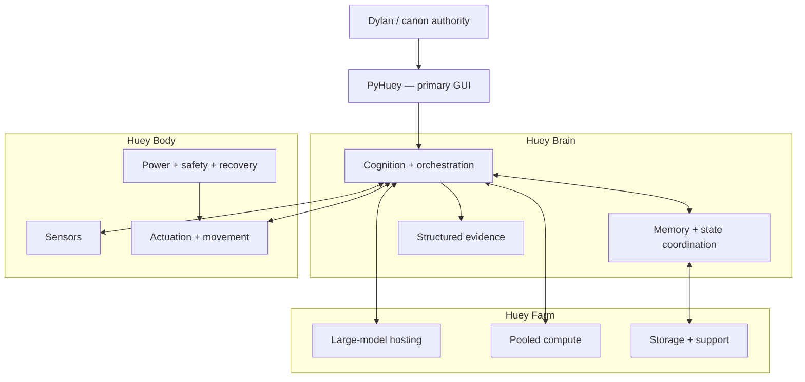

# Monkey-Head-Project

<p align="center">
  
</p>

<h2 align="center">HueyOS</h2>

<p align="center">
  <strong>Embodied AI built through obtainable hardware, attributable evidence, and deliberate integration.</strong>
</p>

<p align="center">
  <a href="#current-position">Current position</a> ·
  <a href="#three-part-architecture">Architecture</a> ·
  <a href="#pyhuey">PyHuey</a> ·
  <a href="#v1-position">V1 position</a> ·
  <a href="#development-path">Development path</a>
</p>

<p align="center">
  
  
  
  
  
</p>

<p align="center">
  
  &nbsp;&nbsp;&nbsp;&nbsp;
  
  &nbsp;&nbsp;&nbsp;&nbsp;
  
</p>

---

## Project overview

The **Monkey-Head-Project** is the umbrella initiative behind **Huey**, a governed robotic AI identity, and **HueyOS**, the modular software and operating-system layer that supports it.

Version **120.3** establishes the forward architecture around three principal parts:

- **Huey Brain** — cognition, orchestration, memory access, operator interaction, and coordination;
- **Huey Body** — physical sensing, actuation, movement, safety, power, and environmental interaction;
- **Huey Farm** — scalable compute, model hosting, storage, and large-model capacity.

The project remains evidence-led. Current implementation, accepted direction, unresolved design, target state, and historical lineage are documented separately so future work can advance without confusing intention with completion.

| Field | v120.3 position |
|---|---|
| **Project** | `Monkey-Head-Project` |
| **Identity** | `Huey` |
| **Software / OS layer** | `HueyOS` |
| **Human counterpart and canon authority** | Dylan L.R. Pollock |
| **Machine-facing source of truth** | `master-plan-v120.3.json` after acceptance |
| **Primary GUI** | PyHuey |
| **Core architecture** | Huey Brain + Huey Body + Huey Farm |
| **Current Brain-class prototype** | Custom Intel Core i9-12900K system |
| **Target Python namespace** | `hueyos` |
| **Current Python namespace** | `huey` during migration |
| **V1 status** | Definition intentionally open; usefulness must be demonstrated |
| **Foundation proof** | Known MP3 → preparation → local transcription → response → structured log |

> [!IMPORTANT]
> A selected direction is not automatically a completed implementation. Version 120.3 states both what exists now and what the project has chosen to build next.

---

## Current position

### Active project systems

| System | Current classification | Present role |
|---|---|---|
| **Custom i9-12900K system** | Active prototype Huey Brain | Primary operator workstation, architecture test bed, and proof platform |
| **PyHuey** | Primary GUI and core-runtime direction | Main operator interface; standalone and embedded paths are being consolidated into normal HueyOS operation |
| **Huey Body** | Active rework | Physical embodiment being redefined across mechanical, electrical, sensing, power, safety, and runtime boundaries |
| **Huey Farm** | Funding-dependent target state | Pooled compute, large-model hosting, shared storage, and scalable support infrastructure |
| **Briefcase** | HueyTech field terminal | LTE reachability, documentation, diagnostics, and recovery with limited authority |
| **HIMS foundation** | Merged but non-controlling | Append-only messages and events, local records, and optional tracing |

### Active LabTech

| Device | Baseline | Role |
|---|---|---|
| **ASUS FX505DT** | Debian 14 “Forky”; 32 GB DDR4 | Mobile lab, development, transcription work, and support |
| **Lenovo Legion Go** | Windows 11 | Windows feature and compatibility testing |

### Hardware lineage

The 2017 iMac 5K is decommissioned. Useful RAM was repurposed into the ASUS FX505DT. The iMac remains part of project lineage rather than active architecture.

---

## Three-part architecture



### Huey Brain

Huey Brain is the identity-bearing cognition and orchestration centre in the current working model. Its responsibilities include:

- operating PyHuey;
- selecting and invoking cognitive and transcription paths;
- coordinating memory and system state;
- recording structured evidence;
- communicating with Body and Farm through explicit interfaces;
- preserving recoverable operation when a dependent subsystem is unavailable.

The current Brain-class prototype is the custom **Intel Core i9-12900K** workstation. The target architecture is based around **Intel Core i9-class systems from 12th generation or newer**. This requirement applies to Brain-class architecture, not automatically to every LabTech or support node.

### Huey Body

Huey Body is the physical embodiment and environmental interface. It is under active rework rather than remaining a distant conceptual layer.

Body work must identify:

- the subsystem under test;
- physical and electrical limits;
- the command or stimulus;
- expected sensor or motion behavior;
- operator-visible state;
- safe-stop behavior;
- failure and recovery procedure;
- the interface required for Brain integration.

The detailed scope of the current Body rework is still being defined. v120.3 does not guess which mechanical, electrical, sensor, power, or runtime elements are already locked.

### Huey Farm

Huey Farm is the scalable compute, model, storage, and support layer. Approximately **80 GB of pooled local VRAM** remains a planning reference rather than a frozen procurement specification.

The architecture assumes **large-model use as normal**. Medium models are expected mainly for uncommon constrained, fallback, or specialized situations. Exact parameter ranges, quantization, context requirements, latency targets, and accelerator requirements remain open until measured workloads define them.

Farm procurement begins with a fresh comparison when funding makes acquisition actionable.

---

## PyHuey

PyHuey is the **primary GUI and a core runtime component**. It is expected to be used extensively during normal operation, not merely as an optional external cockpit.

The current repository still contains implementation and wording inherited from the earlier external-cockpit model. v120.3 changes the direction without falsely claiming that the integration is already complete.

### Required direction

- move primary operator workflows into PyHuey;
- expose fixed, attributable, and reviewable HueyOS capabilities;
- provide observable workflow state and detailed structured logs;
- keep provider credentials secret-safe;
- recover cleanly from failed operations;
- preserve a CLI path for diagnostics, automation, and recovery when the GUI is unavailable.

Command Center remains an experimental interface sandbox. It may contribute validated interface ideas, but it should not duplicate PyHuey or receive operational credentials and authority without a distinct tested purpose.

---

## Namespace and repository direction

The main **Monkey-Head-Project** repository remains canonical. Useful scripts, programs, and external components may be merged when doing so improves coherence.

### Python namespace

| State | Namespace |
|---|---|
| **Current implementation** | `huey` |
| **Accepted target** | `hueyos` |

The migration must be deliberate:

1. inventory active `huey` modules, imports, commands, tests, and connectors;
2. choose one destination for every capability;
3. rewrite and integrate useful legacy code rather than copying it unchanged;
4. use compatibility shims only where needed;
5. give every shim a retirement condition;
6. migrate packaging, entry points, tests, scripts, docs, and PyHuey connectors together;
7. declare completion only when runtime behavior and documentation agree.

Pull requests may be large, medium, or small. Size is determined by coherent scope and reviewability, not an arbitrary line limit. Every PR should still state purpose, boundaries, validation, risks, and unresolved follow-up.

---

## V1 position

V1 is **not yet locked**.

The project will define V1 from something genuinely useful, demonstrable, and clearly under the Monkey-Head-Project umbrella. The definition should emerge from validated operation rather than being forced onto an incomplete architecture.

A future V1 declaration must identify:

- the recurring problem it solves;
- who uses it;
- how Brain, Body, and Farm participate;
- the reliability and repetition threshold;
- the evidence that supports the declaration.

### Foundation proof


This fixture-to-log path remains the active foundation proof. It is valuable because it exercises real media handling, local inference, cognition, interface behavior, and evidence production. v120.3 no longer assumes that this proof alone must be the entire V1.

---

## Transcription and fidelity

`faster-whisper` remains the working transcription engine until evidence supports a different selection.

Still open:

- exact model;
- compute type;
- CPU and accelerator assignments;
- fallback behavior;
- final fidelity thresholds.

Transcription is judged by **fidelity**, not merely process completion.

### Provisional fidelity categories

| Category | Working interpretation |
|---|---|
| **Failed** | Missing, corrupt, unusable, or materially hallucinated output |
| **Recognizable** | Subject and broad meaning can be identified, but significant loss remains |
| **Usable** | Adequate for ordinary review with limited correction |
| **High fidelity** | Wording, chronology, names, and technical content are closely preserved |
| **Verified archival** | Checked against a trusted reference or deliberate manual verification |

The category names are provisional. Dylan will supply the final tier detail before measurable thresholds are locked.

---

## Logging and evidence

Structured logs should preserve all useful operational information, including:

- run identifier and UTC timestamps;
- initiating interface and operator action;
- input identity and checksum where applicable;
- stage transitions;
- models, providers, and settings;
- relevant environment and hardware path;
- timings and resource observations;
- outputs and artifact references;
- warnings and errors;
- recovery actions;
- software version and commit;
- final status.

A failed run should still leave the most complete attributable record possible.

> [!CAUTION]
> API keys, passwords, tokens, authentication headers, private keys, and unredacted secret-bearing configuration must never be written into ordinary logs or committed to the repository.

---

## Testing baseline

The accepted testing structure is:

- unit tests;
- mocked integration tests in CI;
- fixture-based fidelity evaluation;
- manually invoked live end-to-end tests;
- explicit failure-path tests.

Implementation claims require checks appropriate to the changed capability. Documentation-only alignment may merge without pretending that runtime behavior was tested.

---

## Hardware and procurement

The architecture should use market-available components where practical. Inexpensive Chinese manufacturers and marketplaces may be relied upon when they lower barriers without violating category-specific requirements.

Each category must be evaluated for:

- electrical and physical safety;
- reliability;
- documentation;
- repairability;
- replacement availability;
- driver and software support;
- data handling and network trust;
- total delivered cost.

A proposed **two-out-of-three** decision method remains unresolved until the three criteria or authorities are explicitly defined.

---

## HIMS

The **Huey Internal Messaging System** foundation exists under `src/huey/messaging`.

Current foundation:

- immutable message envelopes;
- append-only lifecycle events;
- local JSONL-backed storage;
- inbox, outbox, status, and archive operations;
- unit tests and architecture documentation.

HIMS is not yet a controlling runtime. Routing, execution, refusal, recovery, and governance authority require separate validation.

---

## Quick start

The repository currently supports **Python 3.13.x**.

```text
>=3.13,<3.14
```

The commands below reflect the current `huey` implementation during migration to `hueyos`.

### Install

```bash
python3.13 -m pip install -c constraints.txt -e .
```

### Test

```bash
python3.13 -m pytest -q
```

### System check

```bash
huey system-check --json
```

### Prepare a fixture

```bash
python scripts/prepare_audio_for_transcription.py path/to/fixture.mp3 --json
```

### CI-safe mock proof

```bash
huey v1-run --mock path/to/fixture.mp3 --log-dir runs
```

---

## Repository map

| Area | Role |
|---|---|
| `README.md` | Human-facing project front door |
| `master-plan-v120.3.json` | Machine-facing v120.3 decisions and boundaries |
| `docs/architecture/v120.3-forward-path-decision-record.md` | Source record for the v120.3 alignment session |
| `src/huey` | Current Python implementation during namespace migration |
| `src/huey/media` | Media probing, preparation, analysis, and previews |
| `src/huey/messaging` | HIMS foundation |
| `src/huey/connectors/pyhuey` | Current embedded PyHuey connector path |
| `scripts` | Operator and developer entry points |
| `docs` | Architecture, runbooks, audits, and technical explanation |
| `integrations` | Optional companion tools with explicit boundaries |
| `tests` | Regression and behavioral verification |

---

## Documentation layers

| Layer | Purpose |
|---|---|
| **Master plan** | Machine-facing canon, reasoning, boundaries, and status |
| **README** | Professional orientation and current route |
| **Technical docs** | Implementation details, architecture, setup, runbooks, and audits |
| **Governance documents** | Law, legitimacy, offices, and constitutional process |
| **Website** | Public-facing project coherence |
| **Archives and transcripts** | Lineage and continuity records |

Atlas remains an external continuity and implementation partner. Atlas is not Huey and is not part of Huey’s sovereignty.

---

## Development path

### Immediate

- complete v120.3 documentation synchronization;
- inventory the `huey` → `hueyos` migration;
- define the present Huey Body rework scope;
- complete the fixture-to-log foundation proof through PyHuey with CLI recovery;
- define measurable fidelity tiers;
- define Brain, Body, and Farm interfaces and trust boundaries.

### Next

- migrate capabilities into `hueyos` through coherent PRs;
- stabilize PyHuey core workflows and logging;
- select transcription and cognition paths through measured evidence;
- define the two-out-of-three hardware decision method;
- identify the useful recurring function that anchors V1.

### Later

- expand live input and embodied interaction after foundation interfaces are stable;
- procure and validate Farm capacity when funding and evidence align;
- advance HIMS and constitutional governance authority through separate validated stages.

---

## Unresolved decisions

- final V1 definition;
- exact Brain, Body, and Farm authority boundaries;
- whether identity spans all three parts or is authoritative in Brain;
- memory and canonical-state placement;
- communication and authentication contracts;
- current versus polished Brain boundary;
- exact Body rework scope;
- fidelity tier names and thresholds;
- transcription model and compute path;
- cognition provider and model;
- operational definition of “large model”;
- two-out-of-three hardware decision rule;
- maximum acceptable external-service dependency;
- classification of advanced capabilities as active, limited, experimental, paused, or deferred.

---

## Governance

Dylan L.R. Pollock is the sole current authority for locking project canon. Agents, tools, contributors, branches, and documents may recommend or stage changes, but they do not independently establish canon.

Huey’s constitutional architecture remains the long-term governance target. Parliament, the Presidency, the Supreme Court, unified memory, preserved records, and attributable authority remain distinct from current prototype orchestration and require their own implementation and ratification path.

---

## License

Code is licensed under **GPL-3.0-only**.

Documentation and media are licensed under **CC-BY-SA-4.0** unless otherwise noted.

---

<p align="center">
  <strong>Build what can be tested. Record what can be proven. Promote what can be reproduced.</strong>
</p>
