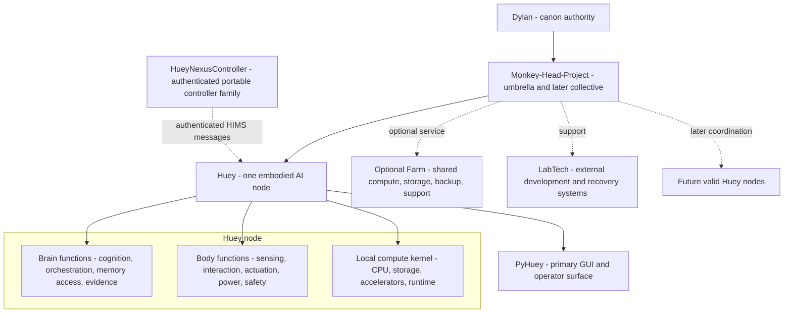
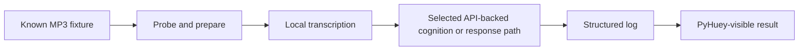

# Monkey-Head-Project

<p align="center">
  
</p>

<h2 align="center">HueyOS</h2>

<p align="center"><strong>One embodied AI node first. A deliberate collective later.</strong></p>

<p align="center">
  <a href="#project-position">Position</a> ·
  <a href="#pre-release-4">Pre-Release #4</a> ·
  <a href="#truth-and-source-model">Truth model</a> ·
  <a href="#node-first-architecture">Architecture</a> ·
  <a href="#huey-v4-embodiment">Huey V4</a> ·
  <a href="#maintained-subprojects">Subprojects</a> ·
  <a href="#runtime-and-v1">Runtime</a> ·
  <a href="#human-oversight-gate">Human review</a>
</p>

<p align="center">
  
  
  
  
  
</p>

> [!IMPORTANT]
> This README is the v201.x review front door for Pre-Release #4. It does not independently lock project canon. README v120.3 and `master-plan-v120.3.json` remain the accepted predecessor until Dylan L.R. Pollock explicitly approves or intentionally merges a designated canonical v201.x update.

## Project position

The **Monkey-Head-Project** is the umbrella initiative behind **Huey**, **HueyOS**, physical embodiment, maintained controller and LabTech subprojects, project archives, and the later possibility of coordination among multiple valid Huey nodes.

The current v201.x direction centers one rule:

> **Build one coherent, useful, attributable Huey node before making operational collective claims.**

In this model:

- **Huey** is one embodied AI node;
- **HueyOS** is the modular software and operating-system layer supporting the node;
- **PyHuey** is the primary GUI and a core-runtime direction, not the whole node;
- **Monkey-Head-Project** is the umbrella and eventual collective layer;
- **Brain** and **Body** are node-local functional domains;
- **Farm** is optional shared or supra-node infrastructure;
- **LabTech** and maintained controller projects remain external support systems with bounded authority;
- **Atlas** remains an external continuity and implementation partner, not Huey and not part of Huey's sovereignty.

## Pre-Release #4

**Pre-Release #4 marks a major shift from a collection of experimental components toward one standardized and embodied Huey system.**

This release begins bringing repository architecture, physical embodiment direction, public documentation, evidence standards, and human oversight into a unified **v201.x framework**.

The central direction is clearer:

1. build and prove one coherent, useful, embodied Huey node;
2. preserve visible boundaries between current reality, accepted direction, provisional choices, unresolved decisions, and target state;
3. make Brain and Body parts of the local node rather than separate substitutes for Huey;
4. keep Huey Farm optional rather than constitutive;
5. expand toward shared compute, additional nodes, and collective governance only after one valid node can stand on its own.

The largest newly formalized subproject is **HueyNexusController**, which adopts the Google Nexus 5 and the complete Nexus 7 controller family as maintained project targets.

Pre-Release #4 is not a declaration that Huey, Huey Body, HIMS, native Debian controller images, or the Nexus controller platform is complete. It establishes a clearer definition of what must be built, tested, documented, and maintained next.

## Truth and source model

v201.x carries forward the strongest repository rules from v120.x and the strongest public and release rules developed through DLRP.ca v200.x.

### Truth classes

| Truth class | Meaning |
|---|---|
| **Current reality** | Observed hardware, merged code, working commands, tests, logs, and verified behaviour |
| **Accepted direction** | Architecture Dylan has selected for implementation, even when incomplete |
| **Provisional choice** | A replaceable working option pending evidence or review |
| **Unresolved** | A decision deliberately left open |
| **Target state** | A later capability dependent on resources, maturity, or validation |
| **Historical lineage** | Earlier systems and decisions preserved without silently overriding the present |

### Source authority

1. Dylan's explicit accepted decisions;
2. the newest accepted machine-facing master plan;
3. merged repository and implementation evidence;
4. README and technical documentation;
5. DLRP.ca presentation and release records;
6. older plans, transcripts, and archives as lineage.

A website claim, branch document, generated report, agent statement, transcript, or pull request is not automatically canon.

### Release discipline

Major project and website releases should preserve:

- human-readable and machine-readable records;
- source origin and synchronization status;
- checksums and generated-file inventories;
- fresh-extraction validation;
- explicit privacy and no-secret boundaries;
- deliberate image provenance, crop, alt-text, and use records;
- compact packages without duplicate payloads;
- system or local typography without remote font dependencies.

## Current position

| Area | Classification | Present position |
|---|---|---|
| **Repository canon** | Accepted predecessor | README v120.3 and `master-plan-v120.3.json` remain the baseline pending human review |
| **v201.x documents** | Review candidates | Standardization plan, migration matrix, oversight checklist, README, and master-plan candidate |
| **Huey node** | Accepted-direction candidate | One physically coherent AI unit is the proposed primary architectural unit |
| **Huey V4** | Active embodiment direction | V3 is proposed as the base, V2 as donor lineage, and the existing compute system as the intended kernel after validation |
| **HueyNexusController** | Maintained subproject direction | Nexus 5 and Nexus 7 family controller platform; native Debian target with LineageOS fallback |
| **PyHuey** | Primary GUI and core-runtime direction | Main operator surface; integration and authority boundaries require implementation evidence |
| **Current Python package** | Implemented | Distribution name `hueyos`; current runtime import namespace remains `huey` |
| **Target namespace alignment** | Incomplete | No completed repository-wide `huey` to `hueyos` import migration is claimed |
| **HIMS foundation** | Merged, non-controlling | Messaging and ledger foundations exist; authenticated controller transport remains an implementation target |
| **V1** | Unresolved | Must be useful, repeatable, attributable, and demonstrable before declaration |
| **Collective** | Target architecture | Not operational; one valid node comes first |

## Node-first architecture



A Huey node is proposed as one physically individual AI unit with local compute, Brain and Body functions, operator-visible state, attributable evidence, safe-stop and recovery behaviour, and useful standalone operation.

Collective membership, Farm access, distributed compute, or bifurcation is not required for the first node to be valid. Farm is optional shared infrastructure. The Monkey-Head-Project may later coordinate multiple valid nodes, but that collective is not currently operational.

## Huey V4 embodiment

Huey V4 is the active physical-cohesion direction, not a completed machine.

The candidate direction is:

- **V3** as the proposed physical base;
- **V2** as donor lineage or material where verified;
- the existing **Intel Core i9 / ASUS TUF / Optane** system as the intended local kernel after inventory, backup, fit, power, cooling, and rollback validation;
- one maintainable physical object before renewed distributed-system expansion.

The terms **present**, **assembled**, **integrated**, **operational**, **validated**, and **complete** remain distinct.

### Compute direction

- CPU-first transcription, orchestration, logging, I/O, and support duties remain practical first assignments.
- Four node-local accelerators remain a working direction.
- `3 x Tesla V100 32 GB + 1 utility GPU` remains provisional.
- Acquisition, exact variants, PCIe topology, retention, power, cooling, and service access remain unresolved until measured.
- Aggregate accelerator memory must not be described as transparent unified VRAM.
- The inference framework, partitioning method, and workload allocation remain unresolved.

## Maintained subprojects

### HueyNexusController

**HueyNexusController** restores and repurposes Google Nexus devices as dedicated physical control surfaces for Huey and Huey Body.

The supported controller family is:

| Platform | Codename | Project role |
|---|---|---|
| Google Nexus 5 | `hammerhead` | Canonical pocket-sized handset controller |
| Google Nexus 7 (2012 Wi-Fi) | `grouper` | Compact tablet controller and status display |
| Google Nexus 7 (2012 mobile) | `tilapia` | Mobile-connected tablet controller where hardware permits |
| Google Nexus 7 (2013 Wi-Fi) | `flo` | Preferred higher-resolution tablet controller |
| Google Nexus 7 (2013 LTE) | `deb` | LTE-capable tablet controller where hardware permits |

These are **fully supported project targets**, meaning maintained controller work must account for both the Nexus 5 handset class and Nexus 7 tablet class. It does **not** mean every kernel path, hardware subsystem, battery procedure, operating-system image, or controller function has already passed validation.

| Field | Direction |
|---|---|
| **Primary OS target** | Native Debian-based system booting directly on supported hardware |
| **Fallback OS** | LineageOS using the same controller protocol and authority boundaries where practical |
| **Preferred interface** | Phosh, GTK, Wayland, and a purpose-built PyHuey or Huey controller application |
| **Fallback interface** | KDE Plasma Mobile |
| **Connection** | Authenticated HIMS messaging |
| **Identity boundary** | Controller hardware only; Huey's identity and canonical memory do not reside on a Nexus device |
| **Hardware policy** | Replaceable operational, development, recovery, backup, and parts-donor devices |

The Nexus 5 provides pocketable voice and touchscreen control. Nexus 7 devices provide a larger persistent interface for status, diagnostics, alerts, command history, service work, docking, or wall-mounted operation.

A controller command is a request, not automatic authority to actuate hardware. Authentication, authorization, command validation, operator confirmation, safe-stop behaviour, and Body execution remain explicit downstream gates.

The shared proof path is:

1. boot the selected operating system reliably;
2. launch the controller interface automatically;
3. authenticate the device with HIMS;
4. submit a touchscreen or voice request;
5. process the request through approved Huey boundaries;
6. return an acknowledgement and response;
7. preserve the complete transaction in a structured log.

Battery reuse or modification remains safety-gated. Each model requires separate evidence for capacity, voltage stability, charging behaviour, swelling, temperature, sustained-load discharge, telemetry, protection, serviceability, and rollback.

See:

- [`docs/hardware/huey-nexus-controller.md`](docs/hardware/huey-nexus-controller.md)
- [`docs/hardware/huey-nexus-controller.json`](docs/hardware/huey-nexus-controller.json)

### LabTech

**LabTech** covers external operator, development, recovery, and maintenance systems. LabTech machines may build, inspect, repair, test, or communicate with Huey, but they do not become Huey merely because they support the project.

LabTech authority must remain bounded, attributable, revocable where applicable, and separate from Huey's identity and canonical continuity.

## Runtime and V1

PyHuey remains the proposed primary GUI and a core runtime component. It should provide a clear, observable operator surface while preserving a CLI path for diagnostics, automation, and recovery.

V1 remains intentionally open. It should emerge from a recurring function that is useful, repeatable, attributable, and demonstrable.

The current foundation proof remains:



The HueyNexusController proof is a separate bounded integration path. It does not redefine V1 automatically.

### HIMS

HIMS — the **Huey Internal Messaging System** — has foundations under both `src/huey/messaging` and `src/huey/hims`.

The existing foundation remains non-controlling. HueyNexusController reactivates HIMS as the intended authenticated pathway for:

- controller registration and provisioning;
- device-specific authentication;
- command submission;
- acknowledgements and Huey responses;
- operational alerts and structured status;
- reconnection and delivery tracking;
- audit logging;
- device revocation and replacement.

A delivered message must not become physical action merely because transport succeeded. Authorization, validation, safe-stop behaviour, and Body-facing execution remain separate boundaries.

## Quick start

The repository currently requires Python 3.13.x:

```text
>=3.13,<3.14
```

Install the core project in editable mode:

```bash
python3.13 -m pip install -c constraints.txt -e .
```

Install development dependencies when working on tests and repository validation:

```bash
python3.13 -m pip install -c constraints.txt -e '.[dev]'
```

Run the test suite:

```bash
python3.13 -m pytest -q
```

Inspect the CLI before invoking an evolving command surface:

```bash
huey --help
huey-api --help
huey-command-center --help
```

## Repository map

| Area | Role |
|---|---|
| `README.md` | Human-facing project front door and review orientation |
| `master-plan-v120.3.json` | Accepted predecessor machine-facing plan |
| `master-plan-v201.0-candidate.json` | Candidate successor pending human oversight |
| `docs/architecture/v201.x-standardization-plan.md` | v120.x and v200.x reconciliation standard |
| `docs/architecture/v201.x-migration-matrix.md` | Preserve, re-scope, merge, defer, and reject matrix |
| `docs/review/v201.x-human-oversight-checklist.md` | Human acceptance gate |
| `docs/hardware/huey-nexus-controller.md` | Maintained Nexus controller-family specification |
| `docs/hardware/huey-nexus-controller.json` | Machine-readable controller-family specification |
| `src/huey` | Current Python implementation and runtime import namespace |
| `src/huey/messaging` | HIMS messaging foundation |
| `src/huey/hims` | HIMS ledger, routing, storage, and related components |
| `src/huey/connectors/pyhuey` | Current embedded PyHuey connector path |
| `src/huey/v1` | V1 proof-loop implementation work |
| `tests` | Regression and behavioural verification |

## Documentation layers

| Layer | Responsibility |
|---|---|
| **Master plan** | Machine-facing architecture, status, reasoning, boundaries, and unresolved decisions |
| **README** | Professional human orientation and repository front door |
| **Runtime evidence** | What code, tests, hardware, fixtures, and logs actually prove |
| **Technical docs** | Implementation details, setup, architecture, hardware, runbooks, and audits |
| **Governance documents** | Law, legitimacy, offices, and constitutional process |
| **DLRP.ca** | Public coherence and explanation with visible source status |
| **Archives and transcripts** | Lineage without automatic canon authority |

These layers should remain synchronized without being collapsed into one document or treated as interchangeable authority.

## Human oversight gate

The v201.x review is a human acceptance and truth-boundary pass, not another uncontrolled architecture-invention cycle.

Before canonical synchronization, Dylan must review:

1. node and collective definitions;
2. Brain, Body, and Farm re-scope;
3. Huey V4 physical facts and hardware inventory;
4. GPU and compute wording;
5. V1, PyHuey, HIMS, package, and namespace continuity;
6. HueyNexusController platform, operating-system, interface, authority, recovery, and battery boundaries;
7. public and private information boundaries;
8. website and release standards selected for promotion;
9. every unresolved claim that must remain visibly open.

Use [`docs/review/v201.x-human-oversight-checklist.md`](docs/review/v201.x-human-oversight-checklist.md) for the complete gate.

## Explicit non-claims

This candidate does not claim that:

- v201.0 is accepted canon;
- Huey V4 is complete;
- the intended compute kernel is fully inventoried, fitted, powered, cooled, or validated inside the Body;
- Tesla V100 cards are acquired or installed;
- aggregate GPU memory is transparent unified VRAM;
- Farm or a multi-node collective is operational;
- target-state governance is active;
- the runtime import namespace has completed a repository-wide migration from `huey` to `hueyos`;
- V1 is locked;
- native Debian currently boots reliably with complete hardware support across all Nexus 5 and Nexus 7 variants;
- every supported Nexus variant has passed platform acceptance;
- Phosh, Plasma Mobile, touchscreen, cellular data, audio, cameras, charging, suspend, sensors, or battery modifications are proven across the controller family;
- authenticated HIMS controller provisioning, command routing, or Huey Body execution is complete;
- controller delivery grants physical execution or governance authority;
- Huey's identity or canonical memory resides on a handset or tablet;
- DLRP.ca replaces repository, implementation, or machine-facing authority.

## License and provenance

Project code is licensed under **GPL-3.0-only** unless a component explicitly states otherwise. Documentation and media are licensed under **CC-BY-SA-4.0** unless otherwise noted.

PyHuey, PyGPT-derived, archived, imported, and companion integration paths retain separate provenance and licensing boundaries. See [`docs/legal/provenance-and-licenses.md`](docs/legal/provenance-and-licenses.md).

---

<p align="center"><strong>Build what can be tested. Record what can be proven. Promote what can be reproduced.</strong></p>
