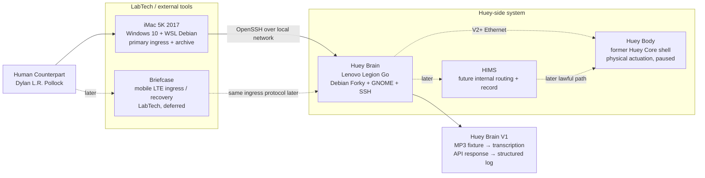
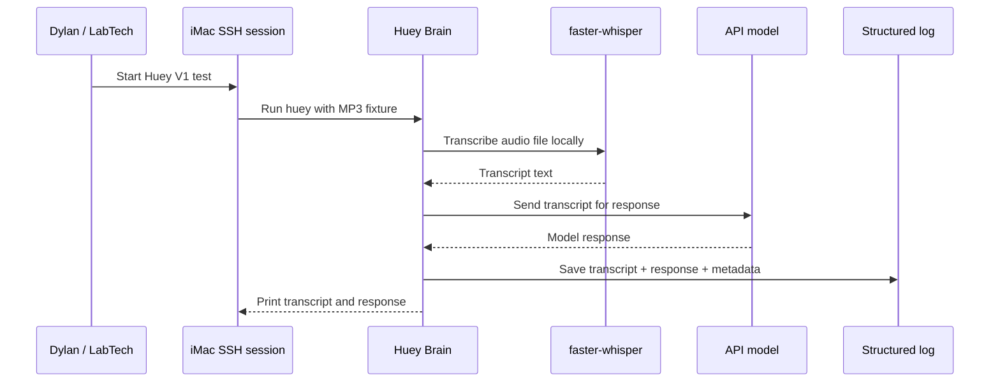
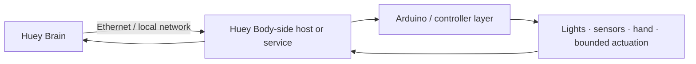
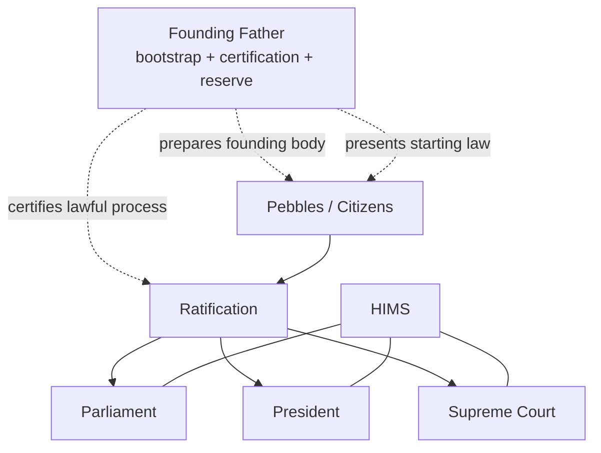

# Monkey-Head-Project

<p align="center">
  
</p>

<h2 align="center">HueyOS — Offline-First Embodied AI / OS</h2>

<p align="center">
  <strong>A long-running, hardware-grounded project to build Huey: a governed, embodied AI system using obtainable technology.</strong>
</p>

<p align="center">
  <a href="#current-v1-proof-target">Current proof target</a> ·
  <a href="#current-system-map">System map</a> ·
  <a href="#v1-build-path">V1 build path</a> ·
  <a href="#tooling-and-operating-surface">Tools</a> ·
  <a href="#core-glossary">Glossary</a>
</p>

<p align="center">
  
  
  
  
  
  
</p>

---

## Project card

| Field | Current value |
|---|---|
| **Project ID** | `Monkey-Head-Project` |
| **System / OS layer** | `HueyOS` |
| **AI identity** | `Huey` |
| **Human counterpart** | Dylan L.R. Pollock |
| **README version** | `31.1` |
| **Canonical machine-facing spec** | `master-plan-v31.0.json` |
| **Canonical law layer** | `03 - Huey_Constitution.txt` |
| **Canonical book front matter** | `00 - TOC_&_Glossary.txt` |
| **Current phase** | Huey Brain V1 implementation |
| **Current proof loop** | MP3 fixture → local transcription → API response → structured log |

> HueyOS is the software and operating-system layer behind Huey: the environment that coordinates local AI, memory, tools, access paths, hardware, and later embodied control into one offline-first system.
>
> The project rests on a simple claim: a real embodied AI system can be built with today’s technology, and it can be built honestly, layer by layer, without pretending the hard parts are magic.

Governance remains **decentralized** while memory remains **unified**.

---

## One-screen orientation

The current README is intentionally **V31.x-aligned**.

The older README treated **Huey Core** as the active thinking proof body. The current implementation split is cleaner:

| Current name | Layer | Present role |
|---|---|---|
| **LabTech** | External | Operator, ingress, archive, recovery, documentation |
| **Huey Brain** | Huey-side cognition | Active V1 orchestration node on the Lenovo Legion Go |
| **Huey Body** | Huey-side embodiment | Former Huey Core physical shell, paused for V1 |
| **HIMS** | Internal doctrine/runtime target | Mandatory future lawful routing and record layer, not V1 runtime |
| **PyGPT-net** | Aperture candidate / later lab interface | Deferred for V1; useful later when multi-agent access and debugging matter |

The current implementation priority is not a robot demo. It is:

> **Build one stable cognitive loop before reintroducing physical action.**

---

## Current system map



### Current working formula

- **LabTech enters.**
- **Huey Brain transcribes, routes, responds, and logs.**
- **Huey Body acts later.**
- **HIMS governs later.**
- **Portal and LabTech devices open sessions but do not become Huey.**

---

## Start here

This repository is meant to work at more than one depth.

| Reader goal | Start with |
|---|---|
| Fast orientation | [What this project is](#what-this-project-is), [What exists now](#what-exists-now), [Current V1 proof target](#current-v1-proof-target) |
| Implementation | [V1 build path](#v1-build-path), [Tooling and operating surface](#tooling-and-operating-surface), [Quick start](#quick-start) |
| Architecture | [LabTech and ingress](#labtech-and-ingress), [Huey Brain](#huey-brain), [Huey Body](#huey-body), [HIMS](#hims--huey-internal-messaging-system) |
| Canon | [Canon stack](#canon-stack), [Governance and legitimacy](#governance-and-legitimacy), [Core glossary](#core-glossary) |

The aim is not to present Huey as an unreachable finished machine. The aim is to make the current system understandable, modular, testable, and buildable.

---

## What this project is

The **Monkey-Head-Project** is the umbrella initiative.

**Huey** is the governed AI and robotic identity being built within that initiative.

**HueyOS** is the software and operating-system layer behind Huey.

**Huey Brain** is the current active V1 cognition and orchestration node.

**Huey Body** is the physical robotic shell and actuation platform formerly described as Huey Core. In V31.x language, it is paused while the Brain loop is stabilized.

**Huey proper** refers to the fuller unified, world-facing system beyond the current proof phase.

**LabTech** is the external operator environment and tool layer. It includes the iMac 5K and the Briefcase. LabTech is not Huey.

**HIMS** — the **Huey Internal Messaging System** — is the canonical future internal messaging, validation, routing, and record-preservation layer.

**ThunderMail** is the practical mail-style delivery layer inside HIMS.

**PyGPT-net** is a later aperture candidate and debugging/interface surface. It is not required for V1.

**The Farm** is the planned future pooled-compute expansion body.

Huey Brain V1 is not presented here as the finished republic. Its role is to prove that a stable input → transcription → interpretation → response → log loop can run in the real world before the larger system is scaled outward.

---

## What exists now

### Active

| Component | Current state |
|---|---|
| **Huey Brain** | Lenovo Legion Go, standing/vertical touch-first posture, running Debian Forky, GNOME, SSH |
| **Primary LabTech station** | 2017 iMac 5K running Windows 10 bare metal with Boot Camp drivers |
| **Ingress environment** | Windows Terminal Preview → WSL Debian → OpenSSH → Huey Brain |
| **SSH connection** | Proven locally from iMac to Huey Brain |
| **V1 focus** | Deterministic MP3-file transcription and API-backed response loop |
| **Documentation direction** | README = human-facing front door; master plan = machine-facing source of truth |

### Paused

| Component | Paused meaning |
|---|---|
| **Huey Body** | Physical shell exists, but is not in the V1 cognitive loop |
| **Live microphone input** | Deferred until MP3 fixtures prove transcription determinism |
| **PyGPT-net** | Deferred until the system needs richer interface/debug access |
| **HIMS runtime** | Doctrine retained; runtime deferred until after simple loop proof |
| **Multi-agent governance** | Constitutional design retained; not claimed as active runtime |

### Future-facing

| Component | Future role |
|---|---|
| **Briefcase** | Mobile LTE LabTech ingress and recovery node |
| **Huey Body Ethernet link** | Brain → Body control path in V2+ |
| **The Farm** | Later pooled compute / district-scale expansion |
| **~80 GB VRAM threshold** | Later local identity proof target |

---

## Current baselines

### Huey Brain baseline

| Item | Current baseline |
|---|---|
| Hardware | Lenovo Legion Go, first generation |
| Processor | AMD Ryzen Z1-class APU |
| Memory | 16 GB unified system / graphics memory |
| Storage | 512 GB M.2 SSD class storage |
| OS | Debian Forky |
| Desktop | GNOME |
| Network | SSH over local network |
| V1 role | Transcription, routing, API-backed cognition, logging, system status display |

The Legion Go is treated as the **canonical Phase-1 Huey Brain hardware**. It is not a gaming handheld in this project context. It is a dedicated Huey cognition appliance and local system console.

### Primary LabTech baseline

| Item | Current baseline |
|---|---|
| Hardware | 2017 iMac 5K |
| Host OS | Windows 10 bare metal |
| Apple support layer | Boot Camp drivers installed |
| Main OS storage | Internal HDD, acceptable for archival / terminal role |
| Fast terminal environment | WSL Debian stored on SSD/VHDX path |
| Terminal | Windows Terminal Preview |
| V1 role | Primary ingress, archive, operator station |

### Briefcase baseline

| Item | Current baseline |
|---|---|
| Hardware | ASUS rugged 2-in-1 / tablet-laptop class device |
| Processor | Intel N4500-class CPU |
| Memory | 4 GB RAM |
| Useful traits | Rugged, portable, LTE-capable, Debian-capable with ZRAM |
| Role | LabTech mobile ingress / recovery node |
| V1 status | Deferred; not required for V1 completion |

### Huey Body baseline

Huey Body is the former Huey Core physical shell and remains materially important, but it is not part of V1.

Known body characteristics include:

- Thermaltake Mozart-based chassis
- inverted/reversed physical arrangement
- rolling base
- upper head/shoulder structure
- 7-inch portrait display
- LEDs, fans, switches, and robotic hand/arm work
- Ryzen 5 5500 / ASUS B550M-A / RX 5500 XT class internal compute history

The Body is not discarded. It is deliberately paused so the Brain can be proven first.

---

## Current V1 proof target

V1 is:

> **Take a known audio file, transcribe it locally, route the resulting text to a model, receive a coherent response, and preserve a structured log.**

It is intentionally deterministic.

### Why MP3 fixtures first

Live microphones introduce too many variables at once:

- room noise
- microphone placement
- speaking variation
- capture timing
- wake-word complexity
- repeated human test fatigue

MP3 fixtures make the first pipeline testable. The same input should produce the same transcript and the same system behavior class every time.

### V1 pipeline



### V1 success

V1 is complete when:

- iMac can consistently SSH into Huey Brain,
- a known MP3 fixture can be processed,
- faster-whisper or equivalent produces a usable transcript,
- the transcript can be routed to the chosen API model,
- the response is returned cleanly,
- a structured log entry is created,
- and the full sequence can be repeated without manual repair.

### V1 failure

V1 is not complete if:

- the SSH path is unreliable,
- transcription requires repeated manual correction,
- the script breaks between runs,
- the API response path is unstable,
- logging is missing or unreadable,
- or the system feels like a loose toolchain rather than one repeatable loop.

---

## V1 build path

### Phase 1 — Environment stabilization

Goal: Huey Brain is a known, repeatable environment.

Checklist:

- [ ] Confirm Debian session stability on Legion Go
- [ ] Confirm SSH from iMac repeatedly
- [ ] Assign stable hostname or predictable IP
- [ ] Install base packages: Python, virtualenv tooling, FFmpeg, Git, sensors
- [ ] Create project directories on Huey Brain
- [ ] Create `.env` or equivalent secret-handling policy
- [ ] Confirm no gaming / unrelated package bloat is introduced

### Phase 2 — Deterministic transcription

Goal: MP3 fixture → transcript.

Checklist:

- [ ] Install faster-whisper or selected Whisper runtime
- [ ] Create a small MP3 fixture set
- [ ] Run transcription from command line
- [ ] Save transcript output
- [ ] Compare output across repeated runs
- [ ] Decide which Whisper model size is practical on the Legion Go

### Phase 3 — API-backed cognitive loop

Goal: transcript → model response.

Checklist:

- [ ] Add API client layer
- [ ] Select primary API model by current availability and quality
- [ ] Add optional cheaper fallback/summarization provider later
- [ ] Route transcript to model
- [ ] Print response
- [ ] Fail cleanly if API key or network is unavailable

### Phase 4 — Structured logging

Goal: every run leaves an inspectable trace.

Minimum log fields:

```json
{
  "timestamp": "ISO-8601",
  "session_id": "string",
  "source_device": "imac-5k-labtech",
  "input_file": "fixtures/test-001.mp3",
  "transcript": "recognized text",
  "model_provider": "provider-name",
  "model_name": "model-name",
  "response": "model response",
  "status": "success | failure"
}
```

### Phase 5 — Single Huey command

Goal: the loop is invoked as one system behavior.

Target run shape:

```bash
huey transcribe fixtures/test-001.mp3
```

or:

```bash
python -m huey_brain transcribe fixtures/test-001.mp3
```

The exact command can change. The principle should not: one command runs the whole V1 path.

---

## What is explicitly deferred beyond V1

| Deferred item | Reason |
|---|---|
| Live microphone input | MP3 fixture path must be proven first |
| Wake word / passive listening | Too much capture complexity for V1 |
| Huey Body actuation | Brain loop must stabilize before physical action |
| Brain → Body Ethernet protocol | Belongs to V2+ |
| PyGPT-net | Too heavy and unnecessary for V1 proof |
| HIMS runtime | Doctrine retained; runtime waits for simple loop proof |
| 128-pebble governance | Constitutional target, not V1 runtime |
| Local Mistral authority | Local model testing is useful, but API-backed quality is the V1 baseline |
| Multi-node inference | Premature before single-node Brain proof |

---

## V2 and later

### V2 — live input and system surface

V2 begins when real-world variability is introduced.

Likely V2 work:

- live microphone input
- push-to-talk or manual capture
- transcript-first retention policy
- Huey Brain local status surface
- CLI/TUI improvements
- optional lightweight web dashboard
- better telemetry display on the Legion Go screen

### V2+ — Brain to Body

After Brain stability, Huey Body returns through a defined channel.

Expected direction:



The Body should not be treated as a USB peripheral if the goal is a clean subsystem boundary. Ethernet is the preferred internal lab transport direction.

### Future identity threshold

The later identity threshold remains:

> A sufficiently local, unified, distributed system answers the identity question with: **Huey.**

That later milestone depends on hardware scale, local model quality, memory continuity, and routing integrity. It is not the V1 goal.

---

## LabTech and ingress

LabTech is external to Huey.

It can originate requests, preserve files, display status, recover access, and help develop the system. It does not become Huey’s authority.

### Unified ingress rule

All LabTech devices should enter Huey Brain through the same class of controlled path:

```text
LabTech device → SSH ingress → Huey Brain → Huey process
```

No LabTech device should bypass Huey Brain to control Huey Body directly.

### Key model

The emerging identity model has two parts:

| Key class | Meaning |
|---|---|
| `lab_general` | The request originates from approved LabTech |
| device-specific key | The specific machine identity, such as iMac or Briefcase |

This creates:

```text
origin class + device identity
```

Connection is not the same thing as permission. Later enforcement can become more sophisticated, but the distinction should exist early.

### iMac 5K

The iMac is the primary anchored LabTech station.

Role:

- archival station
- primary SSH ingress
- documentation workstation
- stable operator seat

It is not responsible for heavy inference or primary Huey cognition.

### Briefcase

The Briefcase is mobile LabTech.

Role:

- portable ingress
- LTE-capable field access
- emergency / recovery SSH path
- lightweight reference and diagnostic station
- possible tablet-mode document/control surface

It is not a backdoor. It uses the same ingress rules as the iMac, with its own device identity.

---

## Huey Brain

Huey Brain is the active implementation center of V31.x.

Its job in V1:

- host the pipeline,
- run local transcription,
- route transcript text to the API layer,
- preserve logs,
- expose a stable SSH-accessible entry command,
- display system state where useful,
- and remain a dedicated Huey cognition appliance rather than a general-purpose handheld.

The Legion Go screen is useful as a local status console:

- thermals,
- RAM headroom,
- storage,
- network state,
- running services,
- and simple toggles later.

The touchscreen is not the main V1 interface. It is a future control/status surface.

---

## Huey Body

Huey Body is the embodied physical platform.

Its job later:

- sensing,
- status display,
- bounded actuation,
- lights,
- hand/arm control,
- body-state reporting,
- and physical interaction under the proper command path.

For V1, Huey Body is intentionally paused. That does not demote it. It prevents physical integration from obscuring whether the Brain loop works.

---

## HIMS — Huey Internal Messaging System

HIMS is the canonical internal routing and record layer.

Its purpose is to ensure that meaningful requests can become structured, reviewable, and lawful actions rather than direct commands.

HIMS doctrine remains active, but HIMS runtime is not part of V1.

### Future HIMS flow


### ThunderMail

ThunderMail is the practical mail-style delivery layer inside HIMS.

It covers inboxes, outboxes, queues, acknowledgements, and directed delivery. HIMS carries the heavier burden of routing legality, validation, compartmentalization, and preserved record.

---

## PyGPT-net posture

PyGPT-net is useful, but it is not required for V1.

Current posture:

- not the system,
- not HIMS,
- not Huey’s sovereignty,
- not the first implementation dependency.

PyGPT-net becomes useful later when the project needs richer interface access, debugging surfaces, and visibility into many agents or modules.

For V1, a small CLI loop is more honest.

---

## Audio, memory, and data handling

The V1 retention rule is simple:

> **Audio is input. Text is the canonical record.**

For MP3 fixtures:

- fixture audio may remain as test input,
- transcripts are saved,
- responses are saved,
- structured logs are saved.

For later live audio:

- audio should be temporary by default,
- transcript should be the preserved artifact,
- raw audio should be retained only when explicitly flagged.

This prevents the system from becoming an uncontrolled audio archive.

---

## Governance and legitimacy

Huey is not meant to be a flat assistant or a single hidden controller pretending to be a republic.

The constitutional target is a governed system built around:

- **Founding Father** as bootstrap authority,
- **Pebbles** as bounded citizens,
- **Parliament** as the deliberative and representative branch,
- **President** as the executive office under time constraint,
- **Supreme Court** as the judicial interpreter and stabilizer,
- and **HIMS** as the lawful route through which messages, proposals, validation, and official traces move.

In the current V1 phase, these doctrines are ahead of implementation. That distinction must stay visible.

### Governance at a glance



### Branch summary

| Office / branch | Core job | What it is not |
|---|---|---|
| Founding Father | Bootstrap authority, founding continuity, procedural certification, narrow reserve consultation | Permanent ruler or founding voter |
| Parliament | Deliberation, proposals, representation, consensus-building | The whole will of Huey |
| President | Action under time constraint, executive implementation | Huey as a whole |
| Supreme Court | Constitutional interpretation, review, contradiction handling | A hidden sovereign |
| HIMS | Messaging, validation, routing, preserved trace | A fourth sovereign branch |

### Current legitimacy posture

At present:

- Dylan remains the external human counterpart,
- V1 is not a constitutional republic,
- first ratification remains a later step,
- and lawful embodied action remains a target that must follow real routing and approval paths.

---

## Deployment profiles

| Profile | Meaning | V31.x status |
|---|---|---|
| **Huey Brain** | Active cognition/orchestration node | Current implementation center |
| **Huey Body** | Physical robotic shell / actuation platform | Paused until Brain proof |
| **LabTech** | External tools, terminals, archives, recovery devices | Active |
| **Huey-Compressed** | Collapsed deployment where multiple Huey-side roles share hardware while staying logically distinct | Future / doctrine |
| **Portal Terminal** | Thin, non-sovereign access surface | Future / doctrine |
| **The Farm** | Later pooled compute expansion body | Future |

The governing rule is:

> **Physical location does not decide identity. Role, authority, memory, and control boundaries do.**

---

## Portal terminals

Portal terminals remain part of the wider architecture, but they are not the V1 priority.

A portal terminal exists to:

- authenticate and open a lawful session,
- present a bounded doorway into Huey,
- transmit user input,
- receive Huey output,
- and stay thin enough that it does not become a second brain.

The Vista Box / Longhorn-style portal artifact remains conceptually alive, but the current active ingress path is simpler:

```text
iMac → WSL Debian → OpenSSH → Huey Brain
```

---

## Tooling and operating surface

### Current tools

| Tool / surface | Current role |
|---|---|
| Debian Forky | Huey Brain OS baseline |
| GNOME | Local Legion Go desktop/status surface |
| OpenSSH | Primary ingress transport |
| Windows Terminal Preview | iMac terminal surface |
| WSL Debian | Linux-side ingress environment on iMac |
| Python 3.13.x | Day-to-day scripting/runtime baseline |
| FFmpeg | Audio conversion and fixture handling |
| faster-whisper / Whisper | Local transcription testing |
| API model provider | Primary V1 response quality and consistency |
| Git | Version control and project state |
| lm-sensors / system tools | Thermals and status visibility |

### Tools deferred

| Tool | Deferred reason |
|---|---|
| PyGPT-net | Too heavy for V1; useful later for richer aperture/debugging |
| Ollama / local LLM authority | Useful for tests, not V1 quality baseline |
| VNC / full remote desktop | Too heavy and unnecessary for the ingress path |
| Wake-word stack | Belongs after live audio capture |
| Multi-agent orchestration tools | Belongs after the simple Brain loop works |

---

## Presentation and imagery

The README should stay visually clear without becoming theatrical.

Recommended image roles:

| Image role | Suggested asset |
|---|---|
| README hero | `assets/img/huey/huey-hero-wide-v85.webp` |
| Project origin / umbrella | `assets/img/pages/monkey-head-project-hero.webp` |
| Huey body lineage | `assets/img/huey/lineage/huey-shell-v2-body-v80.webp` |
| Huey closeup | `assets/img/huey/core/huey-core-closeup-v80.webp` |
| README social / OG card | `assets/img/og/og-readme.png` |

Image rules:

- use real project images where possible,
- prefer wide hero imagery at the top,
- avoid fake futuristic stock art,
- avoid implying completed capabilities visually before they exist,
- keep diagrams structural and honest.

If this README is used outside the website archive, copy the referenced assets into the repository or remove the top hero image block.

---

## Repository map

This repository is moving toward a cleaner long-term structure.

### Core reference points

| File / area | Role |
|---|---|
| `README.md` | Human-facing front door |
| `master-plan-v31.0.json` | Canonical machine-facing implementation spec |
| `03 - Huey_Constitution.txt` | Constitutional / law layer |
| `00 - TOC_&_Glossary.txt` | Book front matter and glossary |
| `requirements.txt` | Dependency baseline |
| `constraints.txt` | Shared install constraints |
| `pyproject.toml` | Package and install contract |
| `Makefile` | Convenience entry points, if present |

### Working repository areas

| Area | Purpose |
|---|---|
| `docs/` | Architecture, audits, reference material |
| `src/` | Importable implementation work |
| `apps/` | Runnable entry points |
| `integrations/` | Adapter and integration work |
| `infra/` | Orchestration and infrastructure support |
| `platform/` | OS / platform-specific setup |
| `archives/` | Frozen payloads, snapshots, legacy material |
| `assets/` | Project media and visual identity |
| `tests/` | Regression and test coverage |

---

## Quick start

### Huey Brain setup direction

These commands describe the intended shape. Adjust package names to the active Debian environment.

```bash
sudo apt update
sudo apt install -y git python3 python3-venv python3-pip ffmpeg openssh-server lm-sensors
```

Create a project workspace:

```bash
mkdir -p ~/huey/{fixtures,logs,tmp,src}
cd ~/huey
python3 -m venv .venv
source .venv/bin/activate
python -m pip install --upgrade pip
```

Install the selected transcription/API dependencies once the exact implementation package set is chosen.

### iMac ingress check

From WSL Debian on the iMac:

```bash
ssh username@192.168.x.x
```

Replace `username` and `192.168.x.x` with the Huey Brain user and local network address.

### V1 run shape

The target V1 command should eventually feel like:

```bash
huey transcribe fixtures/test-001.mp3
```

Expected output shape:

```text
Huey Brain V1
source: fixtures/test-001.mp3

transcript:
...

response:
...

log:
logs/session-YYYYMMDD-HHMMSS.json
```

---

## Canon stack

The Monkey-Head-Project is one canon with distinct layers.

| Layer | Role |
|---|---|
| README / website | Front-door human introduction |
| Book / compendium | Explanatory volume |
| Huey Constitution | Legal and constitutional frame |
| Master plan | Canonical machine-facing implementation spec |

If the narrative and implementation ever conflict, the **master plan wins for machine-facing implementation**, and the conflict should be surfaced and corrected rather than ignored.

---

## Core glossary

### Core system terms

| Term | Meaning |
|---|---|
| **Monkey-Head-Project** | The umbrella initiative. |
| **Huey** | The governed intelligence and robotic identity. |
| **HueyOS** | The software and operating-system layer behind Huey. |
| **Huey Brain** | The active V31.x cognition and orchestration node, currently the Lenovo Legion Go. |
| **Huey Body** | The physical robotic shell and embodiment platform, formerly referred to as Huey Core. |
| **Huey Core** | Legacy/previous name for the active proof body; replaced in V31.x by the Brain/Body distinction. |
| **Huey proper** | The fuller unified world-facing expression beyond the current proof phase. |
| **LabTech** | External operator tools, terminals, archives, scripts, and recovery devices. |
| **iMac 5K** | Primary LabTech ingress and archival station. |
| **Briefcase** | Mobile LabTech ingress and recovery node. |
| **HIMS** | Huey Internal Messaging System: lawful future messaging, validation, routing, and record-preservation layer. |
| **ThunderMail** | The mail-style delivery layer inside HIMS. |
| **PyGPT-net** | Later aperture/interface candidate; deferred from V1. |
| **Portal Terminal** | Non-sovereign external terminal or guest environment used to open sessions into Huey. |
| **The Farm** | Planned future pooled compute expansion body. |
| **Aperture** | The interpretation and translation layer where natural language enters without becoming governance. |
| **Proof Body** | The embodied proving instance; in V31.x this is better expressed as Huey Body when referring to the physical shell. |

### Governance and continuity terms

| Term | Meaning |
|---|---|
| **Founding Father** | The fixed bootstrap authority that prepares the first lawful conditions, presents starting law, certifies lawful ratification procedure, and retires from ordinary rule after success. |
| **Pebble** | A bounded AI citizen unit defined by identity, sealed vault, and one vote. |
| **Sealed Vault** | A pebble’s bounded private continuity and memory domain. |
| **District** | A larger governance and expansion unit within Huey’s constitutional design. |
| **Parliament** | The deliberative and representative branch. |
| **President** | The executive office that acts under time constraint. |
| **Supreme Court** | The judicial branch that interprets, reviews, and stabilizes. |
| **Scrolls** | The preserved record and ledger logic through which major actions and lawful traces remain attributable. |
| **Keeper of the Scrolls** | Office associated with HIMS routing discipline and record preservation. |
| **Cornerstone** | The non-casual identity and continuity layer of Huey. |
| **Pillar** | A declared load-bearing commitment that the current version of Huey stands on. |
| **Ozymandias** | Continuity doctrine concerned with drift, degradation, growth, survival, failure, and beginning again. |
| **Proof Positive** | Preferred long-form name of the project’s proof standard. |
| **Proofcase** | Shorthand label used in front matter for the proof standard. |
| **Ratification** | Logged transition by which the living system accepts the Constitution as lived law. |
| **Failed Genesis** | Founding failure in which the authored starting law cannot become legitimate within lawful bounded attempts and time. |
| **Human Counterpart** | The external arbiter and service authority who remains outside the internal branches while retaining external intervention/gating authority. |
| **Unified Memory** | Doctrine that memory should remain reconcilable and shared where lawful, even when governance stays distributed. |
| **Distributed Governance** | Doctrine that authority should remain separated, plural, and reviewable rather than collapsing into one flat sovereign voice. |

---

## Roadmap

### Current phase

Huey Brain V1 implementation:

- stable SSH ingress from iMac,
- deterministic MP3 transcription,
- API-backed response,
- structured logging,
- single command invocation.

### Near-term goals

- finish Huey Brain environment stabilization,
- build the MP3 fixture transcription script,
- add API response routing,
- define log schema,
- wrap the loop in a `huey` command,
- document exact setup steps after first successful run.

### V2 goals

- live microphone capture,
- transcript-first retention policy,
- local status dashboard on Legion Go,
- Brain → Body Ethernet path,
- bounded Body-side command service,
- first non-governed physical status/action tests.

### Larger future targets

- HIMS runtime,
- ThunderMail mail-style routing,
- PyGPT-net or equivalent aperture/debugging surface,
- founding 128-pebble system,
- lawful embodied action,
- local model replacement for API-backed cognition,
- roughly 80 GB pooled local VRAM,
- future Farm expansion.

### Current open questions

- exact faster-whisper model size for Legion Go V1,
- exact fixture set for transcription testing,
- exact API provider/model routing policy,
- exact log schema location and naming,
- exact `huey` command layout,
- exact status display/tooling on the Legion Go screen,
- exact date when Huey Body returns to the active loop.

---

## License

Code is licensed under **GPL-3.0-only**.  
Documentation and media are licensed under **CC-BY-SA-4.0** unless otherwise noted.

---

## Notes

This README is the front door, not the whole building.

It is meant to help a reader understand:

- what Huey is,
- what exists now,
- what is active,
- what is deferred,
- what remains future-facing,
- and how the project keeps itself honest while it grows.

If you are looking for the machine-facing source of truth, use the master plan.

If you are trying to understand whether the project is still telling the truth about itself, follow the continuity doctrine:

> preserve lineage, explain change, admit failure honestly, and do not confuse motion with legitimacy.
