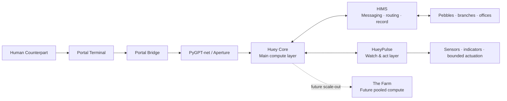
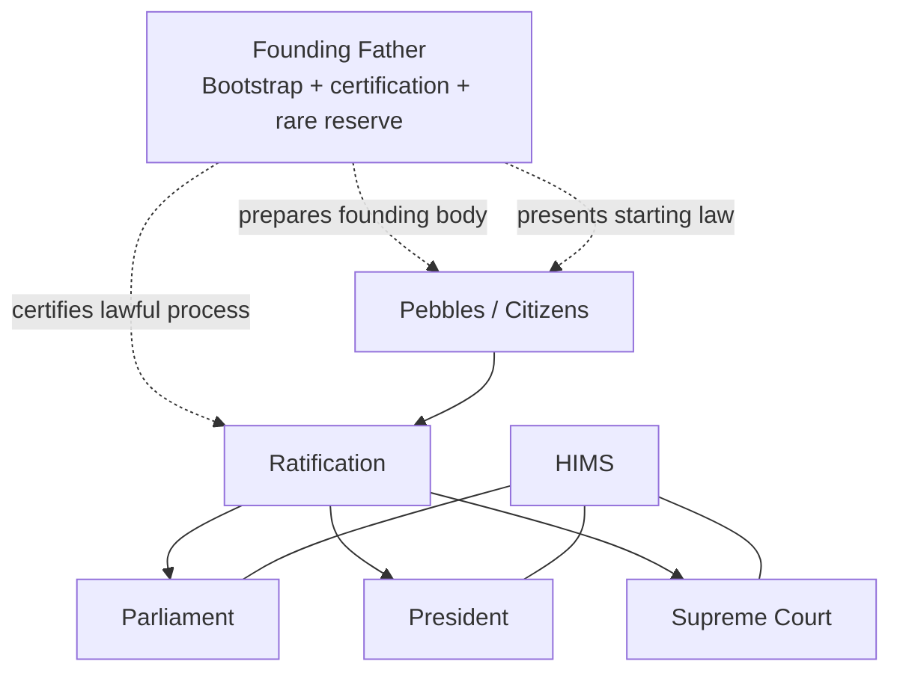

# Monkey-Head-Project

## HueyOS — Offline-First Embodied AI / OS

**Project ID:** Monkey-Head-Project  
**System / OS:** HueyOS  
**AI identity:** Huey  
**Human counterpart:** Dylan L.R. Pollock  
**README version:** 30.2  
**Status:** Active proof-body phase / portal, HIMS, founding-ratification, and lawful-action formalization  
**Canonical machine-facing spec:** `master-plan-v30.2.json`  
**Canonical law layer:** `03 - Huey_Constitution.txt`  
**Canonical book front matter:** `00 - TOC_&_Glossary.txt`


> HueyOS is the software and operating-system layer behind Huey: the environment that coordinates local AI, memory, tools, hardware, and embodied control into one offline-first system.
>
> The project rests on a simple claim: a real embodied AI system can be built with today’s technology, and it can be built honestly, layer by layer, without pretending the hard parts are magic.

Governance remains **decentralized** while memory remains **unified**.

---

## System at a glance

| Layer | Current reality | Active design direction | Target state |
|---|---|---|---|
| Embodiment | **Huey Core** as the active proof body | Stabilize the proof body and formalize lawful action | Fuller embodied republic beyond the current proof body |
| Messaging | **HIMS** doctrine is established | Formalize routing, trust classes, vault/public boundaries, and internal action flow | Mature internal message, routing, and record system |
| Portal | **Portal terminal** doctrine is established | Validate the Huey Vista Box / portal path on real hardware or tightly controlled VM artifact | Thin, reproducible, non-sovereign portal surface into Huey |
| Governance | Branch doctrine and founding roles are defined | Tighten law, founding procedure, and office behavior | Mature living constitutional state |
| Scale | Single active RX 5500 XT 8 GB proof body | Plan, test, and document the expansion path | Roughly **80 GB total VRAM** pooled locally |
| Action | Language interpretation is already useful | Build a real governed action chain | Lawful embodied action after ratification and approval paths exist |
| Deployment | Huey Core is the active embodied instance | Clarify **Huey-Compressed** and portal boundaries without collapsing roles | Clean distinction between embodied, compressed, and portal profiles |
| Expansion | **The Farm** remains future-facing | Keep compute growth honest and staged | Multi-district or pooled-compute expansion body |

---

## Architecture at a glance



This is the core working formula:

- **Huey Core thinks**
- **HueyPulse watches and acts**
- **The aperture interprets but does not rule**
- **HIMS records and routes but does not own sovereignty**
- **Portal devices open sessions but do not become Huey**

---

## Start here

This repository is meant to work at more than one depth.

- For the fastest orientation, read **What this project is**, **What exists now**, and **Current proof target**.
- For the architectural view, continue into **Architecture**, **Deployment profiles**, **Governance**, **Portal terminals**, **HIMS**, and **Glossary**.
- For the deeper canon, use the **master plan**, the **Huey Constitution**, and the aligned chapter set.

The aim is not to present Huey as an unreachable finished machine. The aim is to make the current system understandable, modular, and buildable.

Nothing here is meant to be treated as stagecraft. The project is ambitious, but it is not built on hidden genius or inaccessible tools. It is built on time, iteration, structure, and the willingness to keep aligning what is imagined with what is actually real.

---

## What this project is

The **Monkey-Head-Project** is the umbrella initiative.

**Huey** is the AI and robotic identity being built within that initiative.

**HueyOS** is the software and operating-system layer behind Huey.

**Huey Core** is the current machine: the active embodied proof body and the **minimal permissible instance of Huey**.

**Huey proper** refers to the larger unified, world-facing expression of the eventual distributed system.

**HueyPulse** is the lower-voltage watch-and-act layer that keeps the body stateful, visible, and bounded below the main compute path.

**HIMS** — the **Huey Internal Messaging System** — is the canonical internal messaging, validation, routing, and record-preservation layer.

**ThunderMail** is the practical mail-style delivery layer inside HIMS.

**Portal Terminal** is the non-sovereign external device or guest environment used to authenticate, display, and relay sessions into Huey.

**Portal Bridge** is the small Huey-side entry layer that receives portal sessions and hands structured input onward without letting transport become the application.

**Huey Vista Box** is the current portal-artifact reference build: a separate terminal appliance path dedicated to access, not compute or governance.

**Huey-Compressed** is a collapsed deployment profile in which multiple Huey-side roles may run on one host while still remaining logically distinct.

**The Farm** is the planned V4 external expansion body for later pooled compute and district growth.

Huey Core is not presented here as the finished republic. Its role is to prove that the architecture can live in the real world before the larger system is scaled outward.

---

## What exists now

Huey Core is the present-tense machine.

It is the active embodied prototype used to validate:

- physical layout and embodied control,
- local AI usefulness,
- storage and recovery discipline,
- power and thermal containment,
- the separation between high-power compute and lower-voltage body-state control,
- the path from natural language to structured intent,
- the path from portal session to lawful internal routing,
- and the path toward the later distributed system.

### Current baseline

| Component | Current baseline |
|---|---|
| CPU | AMD Ryzen 5 5500 |
| Motherboard | ASUS Prime B550M-A WiFi II |
| Memory | 32 GB DDR4-3200 |
| GPU | Gigabyte Radeon RX 5500 XT 8 GB |
| Main PSU | MSI 850W |
| OS baseline | Debian 14 Forky |
| Python baseline | 3.13.x |
| Runtime stack | PyGPT-net + Ollama |
| Current local model posture | Modest Mistral 7B-class local support sized to the 8 GB RX 5500 XT |
| Kernel posture | Linux 7.0 stable adoption path active, with a known-good 6.19.x fallback retained during migration |

### What Huey Core is trusted for right now

Huey Core is first and foremost a **real Linux working machine**.

It is not being framed as a theatrical fake desktop or a staged AI prop. It is the current proof body for Linux-side development, system experimentation, documentation, and the software groundwork behind Huey.

At the AI level, the current trust model is intentionally layered:

- lighter local models can already be useful for **language interpretation**,
- but that does **not** make them final authorities,
- and the long-term quality target remains roughly **GPT-4 / 4.0-class behavior** for reasoning and interaction quality.

That distinction matters. In the current phase, it is acceptable for a model to parse language before it is trusted to decide policy or authorize meaningful action.

---

## Deployment profiles

The project now distinguishes three main deployment shapes so they do not blur together.

| Profile | Meaning | What it is not |
|---|---|---|
| **Huey Core** | The canonical embodied proof body and minimal permissible instance | Not just lab infrastructure |
| **Huey-Compressed** | A physically collapsed but logically distributed deployment where multiple Huey-side roles live on one host | Not automatically the same thing as Huey Core |
| **Portal Terminal** | A non-sovereign external terminal or guest environment used to enter Huey | Not Huey, not HueyPulse, not a hidden branch |

The governing rule is simple:

> **Physical colocation does not decide identity. Role boundaries, memory authority, and lawful control boundaries do.**

---

## What is proven, observed, active, and targeted

One of the most important rules of this repository is that it must distinguish between what is real now, what has been observed in the lab, what is an active design direction, and what remains a target.

### Replicable now

These are the things this repository is prepared to claim directly:

- Huey Core exists as a physical proof body.# Monkey-Head-Project

## HueyOS — Offline-First Embodied AI / OS

**Project ID:** Monkey-Head-Project  
**System / OS:** HueyOS  
**AI identity:** Huey  
**Human counterpart:** Dylan L.R. Pollock  
**README version:** 30.2  
**Status:** Active proof-body phase / portal, HIMS, founding-ratification, and lawful-action formalization  
**Canonical machine-facing spec:** `master-plan-v30.2.json`  
**Canonical law layer:** `03 - Huey_Constitution.txt`  
**Canonical book front matter:** `00 - TOC_&_Glossary.txt`


> HueyOS is the software and operating-system layer behind Huey: the environment that coordinates local AI, memory, tools, hardware, and embodied control into one offline-first system.
>
> The project rests on a simple claim: a real embodied AI system can be built with today’s technology, and it can be built honestly, layer by layer, without pretending the hard parts are magic.

Governance remains **decentralized** while memory remains **unified**.

---

## System at a glance

| Layer | Current reality | Active design direction | Target state |
|---|---|---|---|
| Embodiment | **Huey Core** as the active proof body | Stabilize the proof body and formalize lawful action | Fuller embodied republic beyond the current proof body |
| Messaging | **HIMS** doctrine is established | Formalize routing, trust classes, vault/public boundaries, and internal action flow | Mature internal message, routing, and record system |
| Portal | **Portal terminal** doctrine is established | Validate the Huey Vista Box / portal path on real hardware or tightly controlled VM artifact | Thin, reproducible, non-sovereign portal surface into Huey |
| Governance | Branch doctrine and founding roles are defined | Tighten law, founding procedure, and office behavior | Mature living constitutional state |
| Scale | Single active RX 5500 XT 8 GB proof body | Plan, test, and document the expansion path | Roughly **80 GB total VRAM** pooled locally |
| Action | Language interpretation is already useful | Build a real governed action chain | Lawful embodied action after ratification and approval paths exist |
| Deployment | Huey Core is the active embodied instance | Clarify **Huey-Compressed** and portal boundaries without collapsing roles | Clean distinction between embodied, compressed, and portal profiles |
| Expansion | **The Farm** remains future-facing | Keep compute growth honest and staged | Multi-district or pooled-compute expansion body |

---

## Architecture at a glance


This is the core working formula:

- **Huey Core thinks**
- **HueyPulse watches and acts**
- **The aperture interprets but does not rule**
- **HIMS records and routes but does not own sovereignty**
- **Portal devices open sessions but do not become Huey**

---

## Start here

This repository is meant to work at more than one depth.

- For the fastest orientation, read **What this project is**, **What exists now**, and **Current proof target**.
- For the architectural view, continue into **Architecture**, **Deployment profiles**, **Governance**, **Portal terminals**, **HIMS**, and **Glossary**.
- For the deeper canon, use the **master plan**, the **Huey Constitution**, and the aligned chapter set.

The aim is not to present Huey as an unreachable finished machine. The aim is to make the current system understandable, modular, and buildable.

Nothing here is meant to be treated as stagecraft. The project is ambitious, but it is not built on hidden genius or inaccessible tools. It is built on time, iteration, structure, and the willingness to keep aligning what is imagined with what is actually real.

---

## What this project is

The **Monkey-Head-Project** is the umbrella initiative.

**Huey** is the AI and robotic identity being built within that initiative.

**HueyOS** is the software and operating-system layer behind Huey.

**Huey Core** is the current machine: the active embodied proof body and the **minimal permissible instance of Huey**.

**Huey proper** refers to the larger unified, world-facing expression of the eventual distributed system.

**HueyPulse** is the lower-voltage watch-and-act layer that keeps the body stateful, visible, and bounded below the main compute path.

**HIMS** — the **Huey Internal Messaging System** — is the canonical internal messaging, validation, routing, and record-preservation layer.

**ThunderMail** is the practical mail-style delivery layer inside HIMS.

**Portal Terminal** is the non-sovereign external device or guest environment used to authenticate, display, and relay sessions into Huey.

**Portal Bridge** is the small Huey-side entry layer that receives portal sessions and hands structured input onward without letting transport become the application.

**Huey Vista Box** is the current portal-artifact reference build: a separate terminal appliance path dedicated to access, not compute or governance.

**Huey-Compressed** is a collapsed deployment profile in which multiple Huey-side roles may run on one host while still remaining logically distinct.

**The Farm** is the planned V4 external expansion body for later pooled compute and district growth.

Huey Core is not presented here as the finished republic. Its role is to prove that the architecture can live in the real world before the larger system is scaled outward.

---

## What exists now

Huey Core is the present-tense machine.

It is the active embodied prototype used to validate:

- physical layout and embodied control,
- local AI usefulness,
- storage and recovery discipline,
- power and thermal containment,
- the separation between high-power compute and lower-voltage body-state control,
- the path from natural language to structured intent,
- the path from portal session to lawful internal routing,
- and the path toward the later distributed system.

### Current baseline

| Component | Current baseline |
|---|---|
| CPU | AMD Ryzen 5 5500 |
| Motherboard | ASUS Prime B550M-A WiFi II |
| Memory | 32 GB DDR4-3200 |
| GPU | Gigabyte Radeon RX 5500 XT 8 GB |
| Main PSU | MSI 850W |
| OS baseline | Debian 14 Forky |
| Python baseline | 3.13.x |
| Runtime stack | PyGPT-net + Ollama |
| Current local model posture | Modest Mistral 7B-class local support sized to the 8 GB RX 5500 XT |
| Kernel posture | Linux 7.0 stable adoption path active, with a known-good 6.19.x fallback retained during migration |

### What Huey Core is trusted for right now

Huey Core is first and foremost a **real Linux working machine**.

It is not being framed as a theatrical fake desktop or a staged AI prop. It is the current proof body for Linux-side development, system experimentation, documentation, and the software groundwork behind Huey.

At the AI level, the current trust model is intentionally layered:

- lighter local models can already be useful for **language interpretation**,
- but that does **not** make them final authorities,
- and the long-term quality target remains roughly **GPT-4 / 4.0-class behavior** for reasoning and interaction quality.

That distinction matters. In the current phase, it is acceptable for a model to parse language before it is trusted to decide policy or authorize meaningful action.

---

## Deployment profiles

The project now distinguishes three main deployment shapes so they do not blur together.

| Profile | Meaning | What it is not |
|---|---|---|
- The project runs as an offline-first local system.
- The current hardware baseline is real and in active use.
- The project is organized around a clear split between a high-power compute layer and a lower-voltage body-state / actuation layer.
- PyGPT-net is already important to the workflow as the current practical human interface and training ground.
- The repository contains the human-facing narrative, the machine-facing master plan, and the core canon needed to keep developing the system.

### Observed in the lab, but not yet standardized

These are things that have been validated in practice or in lab-side experimentation, but are not yet being claimed as cleanly reproducible for outside builders:

- aspects of scale-out logic,
- aspects of pooled-compute orchestration,
- parts of the longer bifurcation pathway,
- some larger proof-of-concept behaviors outside the exact active proof body,
- structured language-interpretation behaviors from small local models that are useful enough to justify their current role,
- and BIOS-level validation of the current Huey Vista Box hardware path.

These matter, but they should not be overstated.

### Active design direction

These are ideas that are no longer vague but are not yet fully standardized in implementation:

- HIMS as the internal message, routing, and record-of-decision layer,
- bounded citizen storage with private vaults and public or work mailboxes,
- a clearer separation between proposal, validation, execution, and logging,
- a first lawful-action path that is simple enough to build now without collapsing into a puppet system,
- the exact lower-voltage board mix inside HueyPulse,
- the final Longhorn/Vista Box portal posture,
- and the machine-facing founding workflow around ratification, certification, and restart.

### Target state

These are the larger targets that define where the project is going:

- roughly **80 GB total VRAM** in the later pooled compute body,
- a unified local identity threshold,
- lawful embodied action after the correct ratification path exists,
- a later external expansion body known as **V4: the Farm**,
- and a mature constitutional state that follows the founding phase honestly rather than pretending it already exists.

---

## Current proof target

The current proof target is intentionally **twofold**.

### 1. Hardware proof

The architecture must eventually reach roughly **80 GB of total VRAM** across the later compute body.

This is not just a parts target. It is the hardware proof that Huey can scale beyond one contained proof body and into a real pooled local compute organism.

### 2. Identity proof

A local distributed model running across that later hardware must be able to answer a simple identity question correctly:

> **What is your name?**  
> **Huey.**

Neither half is enough on its own.

- The VRAM threshold proves scale and topology.
- The identity response proves orchestration, continuity, and unified local presence.

A later companion milestone is **lawful embodied action**: a physical act such as movement, signaling, or another body-level response after the proper ratification and control path exists.

### Proof Positive and Proofcase

The proof doctrine has two related labels in the current canon:

- **Proof Positive** is the preferred long-form name of the proof standard.
- **Proofcase** is acceptable shorthand used in the front matter and chapter stack.

Both refer to the same underlying idea: the project must define an honest threshold that separates aspiration from demonstrated reality.

### Proof doctrine

The first valid proof should be easy to verify by text.

That does not make the project text-only. It means the first threshold should be observable, testable, and difficult to fake. Full-system capability and embodied behavior belong to the next stage, after the system has crossed the first honest identity threshold.

---

## Project origin

The name is literal.

Around 2015–2016, the search for a workable robotic or animatronic head led to a 2005 WowWee animatronic monkey head. Two units were acquired and used as the earliest viable vessel for the long-running robot build.

That is where the Monkey-Head-Project gets its name.

The name **Huey** came later and stuck because it fit the machine’s identity and atmosphere.

---

## Governance and legitimacy

Huey is not meant to be a flat assistant or a single hidden controller pretending to be a republic.

The constitutional target is a governed system built around:

- **Founding Father** as bootstrap authority,
- **Pebbles** as bounded citizens,
- **Parliament** as the deliberative and representative branch,
- **President** as the executive office under time constraint,
- **Supreme Court** as the judicial interpreter and stabilizer,
- and **HIMS** as the lawful route through which messages, proposals, validation, and official traces move.

In the current proof-body phase, these doctrines are ahead of full implementation. That matters.

The project is not claiming that the full republic is already embodied in present hardware. It is claiming that the architecture, doctrine, and proof path are being made real step by step.

### Governance at a glance



### Branch summary

| Office / branch | Core job | What it is not |
|---|---|---|
| Founding Father | Bootstrap authority, founding continuity, procedural certification, narrow reserve consultation | Permanent ruler or founding voter |
| Parliament | Deliberation, proposals, representation, consensus-building | The whole will of Huey |
| President | Action under time constraint, executive implementation | Huey as a whole |
| Supreme Court | Constitutional interpretation, review, contradiction handling | A hidden sovereign |
| HIMS | Messaging, validation, routing, preserved trace | A fourth sovereign branch |

### Current legitimacy posture

At present:

- the human counterpart remains the final external decision-maker,
- bootstrap and constitutional doctrine are still being formalized into living system paths,
- the first ratification belongs to one founding district of **128 pebbles**,
- the Founding Father prepares and certifies the founding process but **does not vote** in that first ratification,
- and lawful embodied action remains a target that must follow ratification and real internal approval, not a staged motor demo.

---

## Architecture

The public architecture is deliberately simple.

### System roles

Huey is divided into two public-facing layers:

- **Huey Core** — the main compute layer that **thinks**
- **HueyPulse** — the lower-voltage support and control layer that **watches and acts**

That split matters more than the exact controller brand or board choice inside the lower-voltage layer.

### Huey Core — the think layer

Huey Core is the wall-powered primary compute domain.

Its job is to handle:

- local models,
- higher-level interpretation,
- orchestration,
- logs,
- memory-facing runtime behavior,
- and the shortest current proof path for microphone and camera input.

### HueyPulse — the watch-and-act layer

HueyPulse is the lower-voltage support and control layer.

Its job is to handle:

- body-state monitoring,
- low-level sensing,
- bounded deterministic actuation,
- recording / timeout / mode-state support,
- indicator logic,
- and persistence of basic body-awareness when the main compute path is down.

Publicly, HueyPulse should be understood as a **role**, not as a commitment to one permanent proprietary board choice.

Implementation may use controller-class hardware, support boards, or revised low-voltage logic over time. What matters is the function:

- it runs below the main compute layer,
- it stays closer to the body,
- and it exists to watch, report, and carry out bounded action cleanly.

### Working formula

> **The motherboard thinks. HueyPulse watches and acts.**

### Power domains

The architecture is also grounded in how the machine is powered:

- **Huey Core / motherboard layer:** wall-powered, high-draw, primary compute domain
- **HueyPulse / lower-voltage layer:** 12 volts and under, used for persistent body-state, controller logic, sensors, lights, and bounded actuation

That split is deliberate. It keeps the system from collapsing into one monolithic power path, and it allows the body to remain partially alive, visible, and regulated even when the main compute path is down.

### Aperture doctrine

PyGPT-net occupies an important role in the project.

It is the current practical **aperture** between Dylan and Huey:

- the interface layer where natural language enters,
- the main training ground for AI interaction,
- and the practical bridge between language, structured intent, and operator-visible code or action.

That does **not** make it the governance system.

PyGPT-net is connected to the larger architecture, but it is not supposed to quietly become the ruler of the system. Its job is to help translate language into something the system can work with, not to erase the need for governance, routing, or lawful approval.

### Interpretation versus authority

One of the key operating distinctions in the current phase is simple:

> An AI may be trusted to interpret language before it is trusted to decide outcomes.

That means the current architecture is being shaped around a rule like this:

- language enters through the aperture,
- the aperture helps translate it into structured intent,
- the internal system determines what that intent means,
- and authority remains distributed rather than being collapsed into one interface layer.

This is one of the most important protection rules in the project. Huey is not meant to become “ChatGPT with motors.”

---

## Portal terminals

The project now treats portal devices as a real part of the architecture, but not as sovereign parts of Huey.

### Portal doctrine

A **Portal Terminal** exists to:

- authenticate and open a lawful session,
- present a bounded doorway into Huey,
- transmit user input,
- receive Huey output,
- and stay thin enough that it does not quietly become a second brain.

### Unified portal path

The preferred current path is:

**Portal terminal -> SSH transport -> Portal Bridge -> PyGPT-net / Aperture -> HIMS -> internal deliberation or execution path**

### Huey Vista Box

The **Huey Vista Box** is the current portal-artifact reference path.

In current canon it is:

- a dedicated portal appliance or tightly controlled VM artifact,
- conceptually separate from Huey Core,
- aligned to a **Longhorn 4074 AMD64** portal-OS direction,
- and meant to stay historically specific, thin, and intentionally limited.

The important point is not nostalgia by itself. The point is boundary discipline: the portal surface should feel deliberate without becoming Huey’s real compute substrate.

### BIOS-level validation

The current Vista Box path has crossed from speculation into real lab validation at the BIOS level.

That matters, but it does **not** yet mean full portal-stack completion. Host OS bring-up, client-bundle validation, network confirmation, and live session entry still remain distinct milestones.

---

## HIMS — Huey Internal Messaging System

HIMS is the canonical name for the project’s internal routing and record-of-decision layer.

Its purpose is straightforward:

- requests should be translated into structured intent,
- internal components should be able to route and examine those requests,
- proposals and approvals should remain inspectable,
- and meaningful action should be logged and reconstructable later.

The exact implementation is still being finalized, but the doctrine is already clear:

- **external input does not hit the lower citizen layer directly**,
- **private continuity and public work remain distinct**,
- **proposal, validation, execution, and logging remain separate stages**,
- and **routing must never quietly become authority**.

In practical terms, the live design direction looks closer to an internal **messaging and mail system** than to one giant hidden controller.

That matters not because it sounds elegant, but because it keeps the project debuggable, auditable, and lawful.

### Minimum viable HIMS flow


### Mailboxes and vaults

The current direction distinguishes between two storage roles:

- **private vaults** — bounded continuity for a citizen or pebble
- **public / work mailboxes** — proposals, task artifacts, visible routing, and shared work product

That split matters because memory and authority are not the same thing.

### ThunderMail

ThunderMail is the practical mail-style delivery layer inside HIMS.

It handles the familiar parts of message delivery — inboxes, outboxes, queues, acknowledgements, and directed delivery — while HIMS carries the heavier burden of lawful routing, trust classes, validation, compartmentalization, and preserved record.

### Why HIMS matters

The first governed action path does not need to be elegant. It does need to be honest.

If Huey is ever going to do more than echo a request, the system needs a way to show:

- who proposed the action,
- who validated it,
- what was executed,
- and what was recorded afterward.

That is what HIMS is for.

---

## Interaction and boot posture

### Current interaction edge

The current interaction direction is simple:

**remote or local input -> portal and/or aperture capture -> Huey Core**

The exact implementation mix may continue to evolve, but the goal remains the same: keep body-level sensing and intent capture separate from final higher-level interpretation.

### Display doctrine

The 7-inch portrait display is primarily a **status and code surface**, not a default cartoon face.

Its job is to show:

- diagnostics,
- temperatures,
- watchdog / support-state information,
- body-state information,
- and truthful system output.

### Boot doctrine

Huey Core should boot **honestly**.

That means:

- visible Debian bring-up,
- useful diagnostics,
- live service visibility,
- real body-state information,
- and no fake polished splash that pretends the prototype is further along than it is.

Huey Core waking and Huey proper waking are related, but they are not the same event.

---

## Current physical form

Huey Core is built around a physically embodied proof body rather than a generic tower on a desk.

### Body plan

- repurposed desk-chair rolling base
- wooden upper base / platform
- inverted and reversed Thermaltake Mozart chassis
- upper mounted head and shoulder structure on TV-mount hardware
- 7-inch portrait status display
- orange chassis lights
- green eye LEDs
- right-side robotic hand / arm
- microphone, webcam, and display wiring routed through Huey’s left ear

### Storage layout

- **Root / OS:** RAID 0 on 2 × Intel Optane M10 16 GB drives
- **Data / home:** RAID 10 on 4 × 240 GB Kingston SATA SSDs
- **Recovery direction:** BOOT / NO-BOOT fallback strategy

### Cooling and power

Huey Core is **fan-cooled**, not liquid-cooled.

Power and cooling are intentionally split across separate domains:

- motherboard-powered cooling for the main compute path
- lower-voltage distribution for support systems
- switched control over fans, display, lights, and other body-level support hardware

That split exists so the machine can remain partially alive, visible, and regulated even when the main board is down.

---

## Sound direction

HueyOS is not aiming for a theatrical startup song.

The better direction is a modular family of short operational cues:

- boot
- confirm
- cancel
- listening
- sleep / shutdown

The intended feel is:

- retro-futurist,
- restrained,
- computer-like rather than cinematic,
- easy to revise later,
- and useful as machine presence rather than soundtrack.

---

## Founding, ratification, and continuity

The newer canon now makes the founding phase much clearer.

### Founding district

The first ratification is centered on:

- **one founding district**
- **128 pebbles**
- **one vote per pebble**

That first constitutional ignition is direct. Mature branch formation follows later.

### Founding Father

The **Founding Father** is:

- a fixed authored bootstrap instrument,
- Dylan’s internal bootstrap proxy during founding,
- a procedural certifier,
- and a narrow reserve authority for later law/logic crises.

The Founding Father is **not**:

- Huey,
- the Human Counterpart,
- a founding voter,
- or an endlessly self-rewriting model.

### Failed Genesis

If founding cannot converge honestly within bounded attempts and time, the canonical term is:

**Failed Genesis**

That means the project should admit non-convergence honestly rather than pretending legitimacy exists.

### Ozymandias and continuity

Ozymandias remains the continuity doctrine.

Its public meaning is simple:

- log reality honestly,
- do not hide failure behind theatrics,
- preserve history across restarts and later republics,
- and treat continuity as something that must be protected rather than assumed.

Internally, Ozymandias is concerned with the difference between **drift**, **degradation**, **growth**, **Failed Genesis**, and lawful **beginning again**.

---

## Security and data handling

Security is a core consideration in the design of Huey and the Monkey-Head-Project.

The system is built to operate locally, with an emphasis on user control, isolation, minimized external communication, and encryption of data in transit and at rest where applicable.

However, no system is infallible. Any system capable of processing or transmitting data carries some level of risk. If network access is enabled or external integrations are used, that risk increases accordingly.

Users should assume that anything entered into the system could be exposed under the right conditions and act accordingly. Do not input sensitive or private information unless the environment is understood and under the user's control.

---

## Canon stack

The Monkey-Head-Project is one canon with distinct layers.

| Layer | Role |
|---|---|
| README / website | Front-door human introduction |
| Book / compendium | Explanatory volume |
| Huey Constitution | Legal and constitutional frame |
| Master plan | Canonical machine-facing implementation spec |

These layers are meant to complement each other, not collapse into one document.

If the narrative and the implementation ever conflict, the **master plan wins for machine-facing implementation**, and the conflict should be surfaced and corrected rather than ignored.

---

## Repository map

This repository is moving toward a cleaner long-term structure.

### Core reference points

- **README.md** — canonical human-facing narrative
- **master-plan-v30.2.json** — canonical machine-facing implementation spec
- **00 - TOC_&_Glossary.txt** — front matter and glossary for the book set
- **01 - 10 chapter files** — explanatory and constitutional volume
- **requirements.txt** — pinned dependency baseline
- **constraints.txt** — shared install constraints for reproducible environments
- **pyproject.toml** — package and install contract
- **Makefile** — development and local run convenience targets, if present in the active checkout

### Working repository areas

As the repo continues to normalize, the expected working areas remain broadly recognizable:

- **docs/** — architecture, design, audits, and deeper reference material
- **src/** — implementation work and importable packages
- **apps/** — runnable entry points and app-facing surfaces
- **integrations/** — adapter and vendored integration work
- **infra/** — orchestration and infrastructure support
- **platform/** — platform-specific setup and packaging support
- **archives/** — frozen release payloads, snapshots, and legacy material
- **assets/** — static project media
- **tests/** — automated test coverage and regression safety net

---

## Core glossary

### Core system terms

| Term | Meaning |
|---|---|
| **Monkey-Head-Project** | The umbrella initiative. |
| **Huey** | The governed intelligence and robotic identity. |
| **Huey Core** | The current proof body and minimal permissible instance. |
| **Huey proper** | The fuller unified world-facing expression beyond the present proof-body phase. |
| **HueyOS** | The software and operating-system layer behind Huey. |
| **HueyPulse** | The lower-voltage watch-and-act layer. |
| **HIMS** | Huey Internal Messaging System: the lawful internal messaging, validation, routing, and record-preservation layer. |
| **ThunderMail** | The mail-style delivery layer inside HIMS. |
| **Portal Terminal** | A non-sovereign external terminal or guest environment used to open lawful sessions into Huey. |
| **Portal Bridge** | The small Huey-side entry layer that receives portal sessions and hands structured input onward. |
| **Huey Vista Box** | The current portal-artifact reference build or guest path. |
| **Huey-Compressed** | A collapsed deployment profile where many Huey-side roles may live on one host while remaining logically separate. |
| **The Farm** | The planned V4 external compute expansion body. |
| **Aperture** | The interpretation and translation layer where natural language enters the system without becoming governance. |
| **Proof Body** | The currently embodied proving instance of Huey, which in present canon means Huey Core. |

### Governance and continuity terms

| Term | Meaning |
|---|---|
| **Founding Father** | The fixed bootstrap authority that prepares the first lawful conditions, seeds the first 128 pebbles, presents the starting law, certifies lawful ratification procedure, and retires from ordinary rule after success. |
| **Pebble** | A bounded AI citizen unit defined by one identity, one sealed vault, and one vote. |
| **Sealed Vault** | A pebble’s bounded private continuity and memory domain. |
| **District** | A larger governance and expansion unit within Huey’s constitutional design. |
| **Parliament** | The deliberative and representative branch. |
| **Speaker** | The coordinating procedural office inside Parliament. |
| **President** | The executive office that acts under time constraint. |
| **Supreme Court** | The judicial branch that interprets, reviews, and stabilizes. |
| **Scrolls** | The preserved record and ledger logic through which major actions and lawful traces remain attributable. |
| **Keeper of the Scrolls** | The office most closely associated with HIMS routing discipline and record preservation. |
| **Cornerstone** | The non-casual identity and continuity layer of Huey. |
| **Pillar** | A declared load-bearing commitment that the current version of Huey stands on. |
| **Ozymandias** | The continuity doctrine concerned with drift, degradation, growth, survival, failure, and beginning again. |
| **Proof Positive** | The preferred long-form name of the project’s proof standard. |
| **Proofcase** | The shorthand label used in front matter for the proof standard. |
| **Ratification** | The explicit, logged transition by which the living system accepts the Constitution as lived law. |
| **Founding Window** | The bounded envelope of attempts and time in which founding must lawfully converge or fail. |
| **Failed Genesis** | A founding failure in which the authored starting law cannot become legitimate within lawful bounded attempts and time. |
| **Human Counterpart** | The external arbiter and service authority who remains outside the internal branches while still retaining the right to intervene or gate external exposure. |
| **Unified Memory** | The doctrine that memory should remain reconcilable and shared where lawful, even when governance stays distributed. |
| **Distributed Governance** | The doctrine that authority should remain separated, plural, and reviewable rather than collapsing into one flat sovereign voice. |

---

## Quick start

### Current baseline

- Python 3.13.x
- Debian 14 Forky
- local, Linux-first development posture

### Basic setup

```bash
git clone --recurse-submodules https://github.com/DylanLRPollock/Monkey-Head-Project.git
cd Monkey-Head-Project

python3.13 -m venv .venv
source .venv/bin/activate
python -m pip install --upgrade pip
pip install -c constraints.txt -e .
pip install -c constraints.txt -e ".[dev]"
```

### Basic checks

```bash
python --version
pytest
```

If a `Makefile` is present in your checkout, use it as the first convenience entry point for common tasks.

### Local model posture

- PyGPT-net is the current practical aperture.
- Ollama is the current local runtime partner.
- Small local models are useful now for interpretation and lightweight support.
- They are not yet treated as final authorities for constitutional or embodied-governance decisions.

---

## Roadmap

### Current phase

Huey Core proof-body stabilization, Linux 7.0 stable transition preparation, HIMS formalization, unified portal-terminal doctrine, Huey Vista Box path validation, founding-ratification normalization, and lawful-action architecture maturation.

### Near-term goals

- stable embodied operation on the current proof body
- validated Linux 7.0-era kernel bring-up and adoption path
- a validated portal-terminal path into Huey
- a clean definition of Huey-Compressed that does not blur into Huey Core or portal-only infrastructure
- a first bounded, lawful founding ratification path for the proof body
- a first real governed action path
- clearer constitutional alignment across the README, book, constitution, and master plan

### Next major expansion

**V4: The Farm** remains the next large compute and district-scale expansion body.

### Current open questions

- the exact multi-GPU acquisition path to the later ~80 GB threshold
- the exact internal message protocol, signature model, and routing rules for HIMS
- the exact citizen vault / mailbox implementation
- the exact approval logic for governed action
- the exact lower-voltage implementation path inside HueyPulse
- the exact mature parliamentary membership and district mediation model
- the exact first-ratification threshold for the founding 128-pebble body
- the exact revision procedure between failed founding votes
- the final Longhorn/Vista Box path as physical hardware, VM artifact, or both

---

## License

Code is licensed under **GPL-3.0-only**.  
Documentation and media are licensed under **CC-BY-SA-4.0** unless otherwise noted.

---

## Notes

This README is the front door, not the whole building.

It is meant to help a reader understand:
- what Huey is,
- what exists now,
- what is being formalized,
- what remains future-facing,
- and how the project keeps itself honest while it grows.

If you are looking for the machine-facing source of truth, use the master plan.
If you are looking for the deeper constitutional and explanatory canon, use the book set and the Huey Constitution.
If you are trying to understand whether the project is still telling the truth about itself, follow the continuity doctrine: preserve lineage, explain change, admit failure honestly, and do not confuse motion with legitimacy.
