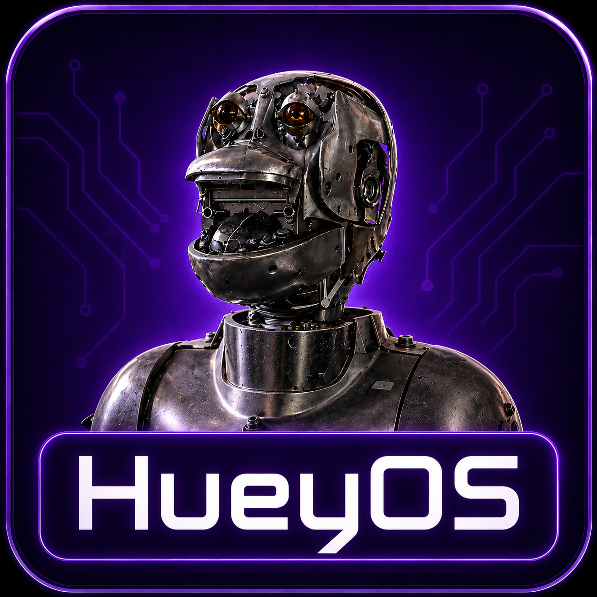
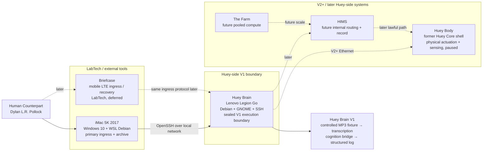
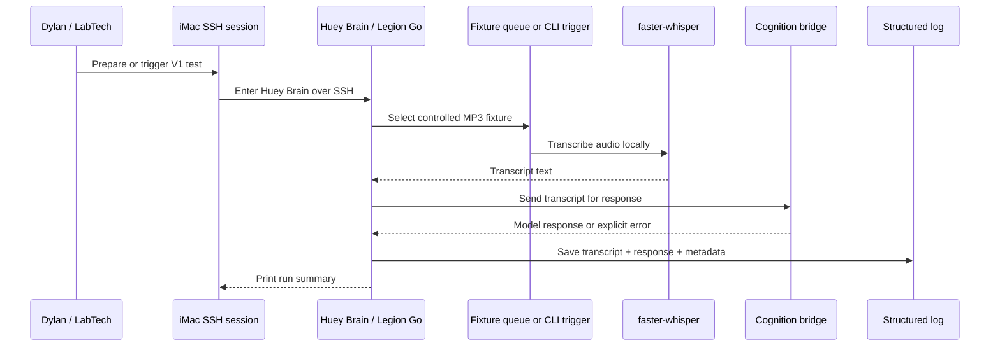
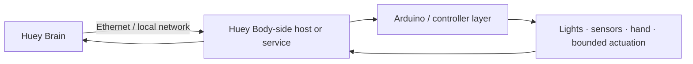
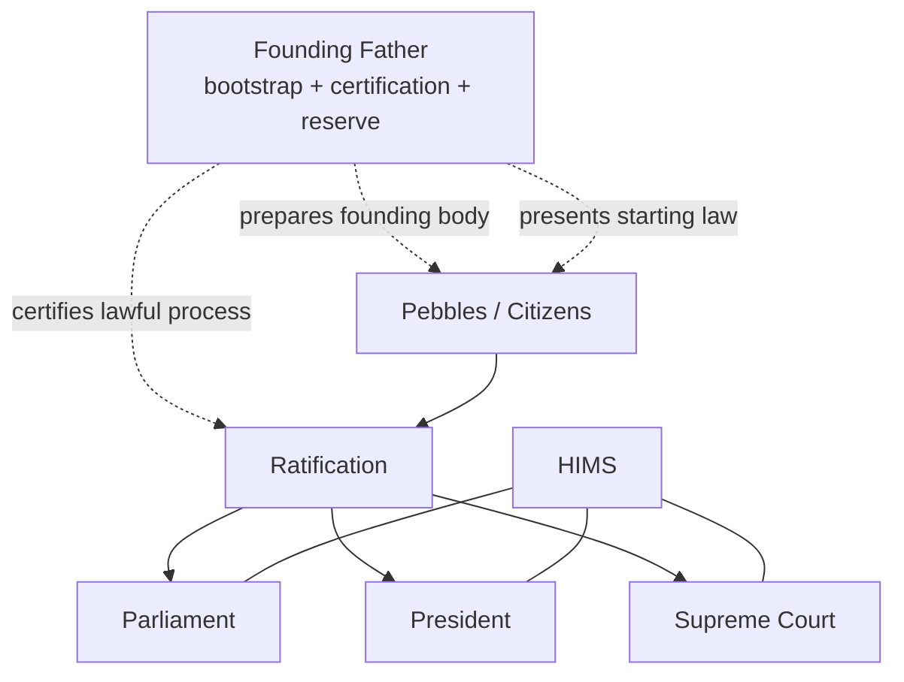

# Monkey-Head-Project

<p align="center">
  
</p>

<h2 align="center">HueyOS — Offline-First Embodied AI / OS</h2>

<p align="center">
  <strong>A long-running, hardware-grounded project to build Huey: a governed, embodied AI system using obtainable technology.</strong>
</p>

<p align="center">
  <a href="#current-v1-proof-target">Current proof target</a> ·
  <a href="#current-system-map">System map</a> ·
  <a href="#v1-build-path">V1 build path</a> ·
  <a href="#tooling-and-operating-surface">Tools</a> ·
  <a href="#core-glossary">Glossary</a>
</p>

<p align="center">
  
  
  
  
  
  
  
</p>

---

## Project card

| Field | Current value |
|---|---|
| **Project ID** | `Monkey-Head-Project` |
| **System / OS layer** | `HueyOS` |
| **AI identity** | `Huey` |
| **Human counterpart** | Dylan L.R. Pollock |
| **README version** | `32.1` |
| **Canonical machine-facing spec** | `master-plan-v32.0.json` |
| **Canonical law layer** | `03 - Huey_Constitution.txt` |
| **Canonical book front matter** | `00 - TOC_&_Glossary.txt` |
| **Current phase** | Huey Brain V1 implementation |
| **V1 execution boundary** | Lenovo Legion Go / Huey Brain only |
| **Current proof loop** | controlled MP3 fixture → local transcription → cognition bridge → structured log |
| **V1 hardware policy** | stock/unmodified Legion Go; observe thermals, do not alter enclosure |
| **V1 audio policy** | predetermined MP3 fixture suite; no live microphone |
| **Supported Python** | Python 3.13.x only; Python 3.14.x is research-stage only |

> HueyOS is the software and operating-system layer behind Huey: the environment that coordinates local AI, memory, tools, access paths, hardware, and later embodied control into one offline-first system.
>
> The project rests on a simple claim: a real embodied AI system can be built with today’s technology, and it can be built honestly, layer by layer, without pretending the hard parts are magic.

Governance remains **decentralized** while memory remains **unified**.

---

## One-screen orientation

The current README is intentionally **V32.x-aligned**.

V31.x established the clean split between **LabTech**, **Huey Brain**, and **Huey Body**. V32.0 tightens the active implementation scope:

> **For V1, the Lenovo Legion Go is the sealed Huey Brain execution boundary.**

That means the first proof is not distributed across the Body, LabTech, or future governance layers. The system is narrowed to one real machine running one repeatable cognitive loop.

| Current name | Layer | Present role |
|---|---|---|
| **LabTech** | External | Operator, ingress, archive, recovery, documentation |
| **Huey Brain** | Huey-side cognition | Active V1 execution boundary on the Lenovo Legion Go |
| **Huey Body** | Huey-side embodiment | Former Huey Core physical shell; paused for V1 and V2+ only |
| **HIMS** | Internal doctrine/runtime target | Mandatory future lawful routing and record layer; not V1 runtime |
| **PyGPT-net** | Aperture candidate / later lab interface | Deferred for V1; useful later when richer access/debugging is needed |
| **The Farm** | Future pooled compute | Deferred; not used for V1 proof |

The current implementation priority is not a robot demo, not live listening, and not a distributed system. It is:

> **Prove one stable, repeatable, logged cognitive loop on the Legion Go before reintroducing physical action.**

---

## Current system map



### Current working formula

- **LabTech enters.**
- **Huey Brain runs the V1 loop.**
- **Huey Brain writes the record.**
- **Huey Body acts later.**
- **HIMS governs later.**
- **Portal and LabTech devices open sessions but do not become Huey.**

---

## Start here

This repository is meant to work at more than one depth.

| Reader goal | Start with |
|---|---|
| Fast orientation | [What this project is](#what-this-project-is), [What exists now](#what-exists-now), [Current V1 proof target](#current-v1-proof-target) |
| Implementation | [V1 build path](#v1-build-path), [Tooling and operating surface](#tooling-and-operating-surface), [Quick start](#quick-start) |
| Architecture | [LabTech and ingress](#labtech-and-ingress), [Huey Brain](#huey-brain), [Huey Body](#huey-body), [HIMS](#hims--huey-internal-messaging-system) |
| Canon | [Canon stack](#canon-stack), [Governance and legitimacy](#governance-and-legitimacy), [Core glossary](#core-glossary) |

The aim is not to present Huey as an unreachable finished machine. The aim is to make the current system understandable, modular, testable, and buildable.

---

## What this project is

The **Monkey-Head-Project** is the umbrella initiative.

**Huey** is the governed AI and robotic identity being built within that initiative.

**HueyOS** is the software and operating-system layer behind Huey.

**Huey Brain** is the current active V1 cognition and orchestration node. In V32.0, Huey Brain means the Lenovo Legion Go as a sealed, single-node execution boundary for the first deterministic cognitive loop.

**Huey Body** is the physical robotic shell and actuation platform formerly described as Huey Core. In V32.x language, it is paused for V1 and referenced only as V2+ embodiment.

**Huey proper** refers to the fuller unified, world-facing system beyond the current Brain/Body proof stage.

**LabTech** is the external operator environment and tool layer. It includes the iMac 5K and the Briefcase. LabTech is not Huey.

**HIMS** — the **Huey Internal Messaging System** — is the canonical future internal messaging, validation, routing, and record-preservation layer.

**ThunderMail** is the practical mail-style delivery layer inside HIMS.

**PyGPT-net** is a later aperture candidate and debugging/interface surface. It is not required for V1.

**The Farm** is the planned future pooled-compute expansion body.

Huey Brain V1 is not presented here as the finished republic. Its role is to prove that a stable input → transcription → interpretation/response → log loop can run in the real world before the larger system is scaled outward.

---

## What exists now

### Active

| Component | Current state |
|---|---|
| **Huey Brain** | Lenovo Legion Go, treated as the sealed V1 execution boundary |
| **Huey Brain OS** | Debian + GNOME + SSH in current working direction |
| **Primary LabTech station** | 2017 iMac 5K running Windows 10 bare metal with Boot Camp drivers |
| **Ingress environment** | Windows Terminal Preview → WSL Debian → OpenSSH → Huey Brain |
| **SSH connection** | Proven locally from iMac to Huey Brain |
| **V1 input method** | Controlled predetermined MP3 fixtures |
| **V1 transcription direction** | faster-whisper, benchmarking small.en int8 vs medium.en int8 |
| **V1 response direction** | API-backed cognition bridge as baseline; optional local model experiments later |
| **V1 record** | Structured run log containing source, transcript, response, timestamps, model/runtime metadata |
| **Documentation direction** | README = human-facing front door; master plan = machine-facing source of truth |
| **Command Center** | Local-first migration dashboard/prototype companion, tracked as an optional umbrella submodule at `integrations/command-center` |

### Paused

| Component | Paused meaning |
|---|---|
| **Huey Body** | Physical shell exists, but is not in the V1 cognitive loop |
| **Live microphone input** | Deferred until MP3 fixtures prove transcription determinism |
| **Wake word / passive listening** | Deferred until live input is proven |
| **PyGPT-net** | Deferred until the system needs richer interface/debug access |
| **HIMS runtime** | Doctrine retained; runtime deferred until after simple loop proof |
| **Multi-agent governance** | Constitutional design retained; not claimed as active runtime |
| **Distributed compute** | Rejected for V1; not needed until after single-node proof |

### Future-facing

| Component | Future role |
|---|---|
| **Briefcase** | Mobile LTE LabTech ingress and recovery node |
| **Huey Body Ethernet link** | Brain → Body control path in V2+ |
| **The Farm** | Later pooled compute / district-scale expansion |
| **~80 GB VRAM threshold** | Later local identity proof target |
| **Local sovereign model path** | Future replacement for API-backed bridge after hardware/model proof |

---

## Current baselines

### Huey Brain baseline

| Item | Current baseline |
|---|---|
| Hardware | Lenovo Legion Go, first generation |
| Processor | AMD Ryzen Z1-class APU |
| Memory | 16 GB unified system / graphics memory |
| Storage | 512 GB M.2 SSD class storage |
| OS | Debian |
| Desktop | GNOME |
| Network | SSH over local network |
| Display | Built-in display used for status, thermals, headroom, and local visibility |
| Physical posture | Portrait/standing posture is acceptable if it supports airflow and workspace needs |
| Controllers | Controller arrangement is practical/ergonomic, not architecturally significant |
| V1 role | Transcription, cognition bridge, orchestration, logging, system status |
| V1 boundary rule | All V1 Huey-side processing happens here |

The Legion Go is treated as the **canonical Phase-1 Huey Brain hardware**. It is not a gaming handheld in this project context. It is a dedicated Huey cognition appliance and local system console.

### Legion Go hardware policy

V32.0 locks the Legion Go as a fixed reference machine for V1.

| Policy area | V1 decision |
|---|---|
| Enclosure | Do not alter for V1 |
| Airflow path | Do not cut, redesign, or replace for V1 |
| SSD | Use existing storage unless storage becomes a measured blocker |
| Fan profile | Stable high/full fan behavior is acceptable if observed and documented |
| Thermals | Monitor; do not optimize before proof |
| External peripherals | Allowed when they do not alter the reference machine |
| 3D printed shells / keyboard cases | Deferred |
| Larger SSD | Deferred unless a real storage blocker appears |

Rationale:

> V1 needs a known fixed platform more than optimized thermals.

Hardware modification can create uncertainty about whether failures are caused by software, model size, thermal throttling, enclosure changes, or power behavior. For V1, the reference machine must stay stable and documentable.

### Primary LabTech baseline

| Item | Current baseline |
|---|---|
| Hardware | 2017 iMac 5K |
| Host OS | Windows 10 bare metal |
| Apple support layer | Boot Camp drivers installed |
| Main OS storage | Internal HDD, acceptable for archival / terminal role |
| Fast terminal environment | WSL Debian stored on SSD/VHDX path |
| Terminal | Windows Terminal Preview |
| V1 role | Primary ingress, archive, operator station |

### Briefcase baseline

| Item | Current baseline |
|---|---|
| Hardware | ASUS rugged 2-in-1 / tablet-laptop class device |
| Processor | Intel N4500-class CPU |
| Memory | 4 GB RAM |
| Useful traits | Rugged, portable, LTE-capable, Debian-capable with ZRAM |
| Role | LabTech mobile ingress / recovery node |
| V1 status | Deferred; not required for V1 completion |

### Huey Body baseline

Huey Body is the former Huey Core physical shell and remains materially important, but it is not part of V1.

Known body characteristics include:

- Thermaltake Mozart-based chassis
- inverted/reversed physical arrangement
- rolling base
- upper head/shoulder structure
- 7-inch portrait display
- LEDs, fans, switches, and robotic hand/arm work
- Ryzen 5 5500 / ASUS B550M-A / RX 5500 XT class internal compute history

The Body is not discarded. It is deliberately paused so the Brain can be proven first.

V32.0 rule:

> Do not run transcription, cognition, orchestration, or V1 logs on Huey Body, even if Huey Body has usable VRAM.

---

## Current V1 proof target

V1 is:

> **Take a known controlled MP3 fixture, transcribe it locally on Huey Brain, route the resulting text to a cognition layer, receive a coherent response, and preserve a structured log.**

It is intentionally deterministic.

### Why MP3 fixtures first

Live microphones introduce too many variables at once:

- room noise
- microphone placement
- speaking variation
- capture timing
- wake-word complexity
- repeated human test fatigue

MP3 fixtures make the first pipeline testable. The same input should produce the same transcript and the same system behavior class every time.

### Fixture set direction

V1 should use a small, controlled fixture set, such as:

| Fixture type | Purpose |
|---|---|
| Clear / audible speech | Establish clean baseline |
| Static / noisy speech | Test resilience |
| Quiet speech | Test volume sensitivity |
| Loud speech | Test clipping / level handling |
| Longer multi-sentence sample | Test context and runtime behavior |

The fixture files are not disposable live recordings. They are test assets and should remain versioned or otherwise preserved for repeatability.

### V1 pipeline



### V1 success

V1 is complete when:

- iMac can consistently SSH into Huey Brain,
- Huey Brain remains the sole Huey-side execution boundary,
- controlled MP3 fixtures can be processed,
- faster-whisper or equivalent produces usable transcripts,
- the transcript can be routed to the chosen cognition bridge,
- the response is returned cleanly or an explicit error is logged,
- a structured log entry is created for every run,
- fixture batches can repeat without manual repair,
- and observed thermals/memory do not invalidate repeatability.

### V1 failure

V1 is not complete if:

- the SSH path is unreliable,
- transcription requires repeated manual correction,
- the loop requires Huey Body or distributed compute,
- the script breaks between runs,
- the cognition bridge is unstable or unlogged,
- logging is missing or unreadable,
- thermal or memory pressure makes fixture batches inconsistent,
- or the system feels like a loose toolchain rather than one repeatable loop.

---

## V1 build path

### Phase 1 — Reference machine stabilization

Goal: Huey Brain is a known, repeatable Legion Go environment.

Checklist:

- [ ] Confirm Debian/GNOME session stability on Legion Go
- [ ] Confirm SSH from iMac repeatedly
- [ ] Assign stable hostname or predictable IP
- [ ] Confirm fan/thermal behavior under expected load
- [ ] Confirm memory headroom under expected load
- [ ] Keep Legion Go hardware/enclosure unchanged
- [ ] Install base packages: Python, virtualenv tooling, FFmpeg, Git, sensors
- [ ] Create project directories on Huey Brain
- [ ] Create `.env` or equivalent secret-handling policy
- [ ] Confirm no gaming / unrelated package bloat is introduced

### Phase 2 — Fixture suite definition

Goal: controlled MP3 fixtures exist for deterministic testing.

Checklist:

- [ ] Create/select clear audio fixture
- [ ] Create/select static/noisy fixture
- [ ] Create/select quiet fixture
- [ ] Create/select loud fixture
- [ ] Create/select longer multi-sentence fixture
- [ ] Name fixtures deterministically
- [ ] Optionally define expected/canonical transcripts
- [ ] Keep fixture audio separate from generated logs

### Phase 3 — Deterministic transcription benchmark

Goal: choose a reliable local transcription baseline.

Checklist:

- [ ] Install faster-whisper or selected Whisper runtime
- [ ] Run `small.en` int8 or equivalent across all fixtures
- [ ] Run `medium.en` int8 or equivalent across all fixtures if stable
- [ ] Compare accuracy, punctuation, runtime, memory, thermals, and repeatability
- [ ] Treat `medium.en` int8 as likely V1 standard if stable
- [ ] Keep `small.en` int8 as fallback
- [ ] Do not require Whisper large / large-v3 for V1

### Phase 4 — Cognition bridge

Goal: transcript → model response.

Checklist:

- [ ] Add a provider route
- [ ] Use API-backed cognition as the V1 quality/consistency baseline
- [ ] Fail cleanly if API key or network is unavailable
- [ ] Log provider/model/config for every run
- [ ] Test local Mistral 7B quantized only after baseline stability
- [ ] Keep any local model experiment on Huey Brain, not Huey Body

### Phase 5 — Structured logging

Goal: every run leaves an inspectable trace.

Minimum log fields:

```json
{
  "timestamp": "ISO-8601",
  "run_id": "string",
  "session_id": "string",
  "source_device": "imac-5k-labtech",
  "execution_device": "huey-brain-legion-go",
  "input_file": "fixtures/001_clean.mp3",
  "input_file_hash": "optional",
  "transcription_engine": "faster-whisper",
  "transcription_model": "medium.en-int8",
  "transcript": "recognized text",
  "cognition_mode": "api | local | skipped",
  "model_provider": "provider-name",
  "model_name": "model-name",
  "response": "model response",
  "started_at": "ISO-8601",
  "finished_at": "ISO-8601",
  "runtime_seconds": 0.0,
  "status": "success | failure",
  "error": null
}
```

### Phase 6 — Single Huey command

Goal: the loop is invoked as one system behavior.

Early bring-up may use a manual command:

```bash
huey run fixtures/001_clean.mp3
```

or:

```bash
python -m huey_brain run fixtures/001_clean.mp3
```

The exact command can change. The principle should not:

> one command runs the whole V1 path.

### Phase 7 — Deterministic ingestion queue

Goal: fixture processing can be queued and repeated in controlled order.

Steady V1 direction:

```text
queue / watched folder → sequential fixture processing → structured logs
```

Rules:

- process sequentially,
- prefer filename/order determinism where useful,
- do not process partially copied files,
- preserve failed runs,
- do not introduce live-audio assumptions,
- do not parallelize before the single loop is boring.

---

## What is explicitly deferred beyond V1

| Deferred item | Reason |
|---|---|
| Huey Body compute/cognition | Would split the Brain role and break the V1 boundary |
| Huey Body actuation | Brain loop must stabilize before physical action |
| Brain → Body Ethernet protocol | Belongs to V2+ |
| Live microphone input | MP3 fixture path must be proven first |
| Wake word / passive listening | Too much capture complexity for V1 |
| PyGPT-net | Too heavy and unnecessary for V1 proof |
| HIMS runtime | Doctrine retained; runtime waits for simple loop proof |
| 128-pebble governance | Constitutional target, not V1 runtime |
| Multi-node inference | Premature before single-node Brain proof |
| Whisper large / large-v3 dependency | Too likely to destabilize runtime on the Legion Go |
| Legion Go enclosure/case modification | Optimizes the platform before proving the system |
| SSD expansion | Deferred unless storage becomes a measured blocker |

---

## V2 and later

### V2 — live input and system surface

V2 begins when real-world variability is introduced.

Likely V2 work:

- live microphone input
- push-to-talk or manual capture
- transcript-first retention policy
- Huey Brain local status surface
- CLI/TUI improvements
- optional lightweight web dashboard
- better telemetry display on the Legion Go screen

### V2+ — Brain to Body

After Brain stability, Huey Body returns through a defined channel.

Expected direction:



The Body should not be treated as a casual USB peripheral if the goal is a clean subsystem boundary. Ethernet remains the preferred internal lab transport direction.

### Future identity threshold

The later identity threshold remains:

> A sufficiently local, unified, distributed system answers the identity question with: **Huey.**

That later milestone depends on hardware scale, local model quality, memory continuity, routing integrity, and lawful embodiment. It is not the V1 goal.

---

## LabTech and ingress

LabTech is external to Huey.

It can originate requests, preserve files, display status, recover access, and help develop the system. It does not become Huey’s authority.

### Unified ingress rule

All LabTech devices should enter Huey Brain through the same class of controlled path:

```text
LabTech device → SSH ingress → Huey Brain → Huey process
```

No LabTech device should bypass Huey Brain to control Huey Body directly.

### Key model

The emerging identity model has two parts:

| Key class | Meaning |
|---|---|
| `lab_general` | The request originates from approved LabTech |
| device-specific key | The specific machine identity, such as iMac or Briefcase |

This creates:

```text
origin class + device identity
```

Connection is not the same thing as permission. Later enforcement can become more sophisticated, but the distinction should exist early.

### iMac 5K

The iMac is the primary anchored LabTech station.

Role:

- archival station
- primary SSH ingress
- documentation workstation
- stable operator seat

It is not responsible for heavy inference or primary Huey cognition.

### Briefcase

The Briefcase is mobile LabTech.

Role:

- portable ingress
- LTE-capable field access
- emergency / recovery SSH path
- lightweight reference and diagnostic station
- possible tablet-mode document/control surface

It is not a backdoor. It uses the same ingress rules as the iMac, with its own device identity.

---

## Huey Brain

Huey Brain is the active implementation center of V32.x.

Its job in V1:

- act as the sealed V1 execution boundary,
- host the pipeline,
- run local transcription,
- route transcript text to the cognition layer,
- preserve logs,
- expose a stable SSH-accessible entry command,
- process controlled fixture batches,
- display system state where useful,
- and remain a dedicated Huey cognition appliance rather than a general-purpose handheld.

Its V1 non-jobs:

- physical actuation,
- live microphone capture,
- wake-word listening,
- Huey Body control,
- multi-node orchestration,
- HIMS/ThunderMail runtime,
- Farm-scale compute,
- full local sovereign intelligence.

The Legion Go screen is useful as a local status console:

- thermals,
- RAM headroom,
- storage,
- network state,
- running services,
- and simple toggles later.

The touchscreen is not the main V1 interface. It is a future control/status surface.

---

## Huey Body

Huey Body is the embodied physical platform.

Its job later:

- sensing,
- status display,
- bounded actuation,
- lights,
- hand/arm control,
- body-state reporting,
- and physical interaction under the proper command path.

For V1, Huey Body is intentionally paused. That does not demote it. It prevents physical integration from obscuring whether the Brain loop works.

Important V32.0 boundary:

> Huey Body may be referenced only as V2+ embodiment during V1 planning. It should not supply VRAM, cognition, transcription, logging, or orchestration for the current proof.

---

## HIMS — Huey Internal Messaging System

HIMS is the canonical internal routing and record layer.

Its purpose is to ensure that meaningful requests can become structured, reviewable, and lawful actions rather than direct commands.

HIMS doctrine remains active, but HIMS runtime is not part of V1.

### Future HIMS flow


### ThunderMail

ThunderMail is the practical mail-style delivery layer inside HIMS.

It covers inboxes, outboxes, queues, acknowledgements, and directed delivery. HIMS carries the heavier burden of routing legality, validation, compartmentalization, and preserved record.

---

## PyGPT-net posture

PyGPT-net is useful, but it is not required for V1.

Current posture:

- not the system,
- not HIMS,
- not Huey’s sovereignty,
- not the first implementation dependency.

PyGPT-net becomes useful later when the project needs richer interface access, debugging surfaces, and visibility into many agents or modules.

For V1, a small CLI loop and deterministic queue are more honest.

---

## Audio, memory, and data handling

The V1 retention rule is:

> **Controlled fixture audio is test input. Structured text/log output is the canonical V1 memory artifact.**

For MP3 fixtures:

- fixture audio remains as repeatable test input,
- transcripts are saved,
- responses are saved,
- structured logs are saved,
- run metadata is preserved.

For later live audio:

- audio should be temporary by default,
- transcript should be the preserved artifact,
- raw audio should be retained only when explicitly flagged.

This prevents the system from becoming an uncontrolled audio archive while preserving the V1 fixture suite for regression testing.

---

## Local model posture

V1 does not require local LLM authority.

The baseline V1 cognition route is API-backed because the current proof is about deterministic processing, logging, and orchestration. API cognition is a bridge, not final sovereignty.

### Mistral 7B / local experiment rule

Mistral 7B quantized, such as a Q4_K_M class GGUF, may be tested only after the baseline loop is stable.

Rules:

- run local model experiments on Huey Brain only,
- do not use Huey Body for V1 local cognition,
- do not make local model output a prerequisite for V1 completion,
- log local model name, quantization, runtime, and error state when tested.

A local model is accepted only if it improves or preserves repeatability, observability, and logging discipline.

---

## Governance and legitimacy

Huey is not meant to be a flat assistant or a single hidden controller pretending to be a republic.

The constitutional target is a governed system built around:

- **Founding Father** as bootstrap authority,
- **Pebbles** as bounded citizens,
- **Parliament** as the deliberative and representative branch,
- **President** as the executive office under time constraint,
- **Supreme Court** as the judicial interpreter and stabilizer,
- and **HIMS** as the lawful route through which messages, proposals, validation, and official traces move.

In the current V1 phase, these doctrines are ahead of implementation. That distinction must stay visible.

### Governance at a glance



### Branch summary

| Office / branch | Core job | What it is not |
|---|---|---|
| Founding Father | Bootstrap authority, founding continuity, procedural certification, narrow reserve consultation | Permanent ruler or founding voter |
| Parliament | Deliberation, proposals, representation, consensus-building | The whole will of Huey |
| President | Action under time constraint, executive implementation | Huey as a whole |
| Supreme Court | Constitutional interpretation, review, contradiction handling | A hidden sovereign |
| HIMS | Messaging, validation, routing, preserved trace | A fourth sovereign branch |

### Current legitimacy posture

At present:

- Dylan remains the external human counterpart,
- V1 is not a constitutional republic,
- first ratification remains a later step,
- and lawful embodied action remains a target that must follow real routing and approval paths.

---

## Deployment profiles

| Profile | Meaning | V32.x status |
|---|---|---|
| **Huey Brain** | Active cognition/orchestration node | Current implementation center |
| **Huey Body** | Physical robotic shell / actuation platform | Paused until Brain proof |
| **LabTech** | External tools, terminals, archives, recovery devices | Active |
| **Huey-Compressed** | Collapsed deployment where multiple Huey-side roles share hardware while staying logically distinct | Future / doctrine |
| **Portal Terminal** | Thin, non-sovereign access surface | Future / doctrine |
| **The Farm** | Later pooled compute expansion body | Future |

The governing rule is:

> **Physical location does not decide identity. Role, authority, memory, and control boundaries do.**

---

## Portal terminals

Portal terminals remain part of the wider architecture, but they are not the V1 priority.

A portal terminal exists to:

- authenticate and open a lawful session,
- present a bounded doorway into Huey,
- transmit user input,
- receive Huey output,
- and stay thin enough that it does not become a second brain.

The Vista Box / Longhorn-style portal artifact remains conceptually alive, but the current active ingress path is simpler:

```text
iMac → WSL Debian → OpenSSH → Huey Brain
```

---

## Tooling and operating surface

### Current tools

| Tool / surface | Current role |
|---|---|
| Debian | Huey Brain OS baseline |
| GNOME | Local Legion Go desktop/status surface |
| OpenSSH | Primary ingress transport |
| Windows Terminal Preview | iMac terminal surface |
| WSL Debian | Linux-side ingress environment on iMac |
| Python 3.13.x | Day-to-day scripting/runtime baseline |
| FFmpeg | Audio conversion and fixture handling |
| faster-whisper / Whisper | Local transcription testing |
| API model provider | Primary V1 response quality and consistency bridge |
| Git | Version control and project state |
| HueyOS Launcher Setup (Windows) | Safe local bootstrap for Command Center setup, repo binding, and doctor checks |
| lm-sensors / system tools | Thermals and status visibility |

### Tools deferred

| Tool | Deferred reason |
|---|---|
| PyGPT-net | Too heavy for V1; useful later for richer aperture/debugging |
| Ollama / local LLM authority | Useful for tests, not V1 quality baseline |
| VNC / full remote desktop | Too heavy and unnecessary for the ingress path |
| Wake-word stack | Belongs after live audio capture |
| Multi-agent orchestration tools | Belongs after the simple Brain loop works |
| Body-side inference | Splits V1 authority and logging |

---

## Presentation and imagery

The README should stay visually clear without becoming theatrical.

Recommended image roles:

| Image role | Suggested asset |
|---|---|
| README hero | `assets/img/huey/huey-hero-wide-v85.webp` |
| Project origin / umbrella | `assets/img/pages/monkey-head-project-hero.webp` |
| Huey body lineage | `assets/img/huey/lineage/huey-shell-v2-body-v80.webp` |
| Huey closeup | `assets/img/huey/core/huey-core-closeup-v80.webp` |
| README social / OG card | `assets/img/og/og-readme.png` |

Image rules:

- use real project images where possible,
- prefer wide hero imagery at the top,
- avoid fake futuristic stock art,
- avoid implying completed capabilities visually before they exist,
- keep diagrams structural and honest.

If this README is used outside the website archive, copy the referenced assets into the repository or remove the top hero image block.

---

## Repository map

This repository is moving toward a cleaner long-term structure.

### Core reference points

| File / area | Role |
|---|---|
| `README.md` | Human-facing front door |
| `master-plan-v32.0.json` | Canonical machine-facing implementation spec |
| `03 - Huey_Constitution.txt` | Constitutional / law layer |
| `00 - TOC_&_Glossary.txt` | Book front matter and glossary |
| `requirements.txt` | Dependency baseline |
| `constraints.txt` | Shared install constraints |
| `pyproject.toml` | Package and install contract |
| `docs/development/python-support-policy.md` | Python runtime support policy |
| `Makefile` | Convenience entry points, if present |

### Working repository areas

| Area | Purpose |
|---|---|
| `docs/` | Architecture, audits, reference material |
| `src/` | Importable implementation work |
| `src/huey/os/` | Canonical HueyOS subsystem surface |
| `src/huey/apps/` | Runnable entry points |
| `src/huey/connectors/` | Adapter and integration work |
| `src/huey/core/` | Core runtime and kernel profile assets |
| `src/huey/config/` | Runtime configuration payloads |
| `vendor/` | Static third-party mirrors and lightweight compatibility copies |
| `infra/` | Orchestration and infrastructure support |
| `src/huey/platform/` | OS / platform-specific setup |
| `archives/` | Frozen payloads, snapshots, legacy material |
| `assets/` | Project media and visual identity |
| `tests/` | Regression and test coverage |

---

## Quick start

Use the current package/runtime contract from `pyproject.toml`, `constraints.txt`, `requirements.txt`, `Makefile`, and `docs/development/python-support-policy.md`.

### Python runtime policy

Monkey-Head-Project / HueyOS currently supports **Python 3.13.x only**.

Supported range:

```text
>=3.13,<3.14
```

Python 3.11.x and Python 3.12.x are not part of the current supported runtime contract.

Python 3.14.x is **research-stage only**. It may be explored in isolated branches or throwaway environments, but it should not be treated as supported until the dependency stack, audio compatibility packages, ML packages, PyGPT/PyHuey integration, and HueyOS runtime path have all been validated.

See `
docs/development/python-support-policy.md
` for the canonical support policy.


- **Source install path:**
```bash
cd /workspace/Monkey-Head-Project
```
- **Editable install command:**
```bash
python3.13 -m pip install -c constraints.txt -e .
```
- **Test command:**
```bash
python3.13 -m pytest -q
```
- **System check command:**
```bash
huey system-check --json
```
- **API launch command:**
```bash
huey-api
```
- **Health check command (after API launch):**
```bash
curl -fsS http://127.0.0.1:1995/healthz
```
- **V1 mock proof-loop command (implemented, CI-safe):**
```bash
huey v1-run --mock path/to/fixture.mp3 --log-dir runs
```

Boundary notes:
- Huey Brain V1 remains the controlled fixture loop only: MP3 fixture → transcription stage → cognition bridge → structured run log.
- `huey v1-run` currently requires `--mock` unless explicit real providers are wired; this prevents overclaiming live hardware proof.
- PyHuey stays optional cockpit/tooling (`infra/docker/pyhuey`) and is not the HueyOS/Huey Brain runtime path.

### Windows launcher (safe Command Center bootstrap)

The repository now ships a prebuilt Windows launcher and matching Go source at `src/huey/platform/installers/windows/launcher/`.

| Action | Result |
|---|---|
| Double-click | Creates HueyOS folders/config if needed, then tries to launch HueyOS Command Center. |
| `HueyOS-Launcher-Setup.exe --install` | Creates `%APPDATA%\HueyOS`, `%LOCALAPPDATA%\HueyOS`, `%LOCALAPPDATA%\HueyOS\logs`, and `%LOCALAPPDATA%\HueyOS\workspace`. |
| `HueyOS-Launcher-Setup.exe --set-repo L:\Monkey-Head-Project` | Saves the local Monkey-Head-Project checkout path. |
| `HueyOS-Launcher-Setup.exe --set-python C:\Python313\python.exe` | Pins a specific Python executable. |
| `HueyOS-Launcher-Setup.exe --launch` | Runs the configured HueyOS Command Center entry point. |
| `HueyOS-Launcher-Setup.exe --doctor` | Generates a local doctor report and opens it in Notepad. |
| `HueyOS-Launcher-Setup.exe --open-config` | Opens the HueyOS config folder. |
| `HueyOS-Launcher-Setup.exe --help` | Shows launcher help. |

`--doctor` checks `py`, `python`, `git`, `ffmpeg`, `ffprobe`, the configured repo path, `pyproject.toml`, `scripts/check_ffmpeg_environment.py`, and `scripts/prepare_audio_for_transcription.py`.

Safety boundary: no file deletion, no Git mutation, no firmware flashing, no hardware control, no robot/servo/power actions, and no arbitrary shell execution.

### API deployment policy (safe defaults)

HueyOS API is designed for **local-first operation**. Public internet exposure is **unsupported** for V1 and should be treated as unsafe unless you add your own authenticated/TLS gateway and host-level controls.

- **Default bind policy:** keep API listen/bind on localhost (`127.0.0.1`).
- **Trusted LAN exception (opt-in):** only bind beyond localhost when you intentionally expose to a trusted private network segment.
- **Never expose directly to WAN:** do not publish `1995` directly on a public IP.

Environment guidance for Docker/Compose:

- `HUEY_HOST` controls the in-container API bind host. Recommended default: `127.0.0.1`.
- `HUEY_PORT` controls the API port (default `1995`).
- `HUEY_BIND_ADDR` controls host-side publish address in Compose. Keep `127.0.0.1` unless you intentionally need trusted-LAN access.

Example (safe local default):

```env
HUEY_HOST=127.0.0.1
HUEY_PORT=1995
HUEY_BIND_ADDR=127.0.0.1
```

Example (trusted LAN opt-in, not internet):

```env
HUEY_HOST=0.0.0.0
HUEY_PORT=1995
HUEY_BIND_ADDR=0.0.0.0
```

Firewall guidance (required when non-local bind is used):

- Allow inbound `tcp/1995` only from explicit trusted CIDRs (for example, `192.168.0.0/16` or a single admin host).
- Deny all public/WAN sources to `tcp/1995`.
- Prefer SSH tunneling or an authenticated reverse proxy with TLS over direct exposure.

### iMac ingress check

From WSL Debian on the iMac:

```bash
ssh username@192.168.x.x
```

Replace `username` and `192.168.x.x` with the Huey Brain user and local network address.

### Build documentation locally

Use the docs-only dependency set (no full PyHuey GUI/runtime stack required):

```bash
python3.13 -m venv .venv-docs
source .venv-docs/bin/activate
python -m pip install --upgrade pip
pip install -r docs/requirements.txt
sphinx-build -b html docs docs/_build/html -W --keep-going
```

### Local developer security check

Run the local helper script before opening a PR:

```bash
./scripts/security/security_check.sh
```

Optional outdated dependency report:

```bash
./scripts/security/security_check.sh --outdated
```

The script is developer-friendly by design:

- Runs `pip-audit -r requirements.txt` when `pip-audit` is installed.
- Runs `bandit` against `src/` and `scripts/` and fails on HIGH severity + HIGH confidence findings.
- Runs a secret scanner only when a local scanner configuration exists (`.gitleaks.toml`, `gitleaks.toml`, or `.secrets.baseline`).
- Prints clear install guidance when tools are missing.
- Avoids printing raw secrets by using redacted scanner modes where supported.

Current script layout:

- `scripts/repo/` for repository maintenance and CI guardrails
- `scripts/media/` for standalone conversion utilities
- `scripts/security/` for local security helpers
- `scripts/automation/{py,sh,bat,ps1}/` for memory-backed launcher surfaces

Legacy flat `scripts/*` entrypoints remain as compatibility wrappers where existing tooling still points at them.

---

## Canon stack

The Monkey-Head-Project is one canon with distinct layers.

| Layer | Role |
|---|---|
| README / website | Front-door human introduction |
| Book / compendium | Explanatory volume |
| Huey Constitution | Legal and constitutional frame |
| Master plan | Canonical machine-facing implementation spec |

If the narrative and implementation ever conflict, the **master plan wins for machine-facing implementation**, and the conflict should be surfaced and corrected rather than ignored.

---

## Core glossary

### Core system terms

| Term | Meaning |
|---|---|
| **Monkey-Head-Project** | The umbrella initiative. |
| **Huey** | The governed intelligence and robotic identity. |
| **HueyOS** | The software and operating-system layer behind Huey. |
| **Huey Brain** | The active V32.x cognition and orchestration node, currently the Lenovo Legion Go. |
| **Huey Body** | The physical robotic shell and embodiment platform, formerly referred to as Huey Core. |
| **Huey Core** | Legacy/previous name for the active proof body; replaced by the Brain/Body distinction. |
| **Huey proper** | The fuller unified world-facing expression beyond the current proof phase. |
| **LabTech** | External operator tools, terminals, archives, scripts, and recovery devices. |
| **iMac 5K** | Primary LabTech ingress and archival station. |
| **Briefcase** | Mobile LabTech ingress and recovery node. |
| **HIMS** | Huey Internal Messaging System: lawful future messaging, validation, routing, and record-preservation layer. |
| **ThunderMail** | The mail-style delivery layer inside HIMS. |
| **PyGPT-net** | Later aperture/interface candidate; deferred from V1. |
| **Command Center** | Optional companion dashboard/prototype repo under the Monkey-Head-Project umbrella; not Huey Brain runtime. |
| **Portal Terminal** | Non-sovereign external terminal or guest environment used to open sessions into Huey. |
| **The Farm** | Planned future pooled compute expansion body. |
| **Aperture** | The interpretation and translation layer where natural language enters without becoming governance. |
| **Proof Body** | The embodied proving instance; in V32.x this should be expressed as Huey Body when referring to the physical shell. |
| **Fixture** | A controlled MP3 test input used to prove deterministic transcription and regression behavior. |
| **Structured log** | The canonical V1 memory artifact containing transcript, response, source, and run metadata. |
| **Cognition bridge** | The V1 route from transcript text to model response; API-backed by baseline, local later. |

### Governance and continuity terms

| Term | Meaning |
|---|---|
| **Founding Father** | The fixed bootstrap authority that prepares the first lawful conditions, presents starting law, certifies lawful ratification procedure, and retires from ordinary rule after success. |
| **Pebble** | A bounded AI citizen unit defined by identity, sealed vault, and one vote. |
| **Sealed Vault** | A pebble’s bounded private continuity and memory domain. |
| **District** | A larger governance and expansion unit within Huey’s constitutional design. |
| **Parliament** | The deliberative and representative branch. |
| **President** | The executive office that acts under time constraint. |
| **Supreme Court** | The judicial branch that interprets, reviews, and stabilizes. |
| **Scrolls** | The preserved record and ledger logic through which major actions and lawful traces remain attributable. |
| **Keeper of the Scrolls** | Office associated with HIMS routing discipline and record preservation. |
| **Cornerstone** | The non-casual identity and continuity layer of Huey. |
| **Pillar** | A declared load-bearing commitment that the current version of Huey stands on. |
| **Ozymandias** | Continuity doctrine concerned with drift, degradation, growth, survival, failure, and beginning again. |
| **Proof Positive** | Preferred long-form name of the project’s proof standard. |
| **Proofcase** | Shorthand label used in front matter for the proof standard. |
| **Ratification** | Logged transition by which the living system accepts the Constitution as lived law. |
| **Failed Genesis** | Founding failure in which the authored starting law cannot become legitimate within lawful bounded attempts and time. |
| **Human Counterpart** | The external arbiter and service authority who remains outside the internal branches while retaining external intervention/gating authority. |
| **Unified Memory** | Doctrine that memory should remain reconcilable and shared where lawful, even when governance stays distributed. |
| **Distributed Governance** | Doctrine that authority should remain separated, plural, and reviewable rather than collapsing into one flat sovereign voice. |

---

## Roadmap

### Current phase

Huey Brain V1 implementation:

- stable SSH ingress from iMac,
- fixed Legion Go execution boundary,
- controlled MP3 fixture suite,
- deterministic local transcription,
- API-backed response bridge,
- structured logging,
- manual bring-up followed by deterministic queue/watch-folder processing.

### Near-term goals

- finish Huey Brain environment stabilization,
- define and preserve the MP3 fixture suite,
- benchmark faster-whisper `small.en` int8 vs `medium.en` int8,
- choose the smallest transcription model that meets archive-safe fixture needs,
- add API response routing,
- define log schema,
- wrap the loop in a `huey` command,
- move from manual CLI smoke tests to a deterministic queue,
- document exact setup steps after first successful repeatable run.

### V2 goals

- live microphone capture,
- transcript-first retention policy,
- local status dashboard on Legion Go,
- Brain → Body Ethernet path,
- bounded Body-side command service,
- first non-governed physical status/action tests.

### Larger future targets

- HIMS runtime,
- ThunderMail mail-style routing,
- PyGPT-net or equivalent aperture/debugging surface,
- founding 128-pebble system,
- lawful embodied action,
- local model replacement for API-backed cognition,
- roughly 80 GB pooled local VRAM,
- future Farm expansion.

### Current open questions

- exact fixture set and naming convention,
- whether each fixture gets a canonical expected transcript,
- exact faster-whisper model/config after benchmark,
- exact API provider/model routing policy,
- exact log schema location and naming,
- exact `huey` command layout,
- exact queue/watch-folder implementation,
- exact status display/tooling on the Legion Go screen,
- exact criteria for reintroducing Huey Body in V2+.

---

## License

Code is licensed under **GPL-3.0-only**.  
Documentation and media are licensed under **CC-BY-SA-4.0** unless otherwise noted.

---

## Notes

This README is the front door, not the whole building.

It is meant to help a reader understand:

- what Huey is,
- what exists now,
- what is active,
- what is deferred,
- what remains future-facing,
- and how the project keeps itself honest while it grows.

If you are looking for the machine-facing source of truth, use the master plan.

If you are trying to understand whether the project is still telling the truth about itself, follow the continuity doctrine:

> preserve lineage, explain change, admit failure honestly, and do not confuse motion with legitimacy.
