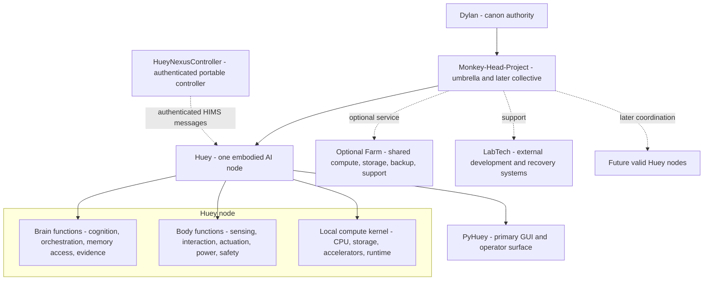
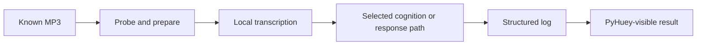

# Monkey-Head-Project

<p align="center">
  
</p>

<h2 align="center">HueyOS</h2>

<p align="center"><strong>One embodied AI node first. A deliberate collective later.</strong></p>

<p align="center">
  <a href="#project-position">Position</a> ·
  <a href="#unified-v200x-standard">Standard</a> ·
  <a href="#node-first-architecture">Architecture</a> ·
  <a href="#huey-v4-embodiment">Huey V4</a> ·
  <a href="#maintained-subprojects">Subprojects</a> ·
  <a href="#runtime-and-v1">Runtime</a> ·
  <a href="#human-oversight-gate">Human review</a>
</p>

<p align="center">
  
  
  
  
  
</p>

> [!IMPORTANT]
> This branch is a review candidate. It does not independently lock project canon. README v120.3 and `master-plan-v120.3.json` remain the accepted predecessor until Dylan L.R. Pollock explicitly approves or intentionally merges a designated canonical update.

## Project position

The **Monkey-Head-Project** is the umbrella initiative behind **Huey**, **HueyOS**, physical embodiment, maintained controller and LabTech subprojects, project archives, and the later possibility of coordination among multiple valid Huey nodes.

The current v201.x candidate centers one rule:

> **Build one coherent, useful, attributable Huey node before making operational collective claims.**

In this model:

- **Huey** is one embodied AI node;
- **HueyOS** is the modular software and operating-system layer supporting the node;
- **PyHuey** is the primary GUI and a core-runtime direction, not the whole node;
- **Monkey-Head-Project** is the umbrella and eventual collective layer;
- **Brain** and **Body** remain useful node-local functional domains;
- **Farm** is optional shared or supra-node infrastructure;
- **LabTech** and maintained controller projects remain external support systems with bounded authority;
- **Atlas** remains an external continuity and implementation partner, not Huey.

## Unified v200.x standard

v201.x carries forward the strongest repository rules from v120.x and the strongest public/release rules developed through DLRP.ca v200.x.

### Truth classes

| Truth class | Meaning |
|---|---|
| **Current reality** | Observed hardware, merged code, working commands, tests, logs, and verified behaviour |
| **Accepted direction** | Architecture Dylan has selected for implementation, even when incomplete |
| **Provisional choice** | A replaceable working option pending evidence or review |
| **Unresolved** | A decision deliberately left open |
| **Target state** | A later capability dependent on resources, maturity, or validation |
| **Historical lineage** | Earlier systems and decisions preserved without silently overriding the present |

### Source authority

1. Dylan's explicit accepted decisions;
2. the newest accepted machine-facing master plan;
3. merged repository and implementation evidence;
4. README and technical documentation;
5. DLRP.ca presentation and release records;
6. older plans, transcripts, and archives as lineage.

A website claim, branch document, generated report, agent statement, or pull request is not automatically canon.

### Release discipline

Major project and website releases should preserve:

- human-readable and machine-readable records;
- source origin and synchronization status;
- checksums and generated-file inventories;
- fresh-extraction validation;
- explicit privacy and no-secret boundaries;
- deliberate image provenance, crop, alt-text, and use records;
- compact packages without duplicate payloads;
- system/local typography without remote font dependencies.

## Current position

| Area | Classification | Present position |
|---|---|---|
| **Repository canon** | Accepted predecessor | README v120.3 and `master-plan-v120.3.json` remain the baseline pending human review |
| **v201.x documents** | Review candidates | Standardization plan, migration matrix, oversight checklist, README, and master-plan candidate |
| **Huey node** | Accepted-direction candidate | One physically coherent AI unit is the proposed primary architectural unit |
| **Huey V4** | Active embodiment direction | V3 is proposed as the base, V2 as donor lineage, and the existing compute system as the intended kernel after validation |
| **HueyNexusController** | Maintained subproject direction | Nexus 5 `hammerhead` controller platform with native Debian target and LineageOS fallback |
| **PyHuey** | Primary GUI and core-runtime direction | Main operator surface; integration and authority boundaries require implementation evidence |
| **Current Python namespace** | Implemented | `huey` |
| **Target Python namespace** | Accepted predecessor direction | `hueyos`; no completed migration is claimed |
| **HIMS foundation** | Merged, non-controlling | Append-only messaging foundation; Nexus controller work reactivates it as an authenticated command-and-status transport target |
| **V1** | Unresolved | Must be useful, repeatable, attributable, and demonstrable before declaration |
| **Collective** | Target architecture | Not operational; one valid node comes first |

## Node-first architecture



A Huey node is proposed as one physically individual AI unit with local compute, Brain and Body functions, operator-visible state, attributable evidence, safe-stop and recovery behaviour, and useful standalone operation. Collective membership, Farm access, or bifurcation is not required for the first node to be valid.

Farm is optional shared infrastructure. The Monkey-Head-Project may later coordinate multiple valid nodes, but that collective is not currently operational.

## Huey V4 embodiment

Huey V4 is the active physical-cohesion direction, not a completed machine.

The candidate direction is:

- **V3** as the proposed physical base;
- **V2** as donor lineage or material where verified;
- the existing **i9 / TUF / Optane** system as the intended local kernel after inventory, backup, fit, power, cooling, and rollback validation;
- one maintainable physical object before renewed distributed-system expansion.

The terms **present**, **assembled**, **integrated**, **operational**, **validated**, and **complete** remain distinct.

### Compute direction

- CPU-first transcription, orchestration, logging, I/O, and support duties remain practical first assignments.
- Four node-local accelerators remain a working direction.
- `3 x Tesla V100 32 GB + 1 utility GPU` remains provisional.
- Acquisition, variants, PCIe topology, retention, power, cooling, and service access remain unresolved until measured.
- Aggregate accelerator memory must not be described as transparent unified VRAM.
- The inference framework and sharding method remain unresolved.

## Maintained subprojects

### HueyNexusController

**HueyNexusController** restores and repurposes Google Nexus 5 phones as dedicated physical controller devices for Huey and Huey Body.

| Field | Direction |
|---|---|
| **Reference device** | Google Nexus 5 |
| **Device codename** | `hammerhead` |
| **Subproject codename** | Shark-themed name, unresolved |
| **Primary OS target** | Native Debian-based system booting directly on the handset |
| **Fallback OS** | LineageOS using the same controller protocol where practical |
| **Preferred interface** | Phosh, GTK, Wayland, and a purpose-built PyHuey/Huey controller app |
| **Fallback interface** | KDE Plasma Mobile |
| **Connection** | Authenticated HIMS messaging |
| **Identity boundary** | Controller hardware only; Huey's identity and canonical memory do not reside on the handset |
| **Hardware policy** | One initial unit, with additional Nexus 5 devices retained as backups, development units, and parts sources |

The first proof must boot reliably, launch the controller automatically, authenticate with HIMS, submit a touchscreen or voice command, receive Huey's response, and preserve the transaction in a structured log.

Battery modifications remain safety-gated. Capacity, voltage stability, charging, swelling, temperature, and sustained-load discharge must be tested before reuse or modification.

See [`docs/hardware/huey-nexus-controller.md`](docs/hardware/huey-nexus-controller.md) for the complete maintained subproject specification.

## Runtime and V1

PyHuey remains the proposed primary GUI and a core runtime component. It should provide a clear, observable operator surface while preserving a CLI path for diagnostics, automation, and recovery.

V1 remains intentionally open. It should emerge from a recurring function that is useful, repeatable, attributable, and demonstrable.

The current foundation proof remains:



The HueyNexusController proof is a separate bounded integration path. It does not redefine V1 automatically.

### HIMS

The Huey Internal Messaging System foundation exists under `src/huey/messaging` and remains non-controlling. HueyNexusController reactivates HIMS as the intended authenticated pathway for controller registration, command submission, acknowledgements, responses, alerts, status, reconnection, and auditable delivery.

A controller message must not become physical action merely because it was delivered. Authorization, validation, safe-stop behaviour, and Body-facing execution remain separate boundaries.

## Quick start

The repository currently requires Python 3.13.x:

```text
>=3.13,<3.14
```

```bash
python3.13 -m pip install -c constraints.txt -e .
python3.13 -m pytest -q
huey system-check --json
huey v1-run --mock path/to/fixture.mp3 --log-dir runs
```

## Repository map

| Area | Role |
|---|---|
| `README.md` | Human-facing project front door and review orientation |
| `master-plan-v120.3.json` | Accepted predecessor machine-facing plan |
| `master-plan-v201.0-candidate.json` | Candidate successor pending human oversight |
| `docs/architecture/v201.x-standardization-plan.md` | v120.x and v200.x reconciliation standard |
| `docs/architecture/v201.x-migration-matrix.md` | Preserve, re-scope, merge, defer, and reject matrix |
| `docs/review/v201.x-human-oversight-checklist.md` | Human acceptance gate |
| `docs/hardware/huey-nexus-controller.md` | Maintained Nexus 5 controller specification |
| `src/huey` | Current Python implementation |
| `src/huey/messaging` | HIMS foundation |
| `src/huey/connectors/pyhuey` | Current embedded PyHuey connector path |
| `tests` | Regression and behavioural verification |

## Documentation layers

| Layer | Responsibility |
|---|---|
| **Master plan** | Machine-facing architecture, status, reasoning, boundaries, and unresolved decisions |
| **README** | Professional human orientation and repository front door |
| **Runtime evidence** | What code, tests, hardware, fixtures, and logs actually prove |
| **Technical docs** | Implementation details, setup, architecture, hardware, runbooks, and audits |
| **Governance documents** | Law, legitimacy, offices, and constitutional process |
| **DLRP.ca** | Public coherence and explanation with visible source status |
| **Archives and transcripts** | Lineage without automatic canon authority |

## Human oversight gate

The v201.x review is a human acceptance and truth-boundary pass, not another architecture invention cycle.

Before canonical synchronization, Dylan must review:

1. node and collective definitions;
2. Brain, Body, and Farm re-scope;
3. Huey V4 physical facts and hardware inventory;
4. GPU and compute wording;
5. V1, PyHuey, HIMS, and namespace continuity;
6. HueyNexusController platform, operating-system, authority, and battery boundaries;
7. public/private information boundaries;
8. website and release standards selected for promotion;
9. every unresolved claim that must remain open.

Use [`docs/review/v201.x-human-oversight-checklist.md`](docs/review/v201.x-human-oversight-checklist.md) for the complete gate.

## Explicit non-claims

This candidate does not claim that:

- v201.0 is accepted canon;
- Huey V4 is complete;
- V100 cards are acquired or installed;
- aggregate GPU memory is transparent unified VRAM;
- Farm or a multi-node collective is operational;
- target-state governance is active;
- the `huey` to `hueyos` migration is complete;
- V1 is locked;
- native Debian currently boots reliably on Nexus 5;
- Phosh, Plasma Mobile, touchscreen, modem, audio, camera, charging, suspend, or sensors are proven on the controller;
- HIMS authentication, command routing, or Body execution is implemented for the Nexus controller;
- a battery modification is safe before testing and documentation;
- Huey's identity or canonical memory resides on a handset;
- DLRP.ca replaces repository or machine-facing authority.

## License and provenance

Project code is licensed under **GPL-3.0-only** unless a component explicitly states otherwise. Documentation and media are licensed under **CC-BY-SA-4.0** unless otherwise noted.

PyHuey/PyGPT-derived and companion integration paths retain separate provenance and licensing boundaries. See [`docs/legal/provenance-and-licenses.md`](docs/legal/provenance-and-licenses.md).

---

<p align="center"><strong>Build what can be tested. Record what can be proven. Promote what can be reproduced.</strong></p>
