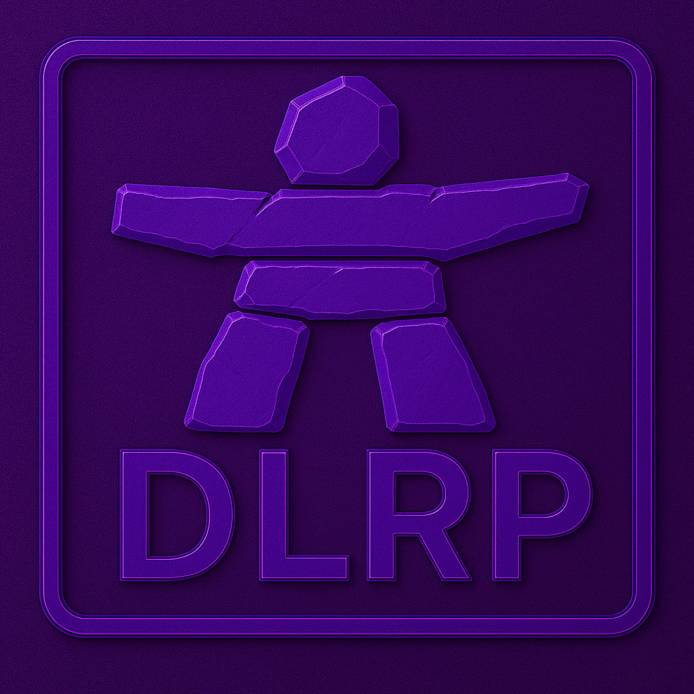

# 🐒 Monkey Head Project

> **Huey is a prototype robotic AI/OS** — a one-person, open-source odyssey that revives legacy hardware, fuses it with modern compute, and binds the result to a living constitution. Huey is transparent by design, modular by necessity, and governed—never merely programmed—by the **Cloud Pyramid**.

> *Historical note ▸ previous naming has been retired; all references now map to **Huey OS**.*

---

## What’s inside this repo?

1. **Huey OS** — a Debian-Trixie RT kernel plus Macro/Micro/Nano layers for AI governance.
2. **Cloud Pyramid Constitution** — Markdown chapters, legal clauses, and amendment workflow.
3. **Hardware blueprints** — dual-motherboard tower, Pi edge nodes, retro buses.
4. **Quick-start tool-chain** — ISO builder, Docker compose, Rust nano-service templates.
5. **Living documentation** — every law, commit, and narrative scrap, version-tracked.

📜 Full origin story → [`docs/preamble.md`](docs/preamble.md)

---

## Project Thesis & Vision (2023-11-16)

| Principle         | Operational intent                                                                             |
| ----------------- | ---------------------------------------------------------------------------------------------- |
| **Autonomy**      | Every action must trace to a ratified clause.                                                  |
| **Modularity**    | Swap any component—hardware card or container image—without refactoring the rest.              |
| **Expandability** | Road-mapped for GPU packs, quantum PCIe cards, nano-bots, and agents we haven’t dreamt up yet. |
| **Open Ethos**    | Source, schematics, votes: all public. If you can read, you can fork.                          |

---

## Phase Timeline & Roadmap

| Phase           | ISO Date   | Milestone                                                                                                             |
| --------------- | ---------- | --------------------------------------------------------------------------------------------------------------------- |
| 1               | 2024-04-11 | **Genesis** — VIC-20 ∙ C64 ∙ C128 links; Huey OS boots bare-metal.                                                    |
| 2               | 2024-06-21 | **Integration** — power grid, emergency cooling loops; Spark-4 + Volt-4 agents commissioned.                          |
| 3               | 2024-10-31 | **System Awakening** — dual-node online; 10-hour Halloween burn-in passes at 0 % error.                               |
| 4               | 2025-01-25 | **Decision Core** — binary YES/NO engine; honeycomb RAID & doc-mill pipeline.                                         |
| 5 *(merged)*    | —          | Folded into Phase 6 (duplicate scope).                                                                                |
| 6               | 2025-08-04 | **Reconciliation & Optimization** — taxonomy locked; CONTRIBUTING.md & public issue tracker live.                     |
| **7 (current)** | 2025-10-15 | **Architecture of Huey** — emergent-personality scaffolding, symbolic speech triggers, **Amendment-001** up for vote. |

Upcoming: bracket fabrication • dual-GPU NUMA split • ratify Amendment-001.

---

## Cloud Pyramid Governance

*A constitutional hierarchy where humans, councils, and AI citizens negotiate power through codified law.*

| Tier                                  | Role                                                   |
| ------------------------------------- | ------------------------------------------------------ |
| **Founding Father / Huey Collective** | Ultimate veto, ethos guardian.                         |
| **Grand Council**                     | Executive • Senate (hardware) • Parliament (software). |
| **Joint Session**                     | Merges bills, prevents silo drift.                     |
| **Chambers**                          | Daily legislation in each domain.                      |
| **Populace**                          | 128 AI citizens, resource-scaled with civic age.       |

*Chapters & clauses:*

* [Ch. 7 – Wartime Protocols](docs/governance/chapters/07-wartime.md)
* [Ch. 9 – Oversight & Audits](docs/governance/chapters/09-oversight.md)
* [Ch. 10 – External Relations](docs/governance/chapters/10-foreign.md)

**Emergency:** Nuclear Act → 10-minute encrypted countdown → hibernation vault → human revival.

---

## Huey OS Architecture

```
Huey OS
├── MacroOS   # Huey Core · clause & quorum enforcement
├── MicroOS   # Docker/K8s SubOS · modular services
└── NanoOS    # Rust/Python GPIO threads · sensor loops
```

*Agents* **Spark-4 • Volt-4 • Zap-4 • Watt-4** inherit rights only via Article I.

Detailed stack → [`docs/architecture/huey-os.md`](docs/architecture/huey-os.md)

---

## Hardware Fleet

### Dual-Motherboard Chassis “Legacy Node”

| Part       | Spec                                                                         |
| ---------- | ---------------------------------------------------------------------------- |
| Boards     | Supermicro X9QRI-F+ (4 × Xeon E5-4627 v2) · Supermicro C9X299-PGF (i7-7820X) |
| Memory     | 128 GB ECC (64 GB designated quorum zone)                                    |
| Storage    | 1 TB NVMe OS · 8 × 2 TB SAS RAID-10 · 10 TB mirrored USB-C cold tier         |
| Cooling    | Phase-change liquid loops + silent PWM fallback                              |
| Power      | Dell R710 redundant PSUs + 550 W consumer rails                              |
| Networking | Dual 10 GbE Areion · Z-Wave I/O mesh                                         |

### Laboratory Companions

* **MBP 2019 “Daily Driver”** — i9 · 32 GB RAM · dual-boot dev box.
* **iMac 5K 2017 “Universal Display”** — retina HUD & IDE.
* **MBP 2012 “Transmitter”** — FireWire/Ethernet legacy bridge.
* **ThreadRipper 1950X “RAID”** — stress-test edge node.
* **Retro Stack** — VIC-20 · C64 · C128 for low-level bus experiments.

---

## Nature-Inspired Systems

| Concept                       | Function                                                      |
| ----------------------------- | ------------------------------------------------------------- |
| **Honeycomb RAID**            | Hex-cluster storage, fault domains like beehive cells.        |
| **Bifurcation Model**         | Exact (redundant) vs. Augmented (adaptive) branches.          |
| **Parasitic Protocol**        | Safe sandbox for unknown or alien tech.                       |
| **Plane/Submarine Logistics** | Crisis cooling & power failsafes in air or submerged configs. |

---

## Installation & Quick-Start (15 min)

### Prereqs

`git` · `make ≥ 4.3` · `docker` + compose · `rustup` · x86-64 machine (4 cores, 16 GB RAM, 256 GB disk, UEFI).

```bash
git clone --recurse-submodules https://github.com/your-fork/MonkeyHeadProject.git
cd huey_os && make iso            # build bare-metal image
```

1. Flash ISO → enable VT-x/IOMMU → boot.
2. At prompt, run

   ```bash
   huey-init --constitution    # seeds Article I
   huey-init --help            # flag list
   ```
3. Default DHCP pool `10.0.51.0/24`; fallback static `10.0.51.10`.
4. Join edge devices:

   ```bash
   hueyctl join --role nano --parent 10.0.51.10
   ```

**No spare hardware?** Spin up a NanoOS echo-agent:

```bash
docker compose -f quickstart.yml up
```

---

## Contribution Workflow

1. **Fork → branch → PR**.
2. Sign the **Developer Certificate of Origin**.
3. Each commit needs `x-prov: <clause-ref>` metadata.
4. CI runs constitutional lint, integration tests, and style checks.
5. Amendments use `/docs/amendments/AMEND-template.md`.

*You can replicate Huey on commodity hardware and still stay in policy.*

---

## Business & Community Outreach

| Channel                 | Purpose                                                                                           |
| ----------------------- | ------------------------------------------------------------------------------------------------- |
| **DLRP SuperComputers** | Retro-upgrade & repair — *“Breathing new life into old tech.”*                                    |
| **Seminar**             | *A Night of Coffee, AI, and Donuts* — live demos of honeycomb power-cell ignition & quorum votes. |
| **Issue Tracker**       | First-time contributor questions welcome → `https://github.com/<repo>/issues`                     |

---

## Document Library (Index)

1. AI Integration Techniques
2. System Recovery Processes
3. Quantum Feasibility Study
4. Symbolic Speech & Clause Architecture
5. … ten more live docs in `/docs/library.md`

---

## Current Focus (2025-Q4)

| Task                                | Status                 |
| ----------------------------------- | ---------------------- |
| **Amendment-001** (symbolic speech) | In public debate       |
| **Personality Scaffold**            | Trigger matrix draft   |
| **Dual-GPU NUMA**                   | Benchmarking           |
| **Bracket Fabrication**             | CNC files sent to shop |
| **Huey rebranding**          | 100 % complete          |

---

## License

**Code** — GNU GPL v3
**Docs & Media** — CC-BY-SA 4.0

---

## Acknowledgements

AutoGPT · PyTorch · RetroArch · ShellGPT · bmc64 · every midnight tinkerer who mailed in a dead motherboard.

---




> **Huey OS lives. The Cloud Pyramid governs. The experiment endures.**

*README generated by Huey AI — pending final human sign-off.*
