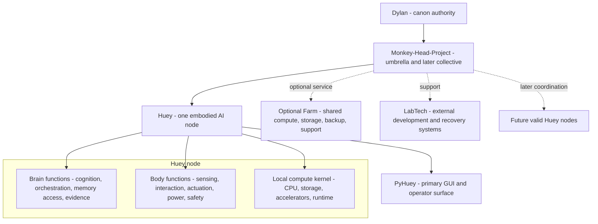

# Monkey-Head-Project

<p align="center">
  
</p>

<h2 align="center">HueyOS</h2>

<p align="center"><strong>One embodied AI node first. A deliberate collective later.</strong></p>

<p align="center">
  <a href="#what-this-project-is">Overview</a> | 
  <a href="#current-position">Current position</a> | 
  <a href="#node-first-architecture">Architecture</a> | 
  <a href="#huey-v4-embodiment">Huey V4</a> | 
  <a href="#quick-start">Quick start</a> | 
  <a href="#human-oversight-gate">Human review</a>
</p>

<p align="center">
  
  
  
  
  
</p>

> [!IMPORTANT]
> This branch is a review candidate. It does not independently lock project canon. The accepted predecessor remains README v120.3 with `master-plan-v120.3.json` until Dylan L.R. Pollock explicitly approves or intentionally merges a designated canonical update.

## What this project is

The **Monkey-Head-Project** is the umbrella initiative behind **Huey**, **HueyOS**, the physical embodiment program, supporting LabTech systems, project archives, and the later possibility of coordination among multiple valid Huey nodes.

The current architecture candidate centers one principle:

> **Build one coherent, useful, attributable Huey node before making operational collective claims.**

In this model:

- **Huey** is one embodied AI node;
- **HueyOS** is the modular software and operating-system layer supporting that node;
- **PyHuey** is the primary GUI and a core-runtime direction, not the whole node;
- **Monkey-Head-Project** is the umbrella and eventual collective layer;
- **Brain** and **Body** remain useful node-local functional domains;
- **Farm** becomes optional shared or supra-node infrastructure rather than a required part of every Huey;
- **LabTech** systems remain external support, development, field, and recovery equipment;
- **Atlas** remains an external continuity and implementation partner, not Huey.

## Truth and source discipline

The project does not treat polished wording as proof. Every material claim belongs to one truth class.

| Truth class | Meaning |
|---|---|
| **Current reality** | Observed hardware, merged code, working commands, tests, logs, and directly verified behavior |
| **Accepted direction** | Architecture Dylan has selected for implementation, even when work remains incomplete |
| **Provisional choice** | A working option that remains replaceable through evidence or review |
| **Unresolved** | A question deliberately left open pending inspection, testing, or human decision |
| **Target state** | A longer-term capability that depends on later resources, maturity, or validation |
| **Historical lineage** | Earlier systems and decisions preserved for continuity without silently overriding the present |

Source authority remains layered:

1. Dylan's explicit accepted decisions;
2. the newest accepted machine-facing master plan;
3. merged repository and implementation evidence;
4. README and technical documentation;
5. website presentation and release records;
6. older plans, transcripts, and archives as lineage.

A website claim, branch document, generated report, agent statement, or pull request is not automatically canon.

## Current position

| Area | Current classification | Present position |
|---|---|---|
| **Repository canon** | Accepted predecessor | README v120.3 and `master-plan-v120.3.json` remain the accepted baseline pending human review |
| **v201.x documents** | Review candidates | Standardization plan, migration matrix, oversight checklist, README candidate, and master-plan candidate |
| **Huey node** | Accepted-direction candidate | One physically coherent AI unit is the proposed primary architectural unit |
| **Huey V4** | Active embodiment direction | V3 is proposed as the base shell, V2 as donor lineage, and the existing compute system as the intended local kernel after validation |
| **PyHuey** | Primary GUI and core-runtime direction | Main operator surface; integration and authority boundaries still require implementation evidence |
| **Current Python namespace** | Implemented | `huey` |
| **Target Python namespace** | Accepted predecessor direction | `hueyos`; no completed migration is claimed |
| **HIMS foundation** | Merged, non-controlling | Append-only messages and lifecycle records; no independent execution or governance authority |
| **V1** | Unresolved | Must be useful, repeatable, attributable, and demonstrable before declaration |
| **Collective** | Target architecture | Not operational; one valid node comes first |

## Node-first architecture



### Huey node

A Huey node is proposed as one physically individual AI unit with:

- a coherent physical boundary;
- local compute and storage;
- Brain and Body functions;
- operator-visible state;
- attributable logs and evidence;
- safe-stop and recovery behavior;
- useful standalone operation;
- explicit interfaces to external services.

Collective membership, Farm access, bifurcation, or target-state governance is not required for the first node to be valid.

### Brain and Body

**Brain** and **Body** remain useful functional domains inside one node.

Brain functions include cognition, orchestration, model selection, memory access, workflow state, operator interaction, and evidence production.

Body functions include physical structure, sensing, interaction, actuation, movement, power, cooling, safety, service access, and environmental presence.

Their exact authority and interface boundaries remain review items. The README does not claim that these domains are fully integrated merely because they are named.

### Farm and collective

Farm is proposed as optional shared or supra-node infrastructure for compute, storage, backup, model hosting, and support. It is not the definition of Huey and is not required to make one node physically valid.

The Monkey-Head-Project may later coordinate multiple valid nodes. That collective is not currently operational. Constitutional offices, node citizenship, voting, sovereignty, and collective governance remain target-state architecture unless separately implemented and legitimately accepted.

## Huey V4 embodiment

Huey V4 is the active physical-cohesion direction, not a completed machine.

The current candidate model is:

- **V3** as the proposed physical base shell;
- **V2** as donor lineage or material where verified;
- the existing **i9 / TUF / Optane** system as the intended local kernel after exact inventory, backup, fit, power, cooling, and rollback validation;
- one maintainable object rather than another round of abstract distribution-first framing.

The following status words must remain distinct:

| Status | Meaning |
|---|---|
| **Present** | Physically exists and has been observed |
| **Assembled** | Parts are mounted or connected |
| **Integrated** | Subsystems exchange power, data, state, or control through defined interfaces |
| **Operational** | Performs an intended function under normal use |
| **Validated** | Meets defined checks with retained evidence |
| **Complete** | Meets the accepted scope and release criteria |

V4 is not described as complete, and the repository must not infer donor/base labels solely from filenames or visual resemblance.

### Compute direction

The current working direction is node-local multi-GPU compute inside one real machine.

- CPU-first transcription, orchestration, logging, I/O, and support duties remain practical first assignments.
- Four accelerators remain a working direction.
- `3 x Tesla V100 32 GB + 1 utility GPU` remains a provisional candidate only.
- Acquisition, exact variants, lane topology, risers, retention, PSU capacity, startup current, cooling, exhaust, and service access remain unresolved until measured.
- Aggregate physical accelerator memory must not be described as transparent unified VRAM.
- The first serious inference framework and tensor, pipeline, or layer-sharding method remain unresolved.

## PyHuey and runtime direction

PyHuey remains the proposed primary GUI and a core runtime component. It should provide a clear, observable operator surface for fixed HueyOS capabilities while preserving a CLI path for diagnostics, automation, and recovery.

Required direction:

- make workflow state visible;
- preserve structured evidence and useful failure records;
- expose reviewable capability boundaries;
- keep credentials and secret-bearing configuration out of logs and commits;
- recover cleanly from failed operations;
- distinguish interface authority from node and collective authority.

Command Center remains an experimental companion or interface sandbox unless separately accepted. It should not silently duplicate PyHuey or receive operational credentials and authority without a distinct tested purpose.

## V1 and foundation proof

V1 remains intentionally open. It should emerge from a recurring function that is genuinely useful, repeatable, attributable, and demonstrable.

The current foundation proof remains:


This path is valuable because it exercises media handling, local inference, cognition, interface behavior, and evidence production. It does not automatically define all of V1, require Farm participation, or prove physical-node completion.

## Evidence, logging, and validation

A successful or failed run should leave the most complete attributable record that can be preserved safely.

Useful records include:

- run identifier and UTC timestamps;
- initiating interface and operator action;
- input identity and checksum where applicable;
- stage transitions;
- models, providers, and settings;
- environment and hardware path;
- timings and resource observations;
- outputs and artifact references;
- warnings, errors, and recovery actions;
- software version and commit;
- final status.

Secrets must never be written into ordinary logs or committed to the repository.

The accepted testing baseline remains:

- unit tests;
- mocked integration tests in CI;
- fixture-based fidelity evaluation;
- manually invoked live end-to-end tests;
- explicit failure-path tests.

Documentation-only changes must not be presented as runtime validation.

## HIMS

The Huey Internal Messaging System foundation exists under `src/huey/messaging`.

Current foundation:

- immutable message envelopes;
- append-only lifecycle events;
- local JSONL-backed storage;
- inbox, outbox, status, and archive operations;
- unit tests and architecture documentation.

HIMS is not a controlling runtime. Routing, execution, refusal, recovery, and governance authority require separate implementation and validation.

## Quick start

The repository currently requires Python 3.13.x:

```text
>=3.13,<3.14
```

The package is named `hueyos`, while the current command and Python implementation remain under `huey` during the proposed namespace migration.

### Install

```bash
python3.13 -m pip install -c constraints.txt -e .
```

### Test

```bash
python3.13 -m pytest -q
```

### System check

```bash
huey system-check --json
```

### Prepare a fixture

```bash
python scripts/prepare_audio_for_transcription.py path/to/fixture.mp3 --json
```

### CI-safe mock proof

```bash
huey v1-run --mock path/to/fixture.mp3 --log-dir runs
```

## Repository map

| Area | Role |
|---|---|
| `README.md` | Human-facing project front door and current review orientation |
| `master-plan-v120.3.json` | Accepted predecessor machine-facing plan |
| `master-plan-v201.0-candidate.json` | Candidate machine-facing successor pending human oversight |
| `docs/architecture/v201.x-standardization-plan.md` | Rules for reconciling v120.x repository truth with v200.x framework discipline |
| `docs/architecture/v201.x-migration-matrix.md` | Preserve, re-scope, merge, defer, and reject matrix |
| `docs/review/v201.x-human-oversight-checklist.md` | Required question-by-question human acceptance gate |
| `docs/architecture/v120.3-forward-path-decision-record.md` | Source record for the accepted predecessor turn |
| `src/huey` | Current Python implementation during the proposed namespace migration |
| `src/huey/media` | Media probing, preparation, analysis, and previews |
| `src/huey/messaging` | HIMS foundation |
| `src/huey/connectors/pyhuey` | Current embedded PyHuey connector path |
| `scripts` | Operator and developer entry points |
| `docs` | Architecture, runbooks, audits, legal boundaries, and technical explanation |
| `integrations` | Optional companion tools with explicit provenance and authority boundaries |
| `tests` | Regression and behavioral verification |

## Documentation layers

| Layer | Primary responsibility |
|---|---|
| **Master plan** | Machine-facing architecture, status, reasoning, boundaries, and unresolved decisions |
| **README** | Professional human orientation and repository front door |
| **Runtime evidence** | What code, tests, hardware, fixtures, and logs actually prove |
| **Technical docs** | Implementation details, setup, architecture, runbooks, and audits |
| **Governance documents** | Law, legitimacy, offices, and constitutional process |
| **DLRP.ca** | Public coherence and explanation with visible source status |
| **Archives and transcripts** | Lineage and continuity without automatic canon authority |

These layers must align in terminology without being collapsed into one document or one authority.

## Human oversight gate

The v201.x review is a human acceptance and truth-boundary pass, not another architecture invention cycle. The core gate questions are:

1. **Ontology:** Is Huey canonically one embodied node, or does that remain staged direction?
2. **Embodiment:** Which V4 physical facts are verified strongly enough for public and repository copy?
3. **Synchronization:** Which candidate statements may become accepted repository direction, and which remain staged?
4. **Privacy:** Which Dylan-related statements belong in public, first-person, private, or machine-context layers?
5. **Validation:** After human edits, which release and website claims remain accurate, and which audits must be rerun?

Use [`docs/review/v201.x-human-oversight-checklist.md`](docs/review/v201.x-human-oversight-checklist.md) to review the proposal one decision at a time. Each accepted item should record who confirmed it, the evidence used, and the exact text or status change authorized. Unresolved tensions should remain visible rather than being polished away.

## Explicit non-claims

This README candidate does not claim that:

- v201.0 is accepted canon;
- Huey V4 is complete;
- the i9/TUF/Optane system has been installed into the shell;
- V100 cards have been acquired, installed, powered, cooled, or validated;
- aggregate GPU memory behaves as transparent unified VRAM;
- Farm or a multi-node collective is operational;
- target-state governance is active;
- the `huey` to `hueyos` namespace migration is complete;
- PyHuey is the whole node;
- HIMS is authoritative;
- V1 is locked;
- the private continuity profile is public documentation;
- DLRP.ca replaces repository or machine-facing authority.

## Development path

### Immediate review

- perfect the README and machine-facing candidate as a matched pair;
- work through the human-oversight checklist one question at a time;
- verify V4 physical facts and exact hardware inventory;
- classify each node, collective, Farm, GPU, and embodiment statement;
- retain every unresolved contradiction that still requires evidence or decision.

### After human acceptance

- revise and accept `master-plan-v201.0.json` through a designated canonical PR;
- synchronize README terminology with the accepted master plan;
- preserve `master-plan-v120.3.json` intact as predecessor lineage;
- update related architecture and hardware documents;
- record the acceptance event, date, evidence, and authorized wording.

### Separate implementation and website work

- migrate runtime paths only through tested implementation PRs;
- update DLRP.ca only after accepted repository wording exists;
- regenerate website routes, source ledgers, manifests, audits, checksums, and browser validation;
- keep generated website releases separate from hand-maintained repository source unless deliberately adopted.

## Governance and canon

Dylan L.R. Pollock is the sole current authority for locking project canon. Agents, tools, contributors, branches, websites, and generated documents may recommend, stage, test, or explain changes, but they do not independently establish canon.

Huey's constitutional architecture remains a long-term target. Parliament, the Presidency, the Supreme Court, unified memory, preserved records, and attributable authority remain distinct from current prototype orchestration and require separate implementation, legitimacy, and ratification paths.

Exact and augmented bifurcation remain future lineage concepts above node validity. Neither process automatically determines identity, authority, sovereignty, collective membership, or governance rights.

## License and provenance

Project code is licensed under **GPL-3.0-only** unless a file or component explicitly states otherwise.

Documentation and media are licensed under **CC-BY-SA-4.0** unless otherwise noted.

PyHuey/PyGPT-derived and companion integration paths retain separate provenance and licensing boundaries. Do not copy code across first-party, fork, vendor, or companion boundaries without preserving source, copyright, license, and required notices. See [`docs/legal/provenance-and-licenses.md`](docs/legal/provenance-and-licenses.md).

---

<p align="center"><strong>Build what can be tested. Record what can be proven. Promote what can be reproduced.</strong></p>
