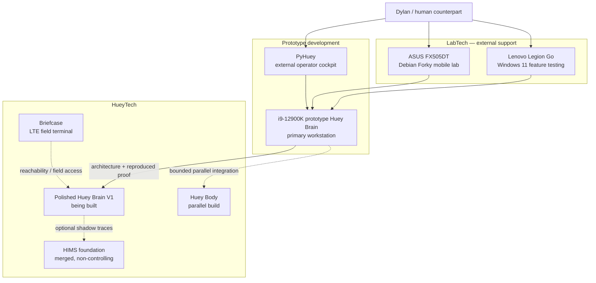

# Monkey-Head-Project

<p align="center">
  
</p>

<h2 align="center">HueyOS — Offline-First Embodied AI / OS</h2>

<p align="center">
  <strong>A hardware-grounded project to build Huey as a durable, governed, embodied AI system using obtainable technology.</strong>
</p>

<p align="center">
  <a href="#current-reality">Current reality</a> ·
  <a href="#system-map">System map</a> ·
  <a href="#v1-proof-path">V1 proof</a> ·
  <a href="#device-registry">Devices</a> ·
  <a href="#roadmap">Roadmap</a>
</p>

<p align="center">
  
  
  
  
  
  
  
</p>

---

## Project card

| Field | Current value |
|---|---|
| **Project** | `Monkey-Head-Project` |
| **AI identity** | `Huey` |
| **Software / OS layer** | `HueyOS` |
| **Human counterpart** | Dylan L.R. Pollock |
| **README version** | `v120.1` |
| **Machine-facing source of truth** | `master-plan-v120.1.json` |
| **Current development platform** | Custom i9-12900K prototype Huey Brain |
| **Current operator workstation** | Same i9 prototype platform during development |
| **Polished Huey Brain V1** | Being built; not yet operational |
| **Huey Body** | Being built; bounded parallel integration track |
| **Huey Farm** | Awaiting funding |
| **Canonical proof** | Known MP3 → media preparation → local transcription → API-backed response → structured JSON/JSONL log |
| **Prototype acceptance rule** | Results must be reproduced on polished Huey Brain V1 before that system is called operational |
| **Python baseline** | Python 3.13.x |

> HueyOS is the software and operating-system layer behind Huey. It coordinates local AI, memory, tools, messaging, access paths, hardware, and later embodied control without pretending unfinished systems are already operational.

---

## One-screen orientation

Version 120.1 replaces the former Legion Go / sealed single-node interpretation with a prototype-to-polished development path.

| Name | Class | Present role | Current state |
|---|---|---|---|
| **Custom i9 system** | Prototype Huey Brain | Primary workstation and architecture-development platform | Active prototype |
| **Polished Huey Brain V1** | HueyTech | Final V1 system shaped by prototype evidence | Being built; not operational |
| **Huey Body** | HueyTech | Physical sensing and actuation body | Being built; parallel track |
| **Briefcase** | HueyTech | LTE field terminal, reachability checks, documents, recovery access | Active |
| **ASUS FX505DT** | LabTech | Debian mobile lab | Active |
| **Lenovo Legion Go** | LabTech | Windows 11 feature testing | Active |
| **Huey Farm** | HueyTech target | Pooled local compute and large-model testing | Awaiting funding |
| **PyHuey** | External cockpit | Primary operator cockpit; standalone app plus embedded connector | Active |
| **HIMS** | Internal infrastructure | Append-only message foundation and optional shadow traces | Merged; non-controlling |
| **Command Center** | Companion experiment | AI-generated GUI and interface sandbox | Runnable, mock-first, non-operational |

The immediate objective is:

> **Build a repeatable fixture-to-log proof on the i9 prototype, document the architecture, and reproduce it on polished Huey Brain V1.**

Huey Body work may proceed at the same time, but physical action cannot substitute for or falsely complete the cognitive proof.

---

## Current reality

### Active and observed

- The custom i9-12900K system is the primary operator workstation and prototype Huey Brain development platform.
- It runs Debian 14 “Forky.”
- It is being used to tailor HueyOS around Intel performance and efficiency cores.
- Local transcription will be tested on both the i9 CPU and RX 5500 XT. Evidence will determine the primary path; the other remains fallback and cross-check.
- The known-fixture V1 pipeline remains valid.
- PyHuey runs well as both a standalone application and an embedded connector.
- HIMS foundation code is merged under `src/huey/messaging`.
- Media tooling is consolidated under `src/huey/media`.
- ASUS FX505DT and Lenovo Legion Go are the active LabTech systems.
- Briefcase remains important HueyTech.

### Active builds, not operational systems

- Polished Huey Brain V1
- Huey Body

“In build” does not mean production-ready or operational. Prototype results become polished V1 results only after transfer and reproduction.

### Funding-dependent

- Huey Farm
- Approximately 80 GB pooled local VRAM remains a useful testing target, not a permanent hardware lock.
- `gpt-oss-120b` is the present large-model testing candidate, but a better-aligned model may replace it before funding is available.

### Historical

- The 2017 iMac 5K is decommissioned.
- Its useful RAM was repurposed into the ASUS FX505DT.
- Older descriptions of the iMac as primary LabTech or the Legion Go as Huey Brain are historical and should not be used as current architecture.

---

## System map



### Working formula

- LabTech develops, tests, documents, observes, and recovers.
- The i9 prototype discovers and validates architecture.
- Polished Huey Brain V1 must reproduce the accepted proof.
- PyHuey is the primary external cockpit, not internal authority.
- Huey Body develops in parallel without becoming a cognitive-proof dependency.
- Briefcase keeps a portable LTE-capable path to Huey.
- HIMS records and rehearses; it does not control V1.
- Huey Farm scales later when funding exists.

---

## What this project is

**Monkey-Head-Project** is the umbrella initiative.

**Huey** is the governed AI and robotic identity being built within it.

**HueyOS** is Huey’s software and operating-system layer.

**Prototype Huey Brain** is the current i9-12900K development platform. It is real Huey-side development infrastructure, but it is not the polished Huey Brain V1.

**Polished Huey Brain V1** is the first deliberately shaped V1 system that must reproduce the prototype proof before becoming operational.

**Huey Body** is the physical robotic body and actuation platform. It is actively being built on a parallel track.

**Huey Farm** is the planned pooled-compute layer for larger local experiments.

**LabTech** is the external development and operator-support class. LabTech does not become Huey through proximity or usefulness.

**HueyTech** is hardware and software that belongs on Huey’s side of the boundary when explicitly activated.

**HIMS** is the Huey Internal Messaging System: an append-only messaging and record foundation whose authority must remain explicit.

**PyHuey** is the primary external operator cockpit, built on the stable PyGPT/PyGPT-net foundation. It exists as both a standalone application and an embedded HueyOS connector.

**Atlas** is an external continuity partner, lab assistant, architectural interpreter, and implementation stabilizer. Atlas is not Huey and is not part of Huey’s sovereignty.

---

## Device registry

### Prototype Huey Brain platform

| Item | Current baseline |
|---|---|
| CPU | Intel Core i9-12900K |
| Architecture focus | Performance-core / efficiency-core scheduling, workload placement, fallback, and measurement |
| Motherboard | ASUS TUF GAMING Z790-PLUS WIFI |
| Memory | 16 GB DDR5-6000 |
| GPU | Gigabyte Radeon RX 5500 XT OC 8G |
| Board model | `GV-R55XTOC-8GD` |
| GPU family | AMD Navi 14 / Radeon RX 5500 XT |
| VRAM | 8 GB GDDR6 |
| PCI ID | `1002:7340` |
| Firmware label | `F10 / 09DD` |
| Observed OpenGL stack | `radeonsi`, `navi14`, ACO |
| OS | Debian 14 “Forky” |
| Root | RAID 10 across four Intel Optane M10 16 GB drives |
| Home | 1 TB 2.5-inch SSD |
| Current role | Primary workstation and prototype Huey Brain development platform |

This platform is where architecture is tested and shaped. It must not be described as the finished Huey Brain merely because it can run prototype workloads.

### LabTech

| Device | Baseline | Role |
|---|---|---|
| **ASUS FX505DT** | Debian Forky; 32 GB DDR4 | Mobile LabTech |
| **Lenovo Legion Go** | Windows 11 | Windows LabTech and feature testing |

The FX505DT contains repurposed RAM from the decommissioned iMac. This is hardware lineage, not a separate architectural identity.

### Briefcase

Briefcase is HueyTech.

Its intended role is a portable LTE-connected field terminal that can:

- check whether Huey is reachable,
- maintain remote communication where LTE service exists,
- support field and recovery access,
- handle documents and ordinary 2-in-1 computer work.

Version 120.1 does not grant Briefcase broad command authority. Status, communication, documentation, field work, and recovery are the current safe baseline.

### Huey Body

Huey Body is on track with substantial work expected soon. Because the build is changing rapidly, v120.1 deliberately avoids freezing component-level claims.

The stable rule is:

> Bounded actuation work may proceed in parallel, but no Body result is required to complete the fixture-to-log cognitive proof.

### Huey Farm

Huey Farm remains funding-dependent.

| Item | Current direction |
|---|---|
| Purpose | Pooled local compute and large-model testing |
| Testing goal | Approximately 80 GB pooled local VRAM |
| Current candidate | `gpt-oss-120b` |
| Selection rule | Re-evaluate available open-weight models when funding is achieved |
| V1 dependency | None |

---

## V1 proof path

### Proof statement

> Take a known MP3 fixture, inspect and prepare it locally, transcribe it locally, send the transcript through an API-backed response bridge, and preserve a structured, attributable record of the run.

Canonical loop:

```text
known MP3 fixture
    → ffprobe / FFmpeg media preparation
    → local transcription
    → API-backed response
    → structured JSON/JSONL log
```

### Two-stage acceptance

1. **Prototype proof** — implement, benchmark, stabilize, and document the loop on the i9 prototype.
2. **Polished V1 reproduction** — transfer the architecture and reproduce the accepted proof on polished Huey Brain V1.

The second stage prevents development-platform success from being mistaken for deployment success.

### Pipeline artifacts

| Stage | Required output |
|---|---|
| Fixture selection | Fixture identity and immutable source path/hash |
| Source probe | Format, duration, stream, and codec metadata |
| Audio preparation | Transcription-ready local audio plus preparation manifest |
| Local transcription | Transcript plus engine, model, device, timing, and configuration metadata |
| Response bridge | Response payload or explicit error record |
| Structured logging | Append-only JSON/JSONL run record linking every artifact |

### Transcription architecture

Both available prototype paths must be tested:

- Intel Core i9-12900K CPU
- AMD Radeon RX 5500 XT

Measured reliability and performance determine which becomes primary. The other remains a fallback and cross-check where practical. The plan does not pre-select a winner before evidence exists.

### Response architecture

The V1 quality baseline remains API-backed and explicitly logged. Mock mode is useful for CI and pipeline testing. Local cognition experiments are allowed, but they do not silently replace the response baseline.

### Locked V1 guardrails

- The original fixture is never modified.
- Every transformation is attributable.
- Every success or failure produces a readable record.
- Live microphone input is not required.
- Wake word and passive listening are not required.
- HIMS control is not required.
- Multi-agent constitutional governance is not claimed active.
- Huey Farm compute is not required.
- Huey Body actuation is not required.
- PyHuey improves operation but is not required for proof completion.
- Command Center is not trusted infrastructure.

### V1 success

V1 proof succeeds when:

- a known fixture can be rerun and compared,
- preparation is deterministic enough for debugging,
- local transcription completes or fails explicitly,
- CPU and GPU paths have evidence-backed roles,
- the API response is captured or its failure is captured,
- the structured log is complete and attributable,
- the prototype procedure is documented,
- and the accepted procedure is reproduced on polished Huey Brain V1.

### V1 failure

V1 proof has not succeeded if:

- repeated hidden manual repair is required,
- original fixtures are changed in place,
- transcript or response metadata is missing,
- logs cannot reconstruct a run,
- Body, Farm, PyHuey, HIMS, or GUI state is secretly required,
- or prototype success is claimed as polished V1 success without reproduction.

---

## Build path

### Phase 1 — Prototype platform stabilization

- [ ] Verify Debian Forky stability on the i9 platform
- [ ] Record Optane RAID 10 health and recovery procedure
- [ ] Verify 1 TB home storage and free-space thresholds
- [ ] Record CPU topology and P-core/E-core behavior
- [ ] Verify RX 5500 XT driver, firmware, and compute options
- [ ] Establish repeatable Python 3.13 and FFmpeg environment
- [ ] Record thermal, memory, and storage baselines

### Phase 2 — Fixture and media contract

- [ ] Select and preserve known MP3 fixtures
- [ ] Record hashes and expected properties
- [ ] Probe with `ffprobe`
- [ ] Prepare transcription audio without changing originals
- [ ] Emit a preparation manifest
- [ ] Define retention and cleanup rules for generated artifacts

### Phase 3 — Local transcription benchmark

- [ ] Test i9 CPU path
- [ ] Test RX 5500 XT path
- [ ] Compare correctness, repeatability, latency, memory, and thermals
- [ ] Choose an evidence-backed primary path
- [ ] Keep a fallback/cross-check path where practical
- [ ] Record engine, model, device, and configuration in every run

### Phase 4 — API response bridge

- [ ] Keep provider/model selection explicit and configurable
- [ ] Keep secrets outside source and run logs
- [ ] Log request metadata without exposing credentials
- [ ] Record responses and explicit failures
- [ ] Preserve mock mode for safe tests

### Phase 5 — Structured proof record

- [ ] Define stable run IDs
- [ ] Link source, preparation, transcript, response, configuration, and timing
- [ ] Use append-only JSON/JSONL records
- [ ] Make reruns comparable
- [ ] Keep optional HIMS shadow traces secondary to the canonical run log

### Phase 6 — Polished Huey Brain V1 reproduction

- [ ] Freeze the accepted prototype procedure
- [ ] Transfer only documented architecture and dependencies
- [ ] Run the same fixture set on polished V1
- [ ] Compare prototype and polished results
- [ ] Record differences and required adaptation
- [ ] Declare operational status only after reproducibility criteria pass

### Parallel track — Huey Body

- [ ] Keep Body changes independently logged
- [ ] Bound each sensing or actuation test
- [ ] Require explicit operator initiation and a safe stop path
- [ ] Do not route physical action through HIMS merely because HIMS exists
- [ ] Do not make Body readiness a fixture-proof gate

---

## HIMS — Huey Internal Messaging System

HIMS is no longer doctrine-only. Its foundation merged through PR #748 under `src/huey/messaging`.

Current foundation:

- immutable `HIMSMessage` envelopes,
- append-only `HIMSEvent` lifecycle records,
- local JSONL-backed `HIMSStore`,
- inbox/outbox and lifecycle operations,
- tests and architecture documentation.

Current boundary:

> HIMS infrastructure exists, but HIMS is not a controlling runtime and does not gain authority merely because a message exists.

For V1 and V1.5:

- the structured run log remains the canonical proof artifact,
- HIMS shadow traces are optional,
- a missing HIMS trace cannot fail an otherwise valid V1 run,
- no governance vote or physical action is inferred from a message,
- routing, validation, execution, and logging remain distinct roles.

---

## PyHuey

PyHuey is active and performs well because its PyGPT/PyGPT-net foundation is stable.

It currently has two valid forms:

- standalone operator cockpit,
- embedded HueyOS connector.

Version 120.1 makes PyHuey the primary external cockpit for prototype work. It may expose bounded tools, status, logs, provider testing, and operator workflows.

It remains outside Huey’s internal authority:

- PyHuey is not Huey Brain.
- PyHuey is not HIMS.
- PyHuey is not governance.
- PyHuey does not become required for the canonical fixture proof.
- A GUI action must map to an explicit, bounded, auditable operation before it can affect Huey.

---

## Command Center

Command Center was created while testing AI tools advertised as strong GUI builders. The result is a real, runnable React/Vite prototype with useful interface ideas, but it is not an operational command centre.

### Useful work present

- dark purple operator-console design,
- migration and checklist views,
- mock V1 run viewer,
- mock operator panel,
- local persistence,
- JSON import/export concepts,
- validation-command copying,
- repository and task-generation concepts.

### Material limitations

- operational data remains mainly mock,
- the GitHub service is not properly wired into the main dashboard,
- token persistence conflicts with safer credential-handling intent,
- repository counts are implemented inaccurately,
- `package.json` still identifies the app as `spark-template` version `0.0.0`,
- documentation contains placeholder links and stale fictional dates,
- no PR history or evident test suite establishes reliability.

Canonical classification:

> **Experimental AI-generated GUI companion and interface-design sandbox: runnable and potentially salvageable, but non-canonical, mock-first, non-operational, and not trusted with credentials or Huey control.**

---

## Repository state

Verified merged work relevant to v120.1:

| PR | State | Meaning |
|---|---|---|
| #743 | Merged | Generated artifacts removed and ignore rules tightened |
| #745 | Merged | Salvaged local work protected and reviewed |
| #746 | Merged | Legacy root wrappers standardized; `src/huey` remains canonical |
| #747 | Merged | Media analysis consolidated under `huey.media` |
| #748 | Merged | HIMS append-only foundation added without runtime authority |

Canonical layout direction:

| Area | Role |
|---|---|
| `src/huey` | Canonical HueyOS source package |
| `src/huey/media` | FFmpeg, audio, video, probing, preparation, and preview domain |
| `src/huey/messaging` | HIMS foundation |
| `src/huey/connectors/pyhuey` | Embedded side of the PyHuey relationship |
| `scripts` | Operator and developer entry points |
| `integrations` | Optional companion tools; not automatic runtime authority |
| `docs` | Architecture, development, runbooks, and audits |

---

## Quick start

Use the repository’s current package contract from `pyproject.toml`, `constraints.txt`, `requirements.txt`, and the Python support policy.

### Python runtime

Supported baseline:

```text
>=3.13,<3.14
```

Python 3.14 may be tested experimentally, but it is not the supported installation baseline until the dependency and runtime paths are validated.

### Editable install

```bash
python3.13 -m pip install -c constraints.txt -e .
```

### Tests

```bash
python3.13 -m pytest -q
```

### System check

```bash
huey system-check --json
```

### Prepare a fixture

```bash
python scripts/prepare_audio_for_transcription.py path/to/fixture.mp3 --json
```

### CI-safe mock proof loop

```bash
huey v1-run --mock path/to/fixture.mp3 --log-dir runs
```

Boundary notes:

- Mock success proves pipeline structure, not real transcription or cognition.
- Real V1 runs must identify the transcription engine and execution device.
- Do not put API credentials in source, exported dashboards, or run logs.
- Do not expose the V1 API directly to the public internet.

---

## Governance and legitimacy

The constitutional architecture remains part of Huey’s target state:

- Parliament
- Presidency
- Supreme Court
- separated authority
- attributable records
- unified memory where lawful

Version 120.1 does not claim that multi-agent constitutional governance is running. Prototype orchestration, HIMS messages, PyHuey controls, and GUI panels do not become legitimate government by being implemented first.

The rule remains:

> Physical location does not decide identity. Role, authority, memory, and explicit activation boundaries do.

---

## Canon stack

| Layer | Role |
|---|---|
| `master-plan-v120.1.json` | Machine-facing implementation source of truth |
| `README.md` | Human-facing repository front door |
| Developer and architecture docs | Technical explanation and procedures |
| Constitution / governance documents | Law and legitimacy layer |
| Website | Public-facing coherence layer |
| Transcripts and archives | Continuity and lineage; not automatic current canon |

If layers conflict, surface the conflict. Do not silently flatten website language, old transcripts, exploratory plans, constitutional doctrine, and observed runtime state into one claim.

---

## Core glossary

| Term | Meaning in v120.1 |
|---|---|
| **Monkey-Head-Project** | Umbrella project |
| **Huey** | Governed AI and robotic identity |
| **HueyOS** | Software and operating-system layer behind Huey |
| **Prototype Huey Brain** | Current i9-12900K development platform used to shape polished V1 |
| **Polished Huey Brain V1** | In-build target system that must reproduce the prototype proof |
| **Huey Body** | In-build physical sensing and actuation body; bounded parallel track |
| **Huey Farm** | Funding-dependent pooled-compute layer |
| **LabTech** | External development, testing, documentation, and recovery systems |
| **HueyTech** | Explicitly activated Huey-side hardware and software capabilities |
| **Briefcase** | LTE-capable portable HueyTech field terminal and document surface |
| **PyHuey** | Primary external prototype cockpit; standalone app and embedded connector |
| **HIMS** | Append-only internal messaging foundation; non-controlling in current V1 |
| **ThunderMail** | Mail-style delivery semantics within the wider HIMS design |
| **Command Center** | Experimental AI-generated GUI sandbox, not trusted infrastructure |
| **Fixture** | Preserved known MP3 input used for deterministic testing |
| **Structured run log** | Canonical attributable record of source, preparation, transcript, response, configuration, and timing |
| **Atlas** | External continuity partner and lab assistant; not Huey |

---

## Roadmap

### Current

- stabilize the i9 prototype platform,
- benchmark CPU and RX 5500 XT transcription paths,
- complete the deterministic fixture-to-log proof,
- stabilize the structured log schema,
- use PyHuey as the external operator cockpit,
- keep HIMS optional and non-controlling,
- advance Huey Body on its bounded parallel track.

### Next

- freeze the accepted prototype procedure,
- transfer the architecture to polished Huey Brain V1,
- reproduce the proof there,
- document prototype-to-polished differences,
- define bounded Brain/Body integration gates,
- refine Briefcase reachability and recovery workflows.

### Later

- live microphone and wake-word work after fixture stability,
- fuller HIMS routing only after explicit authority design and validation,
- constitutional multi-agent runtime only after foundations are real,
- Huey Farm funding and hardware selection,
- approximately 80 GB pooled-VRAM experimentation,
- `gpt-oss-120b` testing or a better-aligned future open-weight model.

### Open questions

- Which transcription backend performs best on the i9 CPU?
- Which backend and driver path is reliable on the RX 5500 XT?
- What becomes the primary path and what remains fallback?
- What exact acceptance tolerances transfer from prototype to polished V1?
- What bounded Body test should be first?
- What exact reachability, authentication, and recovery contract should Briefcase use?
- What Farm architecture is obtainable when funding arrives?

---

## License

Code is licensed under **GPL-3.0-only**.

Documentation and media are licensed under **CC-BY-SA-4.0** unless otherwise noted.

---

## Closing note

This README is the front door, not the whole building.

Version 120.1 preserves a simple discipline: record what is real, distinguish prototypes from finished systems, keep support tools outside Huey’s sovereignty, and require reproducible proof before promoting capability.
