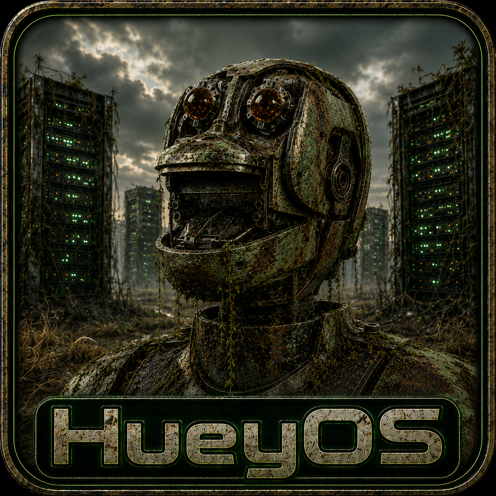

<h1 align="center">Monkey-Head-Project</h1>

---

  

<strong>Philosophy: "Breathing new life into old tech"</strong>

  
  
  
  
  

> [!IMPORTANT]
> **V220 is a project-wide standardization and synchronization pass.** The Master Plan, this README, and dlrp.ca are being brought back onto the same factual baseline after a long period of architectural and documentation drift. Huey is simultaneously undergoing the V4 physical rebuild around the Intel i9-12900K platform, updated storage and accelerator plans, revised cooling, and a more deliberate internal cognition/governance architecture. October 2026 is expected to focus heavily on completing major physical-shell work and aligning project documentation; broader code expansion may temporarily take a secondary role while those foundations are stabilized.

## Project Definition

The **Monkey-Head-Project** is the long-running umbrella project through which **Huey** is designed, built, documented, tested, and evolved.

Huey is not simply a chatbot, a workstation, or an AI model mounted inside a robot. It is a **locally operated, physically embodied AI system** built around modularity, reuse, expandability, repairability, compartmentalized cognition, and eventual autonomous operation. The physical machine, local compute, model runtime, memory, internal messaging, governance, sensors, actuators, and operator interfaces are intended to function as parts of one evolving system.

The project's philosophy — **"Breathing new life into old tech"** — is both aesthetic and architectural. Huey deliberately combines salvaged, repurposed, older, and newer technology where it remains useful, rather than treating every generation as disposable.

Core direction:

- **Local first:** Huey should remain capable of meaningful local/offline operation without making cloud access part of its identity.
- **Physically embodied:** sensing, actuation, audio, thermals, power, safety, and environmental interaction are first-class parts of the system.
- **Modular and expandable:** components should be replaceable, repairable, and able to grow without requiring the entire project to be redefined.
- **Governed and compartmentalized:** the language model is a bounded reasoning component inside a larger framework of jobs, permissions, memory, messaging, and checks and balances.
- **Node-first:** the first Huey must be a valid standalone physical system before any future multi-Huey federation is required.

## System Architecture

Huey is presently organized around three broad architectural domains:

| Domain | Role |
| --- | --- |
| **Huey Brain** | Local cognition, orchestration, operator interaction, model access, memory/state coordination, evidence, logging, and governance execution. |
| **Huey Body** | Physical embodiment: sensing, actuation, audio, animatronics, power, cooling, environmental interaction, physical safety, and recoverable control. |
| **Huey Farm** | Expandable accelerator, model, storage, and support capacity used by the Huey node, including the planned four-V100 compute architecture. |

These domains are useful boundaries, not separate identities. Huey is intended to emerge from the **governed interconnected whole** rather than from one unrestricted model or one piece of hardware.

The local language model is deliberately treated as the **"walnut"**: an encapsulated language/reasoning engine that does what an LLM does best while remaining constrained by Huey's surrounding framework. The model does not receive the keys to the whole system. Access to sensors, storage, tools, actuation, governance, and other capabilities is intended to remain explicit, compartmentalized, and auditable.

A single physical Huey may itself contain a large internal collective of sandboxed jobs and compute districts. That internal collective is still **one Huey node** and is distinct from the longer-term possibility of coordinating multiple separate Huey machines.

## Huey V4 Embodiment

**Huey V4** is the active physical build. It is a synthesis of earlier project generations rather than a clean replacement of them, carrying forward useful materials, parts, mechanical ideas, and visual identity from V1 through V3.

The V4 physical stack is being assembled in three major layers:

### Rolling Audio Base

The bottom section is a sturdy salvaged wooden structure riding on **four 3-inch caster wheels**. It contains three speaker housings and **four speakers total**: two in the centre housing and one in each side housing. The marine-grade stereo/amplifier has already been tested successfully; parts of the audio assembly are presently disassembled or unwired as needed during painting and finishing.

The current finish uses **white primer beneath a metallic-silver colour coat**, with deep purple and black retained as accent directions. No clear coat is presently planned.

### Compute Midsection

A smaller wooden interface platform joins the rolling base to a heavily modified **Thermaltake Mozart** chassis, historically nicknamed the **"black box."** The chassis is secured through the wooden platform with three bolts and is mounted on its **left side and backwards relative to its original orientation** to better suit the V4 physical stack, airflow, and future cooling layout.

This midsection houses the primary workstation architecture built around:

- **Intel Core i9-12900K**
- **ASUS TUF Gaming Z790-Plus WiFi**
- local storage, PCIe expansion, and the developing multi-accelerator topology

### Animatronic Head

The V4 head is **not yet mounted**. The target is a hybrid rebuild using the best surviving plastic, mechanical, and animatronic parts from the project's **two 2005 WowWee animatronic monkey heads**.

The first head had its rubber removed, was reduced toward its essential shell and mechanisms, painted metallic silver, and became the visual identity carried through V1, V2, and V3. The second unit is now part of the donor/rebuild path for V4.

Current direction is to preserve useful original mechanisms where practical, retain at least basic mouth movement, use Arduino-class control, and evaluate a detachable mounting design without unnecessarily gutting functional hardware.

An animatronic hand/arm remains a future experimental peripheral rather than a V4 bring-up requirement.

## Compute and Hardware Direction

V220 distinguishes carefully between **what exists now** and **what Huey is being built toward**.

| Area | Current reality / accepted direction |
| --- | --- |
| **CPU** | Intel Core i9-12900K, definitive V4 baseline |
| **Motherboard** | ASUS TUF Gaming Z790-Plus WiFi |
| **Accelerators** | Target: 4 × NVIDIA Tesla V100 32GB; **1 currently on hand, 3 still required** |
| **Accelerator objective** | Intended unified **128GB VRAM** resource, still requiring real topology/runtime validation |
| **General-purpose GPU** | Separate approximately 16GB target for display and smaller low-latency workloads such as transcription |
| **PCIe** | Five-device target topology using extenders/risers; exact electrical lane layout and P2P behaviour still require validation |
| **Power** | Target: dual 1000W PSUs with deliberate load distribution; exact final model/load split still provisional |
| **Cooling** | Conventional air cooling for V4 bring-up; external liquid heat-exchange infrastructure remains a future path |
| **Root / OS** | Target: 4 × Intel Optane M10 16GB in RAID 10, approximately 32GB usable |
| **`/home`** | Still unresolved; available 2.5-inch SSDs remain candidates |
| **Bulk data** | 2 × 10TB Western Digital HDDs intended for direct-SATA RAID 1 after safe migration from the existing enclosure |

The four-V100 design is an **architectural target**, not a statement that 128GB unified operation already exists. The final PCIe topology, power budget, passive-V100 airflow, driver/runtime stack, and actual multi-GPU model behaviour all have to be proven on the physical machine.

The external cooling room beside the house already exists, but the long liquid loop/reservoir deployment is **paused rather than abandoned**. V4 will first stand up on conventional air cooling.

## Cognition Stack

**PyHuey** — the project's PyGPT-derived operator/runtime environment — is intended to be Huey's primary human-facing GUI and orchestration surface. A recovery-capable command-line path remains important for diagnostics, automation, and hardware recovery.

The software baseline is:

- **Python 3.13** — primary target environment
- **Python 3.12** — compatibility sidecar where required by PyGPT/PyHuey dependencies
- **Python 3.14** — active evaluation/testing
- **Ollama** — preferred first local-model service path, but not permanently locked as the only backend

The initial large-model acceptance target is **OpenAI gpt-oss-120b**. The objective is to determine whether the completed local accelerator stack can run it effectively enough to become the first practical **walnut** around which the broader Huey framework is populated.

This is an engineering acceptance target, not an assumption of compatibility. The final four-V100 runtime may use Ollama, vLLM, llama.cpp, Transformers/device mapping, or another suitable backend depending on what actually works on the V100/Volta hardware.

## Pebbles, Districts, and the Atom

Huey's internal cognition architecture is intentionally compartmentalized.

### Pebbles

A **Pebble** is a logical, sandboxed job or role. Each Pebble is intended to have:

- a specific job
- its own prompt or perspective
- a bounded information allotment
- explicit acceptable and unacceptable operating parameters
- defined triggers and approved actions
- limited permissions appropriate to its role

A Pebble should perform its assigned job without silently expanding its own authority. If a condition falls outside known parameters and no approved protocol applies, the intended behaviour is to **log, contain, and escalate rather than improvise policy**.

The current design target is **128 logical Pebble roles per District**. That number describes job/role slots — **not 128 simultaneous LLM instances**. Actual concurrency may be queued, time-sliced, batched, or otherwise scheduled against available compute.

### Districts

The first full compute architecture is planned around **four Districts**, provisionally mapped one-to-one with the four V100 accelerators.

A District should be able to contribute to unified work while also retaining enough independence to run bounded workloads on its own.

### Atom

The provisional term **Atom** refers to the four-District grouping as a higher-order unit. The Atom is intended to support three ideas at once:

1. combined compute when a workload needs the full resource
2. independent District work when tasks do not require the whole system
3. future redundancy, replication, and expansion experiments

### Bifurcation

**Bifurcation** is the working expansion model:

- **Exact bifurcation** — reproduce an established configuration without deliberate functional change.
- **Augmented bifurcation** — reproduce it while deliberately altering selected roles, prompts, resources, or functions.
- **Hybrid bifurcation** — combine exact and augmented descendants.

The mechanics remain research work. V220 preserves the architectural direction without pretending the scheduler or replication framework already exists.

## Governance and Constitution

Huey is intended to use governance as a **constraint and review layer**, not as a replacement for tightly defined operational jobs.

Ordinary Pebbles perform bounded work. Governance handles proposals, exceptions, system evolution, and constitutional questions.

The present working model has three branches:

- **President** — one special executive/governance office
- **Supreme Court** — three Justices
- **Senate** — the broader legislative/populace governance body

In the first four-District Atom, the working special-office model assigns **one elevated Pebble from each District** across the President and three Justices. This prevents one District from supplying more than one of those four special roles.

An elevated Pebble **keeps its original job**. Its normal job budget remains intact while it receives additional compute/time specifically for governance duties.

Current governance concepts also include:

- one vote per Pebble
- District-level proposals and opinion polling
- multiple rounds of voting where useful to converge on a District position
- a deliberately difficult constitutional-amendment path
- a current working amendment threshold of **3 of 4 Districts**, with **two-thirds approval within each approving District**
- a **Founding Father** bootstrap agent, deliberately authored by Dylan, to initialize the first District/file structure and provide limited founding tie-breaking where required
- a still-unresolved clock/scheduling concept alternating attention between Pebble work and governance work

These mechanics are **active research direction**, not finished constitutional law. The current Constitution and Research corpus remain important project sources but are materially behind the V220 architecture and require a dedicated rewrite.

## HIMS — Huey Internal Messaging System

**HIMS** is the planned internal communication layer between sandboxed Pebbles, Districts, governance roles, and other internal components.

The design direction requires **authenticated, end-to-end encrypted, isolated communication** without collapsing every sandbox into one unrestricted shared context.

HIMS is not yet fully designed. Addressing, authentication, key management, message retention, cross-District routing, audit visibility, and degraded-operation behaviour all remain engineering work.

The principle is already clear: internal components should communicate through explicit, controlled channels rather than by silently sharing unrestricted memory or authority.

## Safety and Control Boundaries

Huey is being designed so that routine actions are narrow, observable, and recoverable.

Known conditions should map to known protocols. Examples include:

- storage pressure invoking controlled cleanup/purge rules
- thermal or cooling failure invoking safe-state, save, hibernate, shutdown, or other emergency handling
- future environmental thresholds invoking bounded house-control actions only when that integration is explicitly permitted
- loss of a control link causing actuators to fall back to defined safe behaviour

Critical actions should not depend on an LLM improvising a safety policy in real time.

The longer-term system also requires explicit work on physical emergency cutoff, thermal monitoring, power-failure handling, Pebble sandbox isolation, prompt/tool permission boundaries, HIMS key management, secrets storage, and auditable action logs.

## LabTech

**LabTech is external support technology, not part of Huey's identity or normal runtime.**

It refers to the computers and devices used to develop, diagnose, test, transcribe, recover, maintain, and otherwise support Huey.

Current examples include:

- **ASUS FX505DT** — mobile lab/development/support system
- **Lenovo Legion Go** — Windows 11 Insider Preview Pro support and diagnostic system

LabTech can interact with Huey extensively without becoming part of Huey Brain, Body, Farm, or governance.

## Current V220 Priorities

V220 is less about declaring the project finished than about making the next work measurable and coherent.

Immediate priorities include:

1. finish and stabilize the V4 physical shell
2. complete the rolling audio base and compute-midsection integration
3. finalize the hybrid WowWee V4 head
4. validate the i9/Z790 workstation and storage layout
5. map and test the five-device PCIe topology
6. acquire the remaining three V100 accelerators
7. validate the dual-1000W power and directed-airflow design
8. bring up PyHuey against a local inference service
9. test gpt-oss-120b on a proven V100-compatible multi-GPU runtime
10. use those results to begin implementing the District/Pebble/HIMS framework
11. rewrite the Constitution and Research material after the V220 documentation baseline is stable
12. complete the V220 synchronization of the Master Plan, README, and dlrp.ca

The project's immediate emphasis through October 2026 is expected to remain **physical integration and documentation alignment first**, with broader code expansion taking a temporary secondary role where necessary.

## Documentation and Canon

The project uses several documentation layers deliberately:

| Source | Purpose |
| --- | --- |
| **Master Plan V220** | Machine-facing architecture, truth states, current reality, targets, lineage, risks, and unresolved decisions |
| **README.md** | Human-facing repository front door and concise project explanation |
| **dlrp.ca** | Public-facing project narrative, imagery, history, status, and broader context |
| **Constitution** | Internal governance/rule source; currently due for a dedicated rewrite |
| **Research** | Long-form conceptual and architectural source; also due for revision |

These layers should agree on core facts and direction without becoming copies of one another.

V220 also acknowledges known public-site drift from an older v30.x/Huey Core documentation line. That material is being reconciled rather than silently treated as current V220 truth.

**Project canon remains locked only by Dylan L.R. Pollock.** No AI agent, generated document, branch, governance role, Pebble, or tool independently decides what becomes canonical project truth.

## License and Provenance

Project code is licensed under **GPL-3.0** unless otherwise noted.

Third-party software, models, hardware firmware, media, documentation, and other incorporated components may remain subject to their own licences and usage conditions.

The project intentionally preserves lineage. Older shells, archived Federation-era governance material, Raspberry Pi experiments, prior software names, and retired architectural ideas may remain documented for historical continuity without overriding current V220 direction.

---

<strong>"Breathing new life into old tech"</strong>

